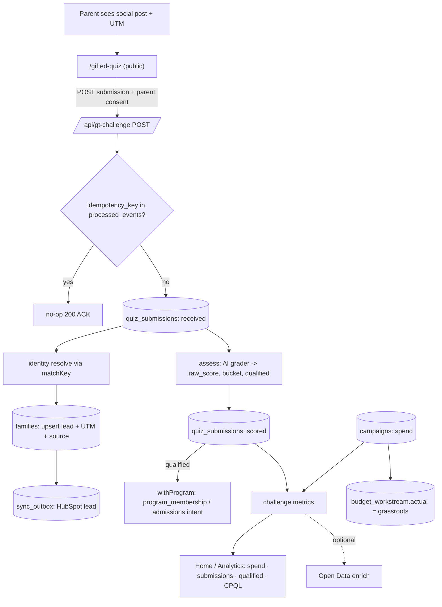

# GT Challenge — End-to-End Workflow & Implementation Spec

> **Status:** spec / ready-to-build · **Owner of build:** the Phase-2 session (this doc is its handoff)
> **PRD source:** _A worked example: the GT Challenge_ (Technical Project · Candidate Brief, p.6)
> **Assessment decision:** AI grader (LLM), behind a swappable `Grader` interface, with a deterministic record-replay mode for the demo and a rules-based safety floor.

The GT Challenge is the one play that exercises **every theme at once** — the sync backbone moving lead + budget data without contamination, an AI assessment step, single-source-of-truth + budget rules, and one view where the numbers reconcile. Build it on the existing backbone; do **not** fork it.

---

## 0. What already exists (build ON this, do not duplicate)

| Capability | Where | Reuse for the Challenge |
|---|---|---|
| Payment propagation + idempotency ledger | `lib/payments.ts`, `processed_events` | Same idempotency pattern for submissions |
| HubSpot connector + match-key identity | `lib/connectors/hubspot.ts`, `lib/connectors/SourceConnector.ts` (`matchKey`) | Resolve a quiz lead to a family |
| Inbound reconcile + parity + echo-suppression | `lib/sync/reconcile.ts`, `lib/parity.ts` | Challenge lead participates in parity / data-confidence banner |
| Durable outbound | `lib/sync/outbox-worker.ts`, `sync_outbox` | Push the new lead to HubSpot |
| Webhook route shape (raw body, fast ACK) | `app/api/webhooks/stripe/route.ts` | Template for the public submission route |
| RLS program isolation | `withProgram` / `withoutProgram` in `lib/db.ts` | Route qualified leads into the right program store |
| Seeded campaign + attribution model | `lib/seed/campaigns.ts` (`gifted_quiz` → utm `gifted_quiz_2026`, landing `/gifted-quiz`, meta id `23847101234560001`) | The Challenge **is** this campaign — thread into existing Meta/GA4/X rows |
| Budget workstreams ($365K) | `lib/seed/dictionaries.ts` (`grassroots` $210K, …) | Challenge spend rolls into `grassroots` |
| Open Data enrichment | `lib/opendata/enrich.ts` | Optional KPI enrichment |
| In-app dev docs | `lib/dev/catalog.ts`, `/dev/*` | Register the 2 new tables here |

---

## 1. Expert-panel synthesis (data + digital-marketing panel, pared to 9)

| Persona | Lens | The catch it enforces |
|---|---|---|
| Tomás Rivera — DM strategist | Campaign framing | Spend rolls into a **workstream** and reconciles to $365K — not a special case |
| Hannah Cho — DM data expert | Attribution honesty | **CPQL has ONE definition**; UTM captured on every submission; missing UTM = `(not set)`, never dropped |
| Elena Schwartz — privacy counsel | **Minors' PII — "don't ship" seat** | Parent-gated consent + data-minimization + COPPA/FERPA note before any real submission persists |
| Sara Kim — MDM | No double-count | Resubmit/replay collapses to one submission + one lead |
| Devon Park — backbone eng | Isolation + idempotency | Routes via RLS; replay is a no-op; cross-program write rejected |
| Ravi Anand — AI/assessment eng | The grader | AI grader, structured output, unit-tested, **reproducible** for the demo |
| Dr. Aisha Rahman — causal scientist | **"Don't trust it" seat** | CPQL is a **measured** number (spend ÷ counted qualified), not the seeded `$41/$63` placeholders |
| Dr. Lena Ortiz — gifted-ed SME | Validity/ethics | Framed as a **fit screen, not a gifted verdict**; no "not gifted" bucket; no child gated out |
| Maya Lindqvist — product/UX designer (interaction + service design) | **Workflow legibility — "can it actually be done?" seat** | Every step of the loop has a **visible affordance + state**: the public `/gifted-quiz` is mobile-first, consent-clear, completable in a short flow with a result screen; and the in-app surfaces (KPI row, admin submissions view, Decision Queue) let a **non-builder execute the §7 demo script end-to-end without docs**. Frameworks: Nielsen heuristics, jobs-to-be-done flow mapping, task-success / click-depth, empty/loading/error/duplicate states. |

**Convergent:** ride the backbone; CPQL is the headline and must be real + single-defined; this is the ideal demo because it lights all four "show us it works" signals.
**Divergent → resolved:** AI grader (Ravi) vs deterministic/auditable (Rahman, Schwartz) → **AI grader behind a `Grader` interface with record-replay + a rules safety floor.**
**Top risks (ranked):** (1) minors' consent/PII; (2) double-count on resubmit; (3) CPQL shown as real but fabricated; (4) quiz mis-framed as a verdict; (5) **the loop is technically correct but not *executable* in the UI** — a parent stalls on the quiz, or no in-app surface lets you actually watch a submission become a lead, see CPQL, and hit the parity banner (Lindqvist).

**Lindqvist's workflow-legibility gate (each must be a real, reachable screen — not just an API):**
- **Public quiz** `/gifted-quiz`: mobile-first, ≤ ~6 questions, consent checkbox above the submit, explicit result screen (`bucket` framed as a fit indicator), and graceful duplicate/error states.
- **Admin submissions view**: a list where a reviewer sees each submission's status (`received → scored → routed`), `bucket`, resolved `family_id`, and UTM (incl. `(not set)`) — so "watch it propagate" is observable.
- **KPI row**: spend · submissions · qualified · CPQL, visibly *beside* other channels on Home/Analytics (not a standalone page).
- **Decision Queue + banner**: the "raise Challenge budget" item and the data-confidence banner must render with clear denied/parity states, so steps 5–6 of §7 are clickable.

---

## 2. Workflow — capture → assess → reconcile → report



### Node table (data-in / processing / data-out)

| Node | Data in | Processing | Data out |
|---|---|---|---|
| **N1 Campaign stand-up** | workstream `grassroots`, utm `gifted_quiz_2026`, spend | create/seed `campaigns` row; spend is a component summed into the workstream | `campaigns` row; `budget_workstream.actual` reflects it; plan total unchanged ($365K) |
| **N2 Capture** | quiz answers, parent contact, **consent flag**, UTM (`utm_source/medium/campaign`) | validate; **block without consent**; dedup via `idempotency_key` + `processed_events`; `matchKey` identity resolve | `quiz_submissions` (received); `families` lead upsert (UTM + `source`); `sync_outbox` HubSpot lead |
| **N3 Assess** | submission answers | AI grader → `{raw_score, bucket, qualified}` (record-replay in demo; rules floor on failure); idempotent writeback | `quiz_submissions` (scored); if qualified → `program_membership` / admissions intent via `withProgram` (RLS) |
| **N4 Report** | campaign spend; submission + qualified counts | metrics layer: `CPQL = spend ÷ qualified`; optional Open Data enrich | Home/Analytics KPI row beside other channels |

### Cross-cutting — the four "show us it works" signals
- **Watch it propagate:** a submission flows capture → lead → assessment → KPI in one motion (the Challenge's analog of "watch a payment propagate").
- **Budget reconcile to total:** N1 spend rolls into `grassroots`; the Budget Tracker still sums to $365K.
- **Role denied the Decision Queue:** a "raise GT Challenge budget" decision item is denied to a non-leader role.
- **Data-confidence banner on parity drop:** an inbound HubSpot edit to a Challenge lead's app-authoritative field (e.g. `funnel_stage`) drops parity → banner appears.

---

## 3. Data model additions (additive migration — touches no backbone table)

`supabase/migrations/0002_gt_challenge.sql`

**`campaigns`** (global; links spend → budget)
| column | type | notes |
|---|---|---|
| `id` | uuid pk | |
| `key` | text unique | e.g. `gifted_quiz` (matches seed campaign) |
| `name` | text | "GT Challenge — Gifted Quiz" |
| `channel` | text | `paid_social` |
| `workstream_key` | text → `budget_workstream.key` | `grassroots` |
| `utm_source/medium/campaign` | text | `meta` / `paid_social` / `gifted_quiz_2026` |
| `spend` | numeric(12,2) default 0 | component summed into the workstream actual |
| `status` | text | `active` |
| `created_at` | timestamptz default now() | |

**`quiz_submissions`** (global capture; routes into program store on qualify)
| column | type | notes |
|---|---|---|
| `id` | uuid pk | |
| `campaign_key` | text → `campaigns.key` | |
| `idempotency_key` | text **unique** | client token / hash → collapses duplicates (Sara Kim, Devon Park) |
| `child_first_name` | text | minimal PII (Schwartz) |
| `child_grade` | text | |
| `parent_email` / `parent_phone` | text | identity inputs for `matchKey` |
| `parent_consent` | boolean not null | **submission rejected if false** (Schwartz) |
| `answers` | jsonb | quiz responses |
| `utm_source/medium/campaign` | text nullable | missing → `(not set)` in CRM Ops, never dropped (Cho) |
| `raw_score` | numeric nullable | grader output |
| `bucket` | text nullable | `strong_fit` / `promising` / `explore` — **no "not gifted"** (Ortiz) |
| `qualified` | boolean nullable | drives CPQL denominator |
| `family_id` | uuid → `families.id` nullable | resolved lead |
| `routed_program_key` | text nullable | program store routed into |
| `status` | text | `received` → `scored` → `routed` |
| `submitted_at` / `scored_at` | timestamptz | |

Grants: `app_rw` read/write, `staff_ro` read. Register both tables in `lib/dev/catalog.ts` with zone + field tags (PII tags on parent/child columns).

---

## 4. AI grader design (chosen approach)

`lib/gt-challenge/assess.ts`

```ts
export interface GradeResult { raw_score: number; bucket: "strong_fit" | "promising" | "explore"; qualified: boolean; rationale: string; }
export interface Grader { grade(answers: QuizAnswers): Promise<GradeResult>; }
```

- **`AiGrader`** — LLM scores answers against a fixed rubric, returns **structured JSON** (validated; reject + retry on malformed). System prompt frames it as a **fit screen, not a gifted diagnosis** (Ortiz). Temperature 0 for stability.
- **Determinism for the demo (Rahman/Ravi):** record-replay — keyed by a hash of the rubric + normalized answers, cached in a fixture so the same submission always yields the same bucket and the walkthrough is reproducible offline.
- **Rules safety floor:** if the LLM is unavailable or returns invalid JSON, fall back to a deterministic rules grader so capture never blocks on the model.
- **No "fail" bucket:** the lowest bucket is `explore` — informational, never gates a child out.
- **`qualified`** = `bucket ∈ {strong_fit, promising}` → this is the CPQL denominator and the routing trigger.

---

## 5. Files to build (all additive)

| File | Purpose |
|---|---|
| `supabase/migrations/0002_gt_challenge.sql` | `campaigns` + `quiz_submissions` + grants |
| `lib/gt-challenge/assess.ts` | `Grader` interface, `AiGrader`, rules floor, record-replay |
| `lib/gt-challenge/ingest.ts` | dedup → submission → `matchKey` lead upsert → `sync_outbox` → score → conditional `withProgram` route (idempotent end-to-end) |
| `lib/metrics/challenge.ts` | single definitions: `submissions`, `qualified`, `CPQL = spend ÷ qualified` |
| `app/api/gt-challenge/route.ts` | public `POST` (consent-gated, fast ACK like the Stripe route) + admin `GET` summary |
| `app/gt-challenge/page.tsx` | public quiz surface, **no Hub sidebar**, parent-consent gate, returns result |
| `app/_components/ChallengeCard.tsx` (+ wire into Home/Analytics) | KPI row: spend · submissions · qualified · CPQL (+ optional Open Data) |
| `app/gt-challenge/admin/page.tsx` | Admin submissions view — list with status (`received → scored → routed`), `bucket`, resolved `family_id`, UTM; makes "watch it propagate" observable (Lindqvist) |
| `lib/seed/generate.ts` (extend) | seed realistic submissions incl. **duplicate-submission** and **missing-UTM** edge cases |
| `lib/seed/invariants.ts` (extend) | new invariants (§6) |
| `tests/gt-challenge.test.ts` | grader determinism, idempotent ingest, RLS routing, CPQL math |

---

## 6. New invariants (provable against seeded data)

1. **No double-count:** N submission events with the same `idempotency_key` → exactly 1 `quiz_submissions` row and ≤1 `families` lead.
2. **CPQL is computable & real:** `CPQL = campaign.spend ÷ count(qualified)`; not a hard-coded constant; `qualified ≤ submissions`.
3. **UTM honesty:** a submission with no UTM persists with `(not set)`, is not dropped, and is visible in CRM Ops.
4. **Budget reconciles:** Challenge spend rolls into `grassroots`; `sum(budget_workstream.recommended) == 365000` still holds.
5. **Isolation:** a qualified lead routes only into its `routed_program_key` store; a cross-program write is rejected by RLS.
6. **Consent gate:** a submission with `parent_consent = false` is rejected (never persisted).
7. **Grader determinism:** identical answers → identical bucket (record-replay).

---

## 7. Demo script (maps to PRD "Show us it works")

1. Open `/gifted-quiz`, take the Challenge → watch the submission become a lead, get AI-scored, and bucket.
2. Resubmit the same answers → no second lead (idempotency).
3. Open Budget Tracker → Challenge spend is inside `grassroots`; total still $365K.
4. Open Home/Analytics → Challenge KPI row shows spend · submissions · qualified · **real CPQL** beside other channels.
5. As a non-leader, open the Decision Queue → "raise Challenge budget" is denied.
6. Edit a Challenge lead's `funnel_stage` in HubSpot → reconcile → data-confidence banner appears.

---

## 8. Coordination note

This rides the same files the Phase-2 session owns. Build order suggestion: land `0002` migration + `assess.ts` + `ingest.ts` first (pure libs, testable), then the public `/gifted-quiz` surface and the KPI row, then seed + invariants. Keep the four demo signals (§2) as the acceptance gate.
