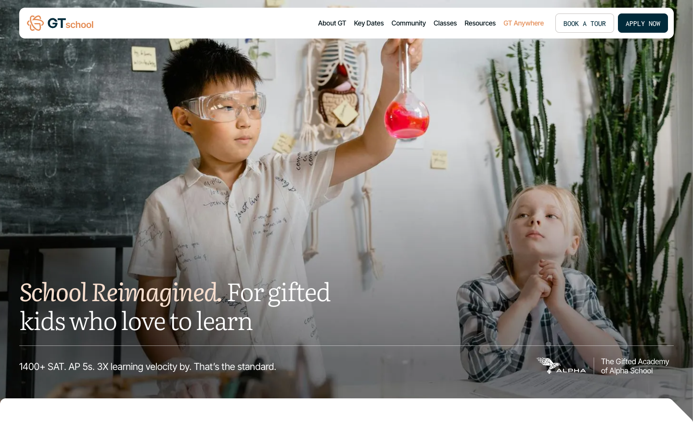
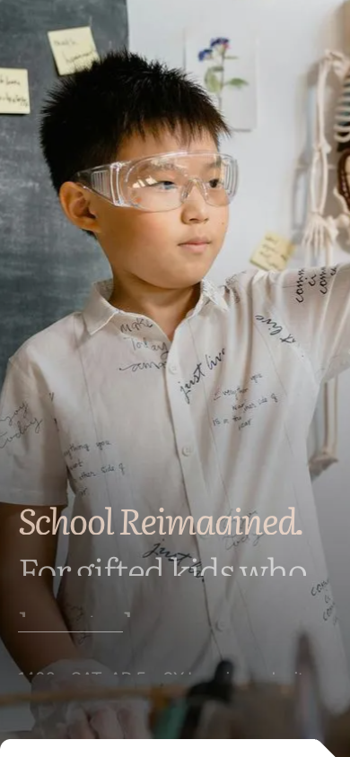

# GT School — Design System

> Reverse-engineered from the live marketing site **[gt.school](https://gt.school)** (redirects to `https://www.gt.school`).
> Every value below was extracted from the **rendered** site (real computed styles + the site's own `:root` custom properties), captured 2026-06-26 via headless Chromium. Nothing here is invented. Where a value was read from pixels rather than computed CSS, it is explicitly flagged.

GT School is "The Gifted Academy of Alpha School" — gifted K‑8 education in Texas. The site is built on **Webflow**, which exposes a complete design-token set as `:root` variables; those are the backbone of this system.

---

## 1. Brand overview

The brand reads as **warm, academic, and editorial**. A literary serif (Literata) carries the headlines at light weight, paired with a clean grotesque (Inter Tight) for body and a monospace (Inconsolata) for uppercase buttons and labels — a "smart, modern prep school" feel rather than a playful kids' brand.

The palette is anchored by a **deep teal-navy** (`#002a3a`) and a single **warm orange accent** (`#e48b53`, the atom logo mark), softened by a family of warm "gold" off-whites (`#fcf4ef` → `#f8e8de`). Surfaces are bright white with very subtle shadows; dark sections and the footer invert to navy.

**Logo system** (see `logos/`):

| Asset | File | Notes |
|---|---|---|
| Header logo (horizontal) | `logos/gt-school-logo-horizontal.svg` | Navy `#002A3A` "GT" + orange `#E48B53` "school". For light backgrounds. |
| Footer logo (horizontal, inverted) | `logos/gt-school-logo-horizontal-footer.svg` | White "GT" + orange "school". For dark backgrounds. |
| Icon mark (atom) | `logos/gt-icon.svg` | Orange `#E48B53` atom glyph, used as the page loader icon. |
| Favicon 32px | `logos/favicon-32.png` | |
| Favicon 48px | `logos/favicon-48.png` | |
| Apple touch icon 180px | `logos/apple-touch-icon-180.png` | |
| Web clip 192px | `logos/webclip-192.png` | |
| Web clip 512px | `logos/webclip-512.png` | |
| Partner: Alpha School (white) | `logos/alpha-logo-white.svg` | Co-brand, shown on the dark hero. |
| Sub-brand: GT Summer Camps | `logos/gt-summer-camps-logo.svg` | |


---

## 2. Color palette

All hexes below are exact, pulled from the site's `:root` variables.

### Brand

| Swatch | Name | Hex | Role |
|---|---|---|---|
| 🟧 | `brand.orange` | `#e48b53` | **Primary accent** — logo mark, highlighted nav item, link/CTA accents |
| 🟦 | `brand.navy` | `#002a3a` | **Primary dark** — solid button background, dark section background |
| ⬛ | `brand.navyDark` | `#001117` | **Darkest** — body text, footer background |
| 🟦 | `brand.blue` | `#004f71` | Secondary blue |
| 🟦 | `brand.blueDark` | `#003b5c` | Secondary blue, darker |
| ⬜ | `brand.goldLightest` | `#f8e8de` | Warm tint |
| ⬜ | `brand.goldLighter` | `#f5ddcd` | Warm tint (success bg) |
| 🟫 | `brand.goldLight` | `#ebba9b` | Warm tint, deeper |
| 🟫 | `brand.yellowDarker` | `#5e5515` | Warning text |

### Neutral

| Swatch | Name | Hex | Role |
|---|---|---|---|
| ⬜ | `neutral.white` | `#ffffff` | Primary background, surfaces |
| ⬜ | `neutral.offWhite` | `#fcf4ef` | **Warm off-white** — secondary section background |
| ⬜ | `neutral.greyLight` | `#d9d9d9` | Default border color |
| ⬜ | `neutral.grey` | `#cac6c4` | Secondary button border |
| ◼️ | `neutral.greyDark` | `#5b5b5b` | Secondary / muted text |

### Semantic mapping

| Token | Value |
|---|---|
| `background.primary` | `#ffffff` |
| `background.secondary` | `#fcf4ef` |
| `background.tertiary` | `#002a3a` |
| `text.primary` | `#001117` |
| `text.secondary` | `#5b5b5b` |
| `text.alternate` (on dark) | `#ffffff` |
| `border.primary` | `#d9d9d9` |
| `state.successBackground` | `#f5ddcd` |
| `state.successText` | `#f8e8de` |
| `state.warningBackground` | `#fcf4ef` |
| `state.warningText` | `#5e5515` |

> **Note on state tokens:** the site defines `success`/`warning` background and text variables, but `successText` (`#f8e8de`) is a very light tint — these state tokens appear defined-but-lightly-used in the Webflow theme. They are reproduced verbatim; treat them as approximate intent rather than a battle-tested status system.

---

## 3. Typography

Three self-hosted typefaces (loaded as `.ttf` from the Webflow CDN; Inconsolata is additionally pulled from Google Fonts):

| Role | Family (stack) | Files observed | Character |
|---|---|---|---|
| **Heading / display** | `Literata, Georgia, sans-serif` | Light, Regular, Medium, Italic | Editorial serif. Used at **light (300)** weight for large headlines; the hero mixes an **italic** Literata phrase ("School Reimagined.") with light roman. |
| **Body / UI** | `"Inter Tight", Arial, sans-serif` | Light, Regular, Medium, Bold | Clean modern grotesque. Body, nav, paragraphs. |
| **Utility / buttons** | `Inconsolata, Arial, sans-serif` | Regular, Medium, SemiBold, Bold | Monospace. Used for **uppercase** button labels and small utility labels. |

### Weight scale

`thin 100 · xlight 200 · light 300 · normal 400 · medium 500 · semiBold 600 · bold 700 · xbold 800 · black 900`

### Type scale (real values)

Headings are **Literata**; body/labels are **Inter Tight**. `1rem = 16px`.

| Style | Font | Size | Line-height | Weight | Letter-spacing |
|---|---|---|---|---|---|
| H1 | Literata | `3.25rem` (52px) | 1.15 | 300 | `-0.1rem` |
| H2 | Literata | `3rem` (48px) | 1.15 | 300 | 0 |
| H3 | Literata | `2rem` (32px) | 1.15 | 300 | 0 |
| H4 | Literata | `1.5rem` (24px) | 1.25 | 400 | 0 |
| H5 | Literata | `1.25rem` (20px) | 1.25 | 400 | 0 |
| H6 | Literata | `0.875rem` (14px) | 1.25 | 500 | 0 |
| Body | Inter Tight | `1rem` (16px) | 1.3 | 400 | 0 |

> The hero `<h1>` rendered at 52px / weight 300 / `-1.6px` tracking — matching the `3.25rem` / `300` / `-0.1rem` `:root` tokens exactly.

Standalone font-size scale (utility sizes): `tiny 0.875rem · small 1rem · regular 1.125rem · medium 1.25rem · large 1.5rem · xlarge 2rem`.
Line-height tokens: `small 1.15 · medium 1.25 · large 1.3`. Letter-spacing tokens: `tight -0.1rem · default 0`.

---

## 4. Spacing & layout

A single rem-based scale (1rem = 16px) drives spacing:

| Token | Value | px |
|---|---|---|
| none | 0 | 0 |
| tiny | 0.125rem | 2 |
| xxsmall | 0.25rem | 4 |
| xsmall | 0.5rem | 8 |
| small | 0.75rem | 12 |
| regular | 1rem | 16 |
| medium | 1.5rem | 24 |
| large | 2rem | 32 |
| xlarge | 3rem | 48 |
| xxlarge | 4rem | 64 |
| huge | 5rem | 80 |
| xhuge | 6rem | 96 |
| xxhuge | 8rem | 128 |

**Section rhythm:** `section-padding` = `small 3rem · medium 5rem · large 8rem`. **Global page padding** (gutter): `2.5rem`. **Gaps:** `small 0.75rem · medium 1.5rem`.

**Containers / max-widths:** containers `small 48rem · medium 64rem · large 90rem`; content max-widths run `xxsmall 12rem` → `xxlarge 80rem`.

**Breakpoints:** the site does not define custom breakpoints — it uses standard **Webflow** breakpoints. Approximated as:

| Name | Query |
|---|---|
| Desktop | `min-width: 992px` |
| Tablet | `max-width: 991px` |
| Mobile landscape | `max-width: 767px` |
| Mobile portrait | `max-width: 479px` |

> ⚠️ **Approximated:** breakpoint pixel values are the Webflow platform defaults, not values read from a custom media query in the site CSS.

---

## 5. Radii, borders, shadows, motion

- **Border radius:** `small 0.25rem (4px) · medium 0.5rem (8px) · large 0.75rem (12px)`. Buttons use **8px**.
- **Border width:** `1px`, color `#d9d9d9` (default) / `#cac6c4` (secondary button).
- **Shadow:** exactly one box-shadow was present on the page —
  `1px 2px 14px 0px rgba(0, 0, 0, 0.03)` — a very soft, low-contrast elevation used on cards/surfaces.
- **Motion:** transitions are short and restrained — `0.2s` over the browser default `ease`. Observed declarations: `color 0.2s`, `background-color 0.2s`, `all 0.2s`. **No custom cubic-bezier** was found; nothing bounces.

> ⚠️ **Approximated:** the easing is recorded as `ease` because no custom timing function appears in the captured styles; only durations (`0.2s`) were explicit.

---

## 6. Components (observed on the live site)

### Primary button — `.button`

- Background `#002a3a` (navy), text `#ffffff`
- Font: **Inconsolata**, 16px, weight 500, **UPPERCASE**
- Padding `8px 16px`, radius `8px`, no border
- Transition `all 0.2s`
- Seen as: **APPLY NOW**, **Book a Tour** (filled variant), **Apply Now**

### Secondary button — `.button.is-secondary`

- Transparent background, text `#002a3a`
- `1px solid #cac6c4` border, radius `8px`, padding `8px 16px`
- Font: **Inconsolata**, 16px, weight 500, **UPPERCASE**
- Transition `color 0.2s`
- Seen as: **BOOK A TOUR** (outlined, in the header)

### Navigation / header

- White background, sits above a full-bleed hero image
- Links: **Inter Tight**, 14px, weight 500, color `#001117`
- One nav item highlighted in orange (`#e48b53`) — "GT Anywhere"
- Right side pairs the outlined **Book a Tour** with the filled **Apply Now**
- Header logo: navy + orange horizontal wordmark with the atom mark

### Hero

- Full-bleed photographic background (`.webp`) with a darkening overlay
- Headline bottom-left: large **Literata** light, mixing **italic** ("School Reimagined.") with roman ("For gifted kids who love to learn"), in white `#ffffff`
- Supporting line in Inter Tight; co-brand "Alpha School" white logo bottom-right
- A thin hairline rule separates headline from the supporting stat line

### Cards / surfaces

- White surface, rounded corners (8–12px), soft `1px 2px 14px rgba(0,0,0,0.03)` shadow
- Used in the off-white (`#fcf4ef`) content sections and photo-grid blocks

### Sections

- Alternating rhythm: bright white, warm off-white (`#fcf4ef`), and dark navy (`#002a3a`) bands
- A navy "split CTA" band and a navy CTA card with an **orange** button appear lower on the page
- Footer is dark (`#001117`/navy) with the inverted white logo

> Component styles above (button, nav, hero) are from **real computed values**. Section/card descriptions combine computed values (shadow, backgrounds) with **visual reading of the full-page screenshot** — treat the structural prose (e.g. "split CTA band") as observed-from-screenshot, the numeric styles as measured.

---

## 7. Usage guidance

- **One accent, used sparingly.** Orange `#e48b53` is reserved for the logo mark, a single highlighted nav item, and select CTAs/links — not for large fills. Keep it scarce.
- **Headlines are serif and light.** Use Literata at weight 300 for display; lean on the **italic** for an editorial flourish on a key phrase. Don't bold headlines.
- **Buttons are monospace + uppercase.** Inconsolata 500, uppercase, 8px radius, 8px/16px padding. Filled = navy; outlined = transparent with a grey hairline border.
- **Body is Inter Tight at 16px / 1.3.** Keep body copy quiet; let the serif headlines carry voice.
- **Warm neutrals, not grey.** Prefer `#fcf4ef` over a cold grey for section backgrounds; borders are light grey `#d9d9d9`.
- **Restrained motion.** 0.2s ease on color/background; avoid long or springy animations.
- **Invert on dark.** On navy sections/footer use white text and the footer (white) logo variant.

---

## 8. Files in this design system

```
hub/docs/design-system/
├── DESIGN-SYSTEM.md          ← this file
├── tokens.json               ← machine-readable tokens
├── tokens.css                ← CSS custom properties (:root)
├── tailwind.tokens.js        ← Tailwind theme.extend mapping
├── preview.html              ← standalone living style guide (open in a browser)
├── logos/                    ← all logo / favicon assets (svg + png)
└── screenshots/              ← homepage desktop + mobile (viewport + full-page)
```

### Reference screenshots

Desktop (viewport):



Mobile (viewport):



---

## 9. Provenance & honesty notes

- **Captured from:** `https://gt.school` → resolves to `https://www.gt.school/` (title: *"GT School | Gifted Education for K-8 Students in Texas"*).
- **Method:** headless Chromium; `getComputedStyle` on real elements + the site's own `:root` custom properties (Webflow exposes the full token set), plus `performance` resource entries for fonts and DOM queries for logo/favicon URLs. Assets downloaded directly from the Webflow CDN.
- **Exact (measured):** all colors, font families, weights, the type scale, spacing scale, container/max-width scale, radii, border widths, the single box-shadow, transition durations, button/nav/hero styles, and every logo/favicon URL.
- **Approximated (flagged above):** breakpoint pixel values (Webflow defaults), transition easing (recorded as `ease` — no custom bezier found), and the structural prose for sections/cards (read from the full-page screenshot).
- **Not captured:** hover-state color values (the page declares `color 0.2s`/`background-color 0.2s` transitions but the specific hover target colors were not individually measured); any logged-in/app surfaces beyond the public marketing site.
