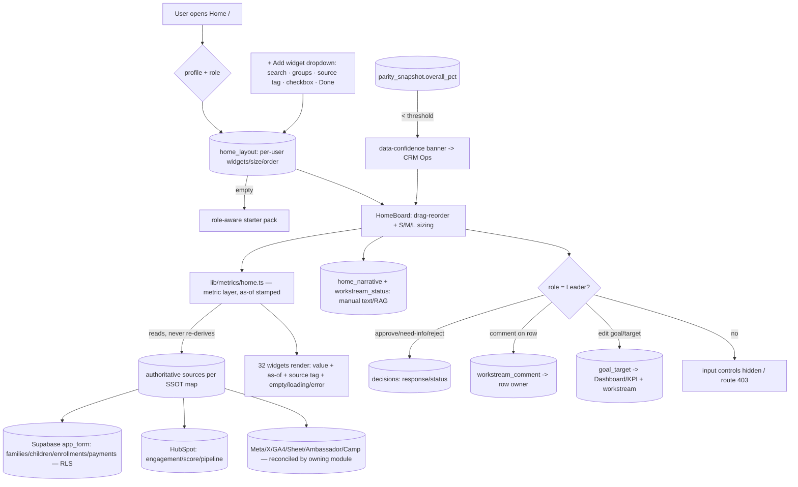

# Module 1: Home / Executive Command Center — Plan Spec
> Status: spec / ready-to-build · Owner: All (personal); leadership-input surfaces = Leader · PRD §3 Module 1 (lines 75–186)
> Source of truth: **aggregates from all 12 other modules** (Home owns only per-user layout, the manual Executive-Narrative/Wins/Risks text, and leadership inputs) · RBAC: every user composes their own Home; Decision-card / goal-edit / comment surfaces are **Leader-only**; VoC widgets are program-scoped
> Panel: `~/.claude/skills/gt-hub-home-panel/SKILL.md` · Engine: `~/.claude/skills/gt-hub-module-panel/SKILL.md`

---

## 0. Build-on-this (existing backbone / tables / connectors to reuse, not duplicate)

| Capability | Where | Reuse for Home |
|---|---|---|
| Canonical module list (nav, tints, Home route) | `lib/modules.ts` | Widget "source module" tags + sidebar; Home is `/` |
| Home shell page (jump-off grid) | `app/page.tsx` | Replace the static grid with the composable widget board (additive rewrite of the one page) |
| Sidebar / chrome | `app/_components/Sidebar.tsx`, `app/layout.tsx` | Top bar gets week-of selector, days-to-cutoff countdown, **"+ Add widget"** (Home only), Light/Dark |
| Parity + data-confidence | `lib/parity.ts`, `parity_snapshot`, `field_state` | Drive the **data-confidence banner** on Home's HubSpot-consuming widgets |
| Decision Queue store | `decisions` table (`response`, `response_note`, `status`, `resolved_at`, `auto_flag`) | **Decision-queue-preview** widget + leadership approve/need-info/reject **writes here** (no new decision store) |
| Budget store ($365K) | `budget_workstream` (`recommended/planned/committed/actual`) | **Budget burn**, **Spend by workstream** widgets; goal edits to budget reuse `planned` |
| Funnel / segments / money | `families`, `children`, `enrollments`, `payments` (RLS via `withProgram`/`withoutProgram` in `lib/db.ts`) | Volume/conversion/audience/funnel widgets read **through a metric layer**, never raw re-derive |
| Stand-in channel feeds | `meta_insights`, `ga4_days`, `x_posts`, `content_sheet`, `community_ambassadors`+`hubspot_ambassadors`, `summer_site_registrations`+`registration_form_entries` | Content/social/website/grassroots/camp widgets read the **reconciled** figure from the owning module |
| DQ surfacing | `data_quality_issue` | Banner detail link target (CRM Ops, Module 7) |
| In-app dev docs | `lib/dev/catalog.ts`, `/dev/*` | Register the new Home-owned tables (additive append, PII tags on VoC/narrative) |

**Nothing in `0001_backbone.sql` / `0002_sync_cursor.sql` is edited.** Home adds one additive migration (`0005_home.sql`) for its current layout footprint.

---

## 1. Expert-panel synthesis

### Roster (pared to 9 — see panel skill for catches; orders: 1st=practitioner, 2nd=critic/regulator, 3rd=outsider)

| Persona | Lens (order) | Falsifiable ask |
|---|---|---|
| Marcus Bell | Leadership operating cadence (3rd) | Starter-pack Home runs the §5 weekly-meeting agenda without leaving Home |
| Priya Nair | Semantic/metric layer — matched source seat (1st) | "Applicants total" = `app_form` count, **byte-equal to Dashboard/KPI** for same as-of |
| Dana Whitfield | Dashboard IA + interaction, mobile/WCAG (2nd) | Picker = search+groups+source-tag+checkbox+Done; empty/loading/error on every widget; works at 390px |
| Sam Okafor | Backbone / integration (1st) | Layout writes only actor's row; non-Leader goal/decision route → 403 |
| Elena Vargas | Privacy & access — **don't ship** (2nd) | VoC/hot-family/quote widgets scoped to viewer program+role; consented attribution |
| Theo Lin | Widget-system / personalization (1st) | Versioned widget registry; unknown keys degrade, don't crash saved Homes |
| Dave Okonkwo | Leadership **end-user** (3rd) | Fresh Leader sees decision-ready starter pack < 30s; approve-with-note in one click |
| Wei Zhang | Aggregation / performance (1st) | Pre-aggregated as-of snapshots; starter pack under stated p95; per-widget "as of" shown |
| Dr. Naomi Frank | Causal / decision science — **don't trust** (3rd) | Every KPI measured (not placeholder); goal edit versioned + propagates, not forks |

### Convergent (the spec can rely on it)
- **Home mirrors, never re-derives.** A shared metric layer is the only number source; widgets are thin renderers (Priya, Naomi, Wei).
- **Home owns three things only:** per-user **layout**, the manual **narrative/wins/risks** text, and **leadership inputs** (comments, goal edits, decision responses). Everything else is read-through (Marcus, Sam).
- **The picker + states are the product**, not the chart styling — composability and legibility decide adoption (Dana, Dave, Theo).
- **Leadership input surfaces are write-paths into other modules**, so they inherit those modules' RBAC and contracts (Sam, Elena).

### Divergent (surfaced, not averaged)
- **Live reads vs cached aggregates** — Priya/correctness wants the freshest module number; Wei/perf wants pre-aggregated snapshots to avoid 32-way fan-out. → **Resolved:** read a **metric layer that returns an as-of-stamped value** (snapshot by default, with a freshness SLO + visible "as of"), so correctness = "equals the owning module *at that as-of*", not "live to the millisecond".
- **One Home for all vs role-shaped defaults** — a single starter pack vs Leader/Operator-specific packs. → **Resolved:** one widget library; **role-aware default starter pack** (Leaders get narrative+grid+decisions; Operators get their own module's widgets), all user-editable.

### Risks (ranked, sourced)
1. **Number drift / re-derivation** — Home ≠ owning module (Priya, Naomi).
2. **Minors' PII / VoC leakage** on a shared surface across role/program (Elena).
3. **RBAC bleed** via input surfaces — Operator decides/edits goals from Home (Sam, Dave).
4. **Unusable 32-widget picker** — no search/groups/states (Dana).
5. **Fan-out performance / external-API hammering** (Wei).
6. **Brittle layout schema** breaks saved Homes on a registry change (Theo).
7. **Vanity wall** — pretty but the meeting can't be run from it (Marcus).

### Open
- Canonical **workstream** taxonomy for the Health Grid (≠ the 4 budget workstreams?) — see §8.
- Identity/auth: current layout rows use the signed session user id; production **profiles/session** ownership remains a C1 auth question — see §8.
- Source for **"Top 3 personas by volume"** (persona dossier v2) and **ambassador/P2P/RSVP** manual feeds — owned by Grassroots/Admissions, Home only reads.

---

## 2. Workflow — widget-categories & mechanics as nodes (data-in / processing / data-out)

One node per PRD sub-view: the **2 personalization mechanics**, the **9 widget categories**, the **leadership input surface**, and **global chrome + banner**. Cross-cutting (SSOT mirror, reconciliation, RBAC, data-confidence, cross-links) is enforced **inside the metric layer + route guards**, not per widget.

### Node table

| Node | Data in | Processing | Data out |
|---|---|---|---|
| **N1 Widget picker & registry** | Widget registry (32 entries: key, category, **source tag**, sizes, default-pack flag); search text | Filter by search; group by 9 categories; checkbox toggles; "Done" diffs against current layout | Add/remove writes to `home_layout`; closed dropdown; rendered/removed widgets |
| **N2 Layout & personalization** | `home_layout` for the actor; default starter pack (role-aware) | First load → seed starter pack; drag-reorder; S(1col)/M(2col)/L(full) resize; debounced save | Persisted `home_layout` (order+size per widget); board re-render; **isolated to actor** |
| **N3 Volume & conversion** (6 widgets) | Metric layer: applicants, deposits vs 180, conversion-by-channel, channel mix, vol×conv quadrant, deposits/wk | Read **Supabase app_form** (SSOT, not HubSpot); compute via single metric defs; as-of stamp | Cards/bars/scatter, each with source tag + "as of"; numbers **equal Dashboard module** |
| **N4 Audience & segments** (8) | T1/T2/T3 + reachability, engagement tier mix, T3 sub-buckets, geo, income, grade, top-3 personas, lead-score dist | T-counts/geo/income/grade → Supabase; engagement/lead-score → HubSpot; personas → dossier ref | Segment widgets with correct source tag per row (Supabase vs HubSpot vs dossier) |
| **N5 Funnel & pipeline** (4) | Funnel stages+drop-off, velocity, stuck-in-stage, 24-hr SLA | Stages → Supabase app_form; velocity/stuck/SLA → HubSpot pipeline; single defs | Funnel/SLA widgets; drop-off math identical to Dashboard |
| **N6 Content & engagement** (4) | Latest send health, top content, content pipeline status, social engagement | Email/content → HubSpot; pipeline status → Google Sheet (Content); social → Meta+X | Engagement widgets; source tag per channel |
| **N7 Grassroots & ambassadors** (4) | Ambassador-influenced enrollments, P2P calls, events+RSVPs, referral pool | Read **reconciled** ambassador figure (community ⇄ HubSpot) from Grassroots; manual feeds | Grassroots widgets; **no double-count** (reconciled total only) |
| **N8 Voice of customer** (5) | Top objections, SMS inbox themes, "haven't heard back", hot families, family quote | HubSpot Conversations + manual; **program+role scope**; consented quote attribution | VoC widgets scoped to viewer; minors'/family PII gated (Elena) |
| **N9 Narrative & sprint** (6) | Exec narrative (4 fields), workstream health grid, decision-queue preview, sprint phase, wins, risks | Narrative/wins/risks/grid = **Home-owned manual** (`home_narrative`,`workstream_status`); preview = top 2-3 open `decisions`; sprint = config | Editable narrative (Marketing-Lead weekly); G/Y/R grid; live decision preview |
| **N10 Calendar & budget** (4) | Days-to-Aug-17, upcoming events, budget burn vs $365K, spend by workstream | Countdown = config; events → Field Marketing; budget → `budget_workstream` | Countdown, events list, burn + pie; budget **reconciles to $365K** |
| **N11 Website** (3) | Sessions this week, top landing pages, PDF downloads | Read **GA4** (gt.school + anywhere.gt.school) via `ga4_days` | Website widgets with GA4 source tag |
| **N12 Leadership input surface** | Decision card actions, row comments, goal/target edits | **Leader-only** route guard; write to source-of-record; version goal edits | `decisions.response/status` (→ Decision Queue), `workstream_comment` (→ owner), `goal_target` (→ Dashboard/KPI + workstream) |
| **N13 Global chrome + banner** | Week-of selector, days-to-cutoff, Light/Dark, `parity_snapshot` | Week scopes metric as-of; theme toggle; if `overall_pct < threshold` → render banner | Chrome state; **data-confidence banner** on HubSpot-consuming widgets → CRM Ops |

---

## 3. Data model touchpoints

**Reads only (no edits):** `families`, `children`, `enrollments`, `payments` (via `lib/db.ts` RLS), `budget_workstream`, `decisions`, `parity_snapshot`, `field_state`, `data_quality_issue`, and the stand-ins `meta_insights`, `ga4_days`, `x_posts`, `content_sheet`, `community_ambassadors`+`hubspot_ambassadors`, `summer_site_registrations`+`registration_form_entries` — **always through `lib/metrics/home.ts`**, never re-derived inline.

**Additive migration — `supabase/migrations/0005_home.sql` (touches no backbone table):**

Current implementation covers the `home_layout` slice only. The broader Home-owned tables below remain planned for the narrative, workstream-comment, and goal-edit surfaces.

| Table | Key columns | Why |
|---|---|---|
| `profiles` | `id` uuid pk · `email` unique · `display_name` · `role` enum(`admin`\|`leader`\|`operator`) · `owned_module_slugs` text[] | Identity + RBAC for per-user Home and Leader-only surfaces. *Assumption §8: reuse if an auth/profiles module is already planned.* |
| `home_layout` | `id` uuid pk · `profile_id` fk **unique** · `widgets` jsonb `[{widget_key,size,order}]` · `updated_at` | Per-user saved layout; one row per user (isolation key). |
| `home_narrative` | `id` uuid pk · `week_of` date · `topline`/`working`/`stuck`/`decisions` text · `wins` jsonb · `risks` jsonb · `updated_by` fk→profiles · `updated_at` | Manual Executive Narrative + Wins + Risks (Marketing-Lead editable weekly). |
| `workstream_status` | `id` uuid pk · `workstream_key` · `owner` · `rag` enum(`g`\|`y`\|`r`) · `this_week` · `next_week` · `key_metric` · `decision_ask` · `week_of` · `updated_by` | Workstream Health Grid rows (manual + a live KPI pull joined at read time). |
| `workstream_comment` | `id` uuid pk · `workstream_status_id` fk · `author_profile_id` fk · `body` · `created_at` | Leadership comments on rows (visible to row owner). |
| `goal_target` | `id` uuid pk · `metric_key` · `period` · `target_value` numeric · `version` int · `set_by` fk→profiles · `updated_at` | Goal/target edits (e.g. Deposits Fall goal=180); versioned; the **one** target both Home and Dashboard/KPI read. |

Grants mirror backbone: `app_rw` read/write, `staff_ro` read. **Register all six in `lib/dev/catalog.ts`** (zone `machinery` for layout/goal/comment, with **PII tags** on `home_narrative`/VoC-derived fields). No `field_authority` row changes (Home owns these outright).

---

## 4. Cross-module contracts

### Inbound (Home consumes)
| Trigger / feed | From | Payload Home reads |
|---|---|---|
| Aggregated metric request (as-of stamped) | All 12 modules via metric layer | `{metric_key, value, as_of, source}` per widget |
| Decision-queue preview | Decision Queue (#11) | Top 2–3 open `decisions` (`question, raised_by, due_date, priority`) |
| Workstream rows (live KPI pull) | Each workstream's module | Current `key_metric` value joined onto `workstream_status` |
| **Sync-parity drop → data-confidence banner** | CRM Ops (#7) / `parity_snapshot` | `{overall_pct, taken_at}` < threshold → banner on HubSpot-consuming widgets |
| Hot-family flag | Admissions/VoC (#9) | Chip in the "Hot families flagged" widget (program-scoped) |

### Outbound (Home emits)
| Edge | To | Payload |
|---|---|---|
| **Decision response** (Leader-only) | Decision Queue (#11) → `decisions` | `{decision_id, response: approve\|reject\|need_info, response_note, resolved_at}` |
| **Workstream comment** (Leader) | Owning workstream module | `{workstream_key, author, body, created_at}` → visible to row owner |
| **Goal/target edit** (Leader) | Dashboard/KPI (#6) + relevant workstream module | `{metric_key, target_value, period, version}` (propagates, does not fork) |

These mirror PRD §3 Module 1 **Inputs & Outputs** exactly.

---

## 5. Files to build (additive; real Next.js / lib paths)

| File | Purpose |
|---|---|
| `supabase/migrations/0005_home.sql` | Current layout table + grants (§3); remaining Home-owned tables stay planned |
| `lib/metrics/home.ts` | **Single** definition per metric for the 32 widgets; reads authoritative source per SSOT map; returns `{value, as_of, source}` (the no-re-derive contract) |
| `lib/home/widgets.ts` | Widget **registry**: 32 entries `{key, title, category, source, sizes[], defaultPack, inputs, output}`; **versioned**, unknown-key tolerant |
| `lib/home/layout.ts` | Load/save per-user layout; role-aware starter-pack defaults; diff from picker |
| `app/page.tsx` | Replace static grid with `HomeBoard` (additive rewrite of the single Home page) |
| `app/_components/HomeBoard.tsx` | Grid: drag-reorder, S/M/L sizing, per-widget empty/loading/error |
| `app/_components/WidgetPicker.tsx` | "+ Add widget" dropdown: search + category groups + source tag + checkbox + Done; keyboard + mobile |
| `app/_components/widgets/*.tsx` | One renderer per widget (or per category) — thin, consumes the metric layer |
| `app/_components/DataConfidenceBanner.tsx` | Banner driven by `lib/parity.ts`; links to CRM Ops |
| `app/_components/TopBar.tsx` | Week-of selector + days-to-cutoff countdown + "+ Add widget" (Home only) + Light/Dark |
| `app/api/home/layout/route.ts` | GET/PUT actor's layout (own row only) |
| `app/api/home/narrative/route.ts` | GET; PUT exec narrative/wins/risks (**Marketing-Lead/Admin only**) |
| `app/api/home/workstream/route.ts` | GET rows (+ live KPI join); POST comment (Leader); PATCH RAG/status (owner) |
| `app/api/home/goals/route.ts` | PUT goal/target (**Leader-only**, versioned; emits to Dashboard/KPI) |
| `app/api/home/decisions/[id]/respond/route.ts` | **Leader-only** approve/need-info/reject → writes `decisions` |
| `lib/dev/catalog.ts` | **Additive append**: register the 6 new tables (zones + PII tags) |
| `lib/seed/*` (extend) | Seed `profiles` (1 admin, 1 leader, ≥1 operator), a starter `home_layout`, `home_narrative`, `workstream_status` + one comment, `goal_target` (Deposits=180) |

---

## 6. Provable invariants (against seeded data)

1. **SSOT mirror:** "Applicants total" widget value == `count(app_form applicants)` (Supabase) **and** == the Dashboard/KPI module's number for the same `as_of` (byte-equal). Not read from HubSpot.
2. **No re-derivation:** for every widget, `home metric == owning-module metric` at the same as-of (Home is a pure mirror).
3. **Per-user isolation:** user A saving a layout mutates only A's `home_layout` row; B's row byte-unchanged.
4. **RBAC denial:** Operator → `PUT /api/home/goals`, `POST /api/home/workstream` (comment), `POST /api/home/decisions/:id/respond`, `PUT /api/home/narrative` all return **403**; the controls are absent from the Operator UI.
5. **Decision cross-link fired:** a Leader response from Home updates `decisions.response/status/resolved_at` and the item **leaves** the Decision-queue-preview widget.
6. **Goal propagation:** editing Deposits Fall goal 180→200 bumps `goal_target.version` and the **same** value is read by both Home's progress bar and the Dashboard/KPI module (no fork).
7. **Reconciliation:** "Ambassador-influenced enrollments" == Grassroots' **reconciled** total (community ⇄ HubSpot); no double-count.
8. **Data-confidence banner:** `parity_snapshot.overall_pct < threshold` → banner renders on Home's HubSpot-consuming widgets, links to CRM Ops; clears when parity recovers.
9. **Widget Inputs→Outputs:** adding a widget in the picker persists to `home_layout` and renders with its **source tag + as-of**; removing it persists; an unknown registry key degrades gracefully (no crash).
10. **Program scope (VoC):** an Operator in program A cannot see program B's hot family / quote on Home.

---

## 7. Demo script (clickable)

1. **Fresh Leader** logs in → Home renders the **role-aware starter pack** (8 widgets) decision-ready in < 30s, each with a **source tag + "as of"** (no empty board). *(Marcus, Dave, Wei)*
2. **"+ Add widget"** → type "objection" → grouped results, source tag shown → check **VoC › Top objections** → **Done**; the widget appears; **drag** to reorder; **resize** to large; reload → layout persists. *(Dana, Theo)*
3. Log in as a **second user** → their Home differs → prove **per-user isolation**. *(Sam)*
4. **SSOT proof:** "Applicants total" on Home == the number on the **Dashboard/KPI** module == Supabase `app_form` count. *(Priya, Naomi)*
5. As **Leader**: in **Decision-queue preview**, **Approve** a decision with a note → it leaves the queue (writes `decisions`); **comment** on a Workstream Health row → owner sees it; **edit** Deposits goal 180→200 → the **Dashboard** target updates too. *(Dave, Naomi)*
6. As **Operator**: the goal-edit / decision / narrative controls are **absent**, and the API returns **403**. *(Sam, Elena)*
7. Trip **parity below threshold** → **data-confidence banner** appears on Home's HubSpot-sourced widgets, linking to CRM Ops; recover parity → banner clears. *(Wei, CRM-Ops contract)*
8. As an **Operator in program A**: program B's **hot family / family quote** does **not** appear on Home. *(Elena)*

---

## 8. Open questions / assumptions

- **Identity/auth:** current layout persistence keys off the signed session user id; a future production auth/profile module should be reused rather than duplicated — Home needs a stable user + role to personalize and gate.
- **Workstream taxonomy:** the Health Grid's "workstream" is **not** assumed equal to the 4 `budget_workstream` keys; assumed to be the **function modules/owners**. Needs a canonical workstream list (config) — flagged for the Dashboard/KPI module to co-own.
- **"Top 3 personas by volume"** reads **persona dossier v2**, which is not in the data model — assumed a config/fixture reference owned upstream; Home only renders.
- **Manual feeds** (P2P calls, events/RSVPs, ambassador touchpoints, family quotes, wins/risks) are **owned by Grassroots/Admissions/Field-Events**; Home reads their reconciled/aggregated figure and only **writes** narrative/comments/goals/decision-responses.
- **Metric freshness:** assumes a **pre-aggregated, as-of-stamped** read path with a freshness SLO (not live-to-the-ms); the correctness invariant is "equals the owning module **at that as-of**". p95 render budget for the starter pack = TBD with the perf seat.
- **Goal/target granularity:** `goal_target.metric_key` taxonomy (which numbers are editable targets) co-owned with Dashboard/KPI; budget targets reuse `budget_workstream.planned`, non-budget targets live in `goal_target`.
- **Week-of selector + Light/Dark** assumed **global chrome** (top bar), with the selector scoping each widget's as-of.
- **Sprint phase tracker** ranges (Wks 1–2 Build → … → End-of-Aug Review) and the **Aug 17 cutoff** are **config**, not data.
