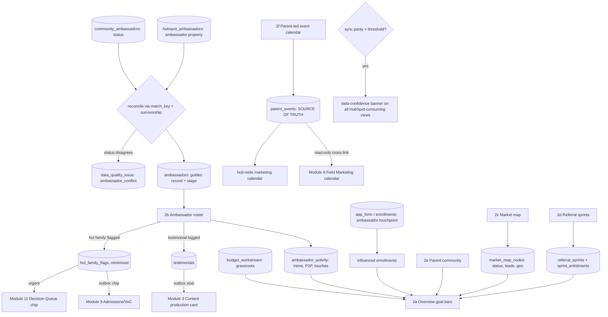

# Module 2: Grassroots Engine — Plan Spec
> Status: spec / ready-to-build · Owner: the Grassroots Owner (role: Operator) · PRD §3 Module 2 (lines 188–293)
> Source of truth: ambassadors = **HubSpot ambassador property + community.gt.school** (dual, reconciled) · influenced enrollments = **Supabase `app_form`** · P2P / events / testimonials / market-map / hot-family = **manual entry** · parent-led events = **owned HERE** (Field Marketing reads only)
> RBAC: Grassroots Owner r/w own module · all others read-only · Decision Queue = **submit-not-view** · Leadership approves budgets / comments

## 0. Build-on-this (existing backbone/tables/connectors to reuse, not duplicate)

| Capability | Where | Reuse for Grassroots |
|---|---|---|
| Dual-source ambassador feeds | `community_ambassadors` + `hubspot_ambassadors` fixtures (stand-in zone, `lib/dev/catalog.ts`) | The two sources we **reconcile**; survivorship → one golden `ambassadors` record |
| Identity resolution | `lib/connectors/SourceConnector.ts` (`matchKey`), `sync_identity_map` | Match ambassador across the two feeds + to a `families` row by `match_key` (email→phone→name+zip) |
| Inbound reconcile + parity + echo-suppression | `lib/sync/reconcile.ts`, `lib/parity.ts`, `parity_snapshot`, `field_state` | Ambassador status participates in parity; sync-parity drop → **data-confidence banner** |
| Durable outbound + idempotency | `lib/sync/outbox-worker.ts`, `sync_outbox` (unique `dedupe_key`), `processed_events` | Emit cross-link payloads (testimonial→Content, hot-family→Admissions/Decision) exactly once |
| People + funnel | `families`, `children` | Ambassador IS a `family` (parent); hot-family flag points at a `families.id` |
| Enrollment attribution | `enrollments`, `program_membership` (RLS via `withProgram`) | Influenced-enrollment count traces to `app_form`/`enrollments` carrying an ambassador touchpoint |
| Budget | `budget_workstream` (`grassroots` key; reconciles to **$365K** total) | Toolkit/event spend rolls into the `grassroots` workstream — not a special case |
| Decision Queue | `decisions` (leader-only act; `auto_flag`) | Toolkit/event-budget asks + urgent hot-family escalations land here |
| Data-quality surfacing | `data_quality_issue` | Ambassador conflict / unmapped HubSpot status raised as an issue for CRM Ops |
| In-app dev docs | `lib/dev/catalog.ts`, `/dev/*` | Register the new grassroots tables here (zone + PII field tags) |

**No backbone migration is edited.** New grassroots tables are additive (§3).

## 1. Expert-panel synthesis (gt-hub-grassroots-panel, pared to 9)

| Persona | Lens | The catch it enforces |
|---|---|---|
| Renata Cole — ambassador/community-ops SME | Advocacy ladder | Pipeline is a **state machine**; per-stage counts sum to roster total; "Active" needs ≥1 logged touch (2b) |
| Marcus Webb — HubSpot CRM data specialist | Ambassador property quirk | Unreliable/null HubSpot status maps to canonical stage or surfaces as **Prospect + low-confidence**, never dropped (2b) |
| Devon Park — backbone/integration eng | SSOT · RBAC · cross-links | Cross-links fire with **payload+trigger**, idempotent; Operator **submits-not-views** Decision Queue |
| Maya Lindqvist — product/UX designer | Workflow legibility | Reachable screens with empty/loading/error/duplicate states; mobile sprint launch (2d) |
| Dr. Aisha Rahman — incrementality experimenter | **"Don't trust it"** | 30 influenced enrollments **trace to `app_form`** attribution, not a checkbox; "influenced ≠ incremental" caveat (2a) |
| Sara Kim — MDM / identity-resolution | Survivorship | One golden record per `match_key`; documented winner on status conflict; **25-active** counts once |
| Priya Nair — geo / market-map analyst | Coverage denominator | Each category shows `contacted/total` + coverage %; ungeocoded bucket, never dropped (2c) |
| Hannah Cho — RevOps / attribution | Metric definition | One definition + dedupe key for warm intro / P2P; 200/50 bars reconcile to roster logs |
| Elena Schwartz — privacy counsel | **"Don't ship"** | Hot-family flag payload **minimized**; Decision Queue chip hides sensitive detail from non-leaders |

**Convergent (the spec relies on it):** ride the existing backbone (reconcile, outbox, parity, RLS, budget); the dual-source ambassador reconcile is the module's defining hard part; **every goal bar must be a *computed*, single-defined number**, and influenced enrollments must read `app_form`.

**Divergent (surfaced, not averaged):** *Webb* wants HubSpot's ambassador property treated as canonical for status; *Kim* says **neither feed is canonical — survivorship decides**. → **Resolved:** community.gt.school and HubSpot are *peers*; a documented survivorship rule (most-advanced stage wins, ties broken by most-recent `*_updated_at`) computes the golden stage, and the disagreement is logged as a `data_quality_issue` (visible in CRM Ops), not silently overwritten.

**Risks (ranked, sourced):**
1. **Ambassador double-count** inflates 25-active — survivorship undefined (Kim, Webb).
2. **Influenced enrollments circular/fabricated** — self-asserted not traced to `app_form` (Rahman).
3. **Minors'/parent PII leak** via hot-family flag into Decision Queue (Schwartz — don't ship).
4. **HubSpot ambassador property unreliable** → mis-staged/dropped roster rows (Webb).
5. **Parent-led event SoT split breaks** — written in Field or duplicated (Park, Lindqvist).
6. **Market-map coverage is vanity** — no denominator (Nair).
7. **Warm-intro/P2P drift** — 200/50 bars don't reconcile across 2a/2b (Cho).

**Open:** is the warm-intro window 14 days (sprint-aligned) or rolling? does an ambassador map 1:1 to a `families` row or can a non-parent be an ambassador? is community.gt.school a live API or stand-in for this build (assume stand-in fixture)?

## 2. Workflow — sub-views as nodes (data-in / processing / data-out)

| Node (sub-view) | Data in | Processing | Data out |
|---|---|---|---|
| **2a Overview** | `ambassadors` (stage), `ambassador_activity` (intros/P2P), `app_form`/`enrollments` (influenced), `parent_events` (RSVPs), `referral_sprints` (pool), `market_map_nodes` (status), `budget_workstream.grassroots` | Compute **4 goal bars** (active=count stage∈{Active,Champion}; intros=Σ deduped; P2P=Σ deduped; influenced=count `app_form` rows w/ ambassador touchpoint) + the 9 default widgets; widget-picker scoped to grassroots | Goal tracker + influenced-enrollment total (with attribution chain) + segment/P2P/events/referral-pool/testimonials/hot-family/market-map widgets |
| **2b Ambassador roster** | `community_ambassadors` + `hubspot_ambassadors` (dual feed), `families` (`match_key`) | **Reconcile**: match by `match_key` → golden `ambassadors`; **survivorship** picks stage on conflict; unmapped HubSpot status → Prospect + low-confidence; enforce pipeline state machine | CRM-style list (name, segment, status, intros, P2P, last touch, owner); filters; detail drawer (profile + activity log + assigned families); bulk actions (toolkit, request testimonial, assign segment) |
| **2c Market map** | `market_map_nodes` (manual; 14 seeded categories) | Per-category `contacted/total` + coverage %; grid↔geo toggle (geocoded plotted, rest → ungeocoded bucket) | Category grid / geo map; node detail (contact, status, leads, last activity, owner); outreach status rollup → 2a |
| **2d Referral sprints** | `referral_sprints`, `sprint_enlistments`, `ambassadors` | Define 14-day window; enlist ambassadors; track families identified → conversions; archive on close | Active sprint card (window, enlisted, families, conversions) + sprint history + "Launch new sprint" CTA |
| **2e Parent community** | `parent_events` (attendance), `ambassador_activity`, optional NPS/forum feed (manual/stand-in) | Aggregate active parents, event attendance, retention pulse | Parent-ed attendance, active-parent count, NPS (if instrumented), community-channel activity |
| **2f Parent-led event calendar** | `parent_events` (created HERE by ambassadors/owner) | CRUD events (name, host ambassador, date, location, type, materials, GT support, RSVP, attendance, follow-up families, conversions); **emit read-only cross-links** | Calendar of ambassador-hosted events; **read-only cross-link** into Field Marketing (Module 8) + hub-wide marketing calendar |

**Cross-cutting:** SSOT (each number one source) · dual-source reconciliation + survivorship (no double-count) · RBAC (Operator submits-not-views Decision Queue; Field reads 2f) · data-confidence banner on parity drop · cross-link emission (testimonial / hot-family / parent-event) via the outbox pattern.

## 3. Data model touchpoints (additive only — NO backbone edits)

**Read (existing):** `families`, `children`, `enrollments`, `program_membership`, `budget_workstream`, `decisions`, `data_quality_issue`, `parity_snapshot`, `field_state`, `community_ambassadors`, `hubspot_ambassadors` (dual feed), `sync_identity_map`.

**Additive migration** `supabase/migrations/0003_grassroots.sql` (all grassroots-owned; register in `lib/dev/catalog.ts`):

| Table | Grain | Key columns | Notes |
|---|---|---|---|
| `ambassadors` | one **golden** ambassador | `id` pk · `family_id`→`families.id` · `match_key` (key) · `stage` (Prospect→Outreached→Onboarded→Active→Champion) · `segment` · `persona` · `region` · `owner` · `source_winner` (community\|hubspot) · `status_confidence` (low when unmapped) · `last_touch_at` | Survivorship output; **unique on `match_key`** (no double-count) |
| `ambassador_activity` | one logged touch | `id` pk · `ambassador_id` fk · `type` (intro\|p2p_call\|touch\|testimonial_req) · `family_id` (nullable, the introduced family) · `dedupe_key` (unique: ambassador×family×type×window) · `occurred_at` | Powers intros/P2P goal bars; dedupe_key prevents double-count |
| `market_map_nodes` | one node | `id` pk · `category` (14 seeded) · `name` · `contact` · `status` (cold\|outreach\|in_conversation\|active\|closed) · `leads_generated` · `lat`/`lng` (nullable→ungeocoded) · `owner` · `last_activity_at` | Coverage % = contacted/total per category |
| `referral_sprints` | one sprint | `id` pk · `name` · `window_start`/`window_end` (14d) · `status` (active\|archived) · `families_identified` · `conversions` | |
| `sprint_enlistments` | sprint×ambassador | `sprint_id` fk · `ambassador_id` fk | enlisted roster per sprint |
| `parent_events` | one parent-led event | `id` pk · `name` · `host_ambassador_id` fk · `date` · `location` · `type` (coffee_chat\|qa\|school_visit\|virtual) · `materials_requested` · `gt_support` · `rsvp_count` · `attendance` · `follow_up_families` · `conversions_influenced` | **Source of truth**; Field Marketing reads only |
| `testimonials` | one clip | `id` pk · `ambassador_id` fk · `clip_url` · `summary` · `content_stub_id` (nullable) | Logging → outbox stub in Content |
| `hot_family_flags` | one flag | `id` pk · `family_id` fk · `flagged_by_ambassador_id` fk · `reason_code` · `urgent` (bool) · `minimized` (bool, enforced) | **Minimized PII**; → Admissions/VoC + Decision Queue |

Grants: `app_rw` read/write, `staff_ro` read. PII tags in catalog on `families`-pointing + `hot_family_flags` columns.

## 4. Cross-module contracts

**Inbound (consumed):**
- **Decision Queue (M11) → here:** leadership approve/reject of toolkit/event budget asks (`decisions.response`) renders on the 2a/2d card.
- **Sync parity drop (M7) → here:** `parity_snapshot.overall_pct < threshold` → data-confidence banner on all HubSpot-consuming grassroots views.
- **app_form / enrollments (Supabase) → here:** influenced-enrollment attribution chain (the touchpoint id) — read-only.

**Outbound (emitted, payload + trigger, idempotent via `sync_outbox`/`dedupe_key`):**
| Trigger | Payload | Destination |
|---|---|---|
| Testimonial logged (2b/2a) | `{ambassador_id, clip_url, summary}` → production stub | **Content (M3)** production card |
| Hot family flagged (2a/2b) | **minimized** `{family_id, reason_code, urgent}` | **Admissions/VoC (M9)** chip + (if `urgent`) **Decision Queue (M11)** chip |
| Parent-led event created/updated (2f) | `{event_id, name, date, host, type}` read-only | **Field Marketing (M8)** calendar (read-only) + **hub-wide marketing calendar** |
| Toolkit/event budget ask (2a/2d) | `{workstream:'grassroots', budget_ask, recommendation}` | **Decision Queue (M11)** (Operator may submit, not view) |

## 5. Files to build (additive list → real paths)

| File | Purpose |
|---|---|
| `supabase/migrations/0003_grassroots.sql` | 8 additive tables (§3) + grants; no backbone edits |
| `lib/grassroots/reconcile.ts` | Dual-source ambassador reconcile: `match_key` join + survivorship → golden `ambassadors`; conflicts → `data_quality_issue`; idempotent |
| `lib/grassroots/metrics.ts` | Single definitions: `activeAmbassadors`, `warmIntros` (deduped), `p2pCalls` (deduped), `influencedEnrollments` (from `app_form`), `marketCoveragePct` |
| `lib/grassroots/crosslinks.ts` | Emit testimonial→Content, hot-family→Admissions/Decision, parent-event→Field/marketing-calendar via outbox pattern |
| `app/m/grassroots/page.tsx` + tab bar | Module shell + 6 sub-view tabs (2a–2f) |
| `app/m/grassroots/_components/Overview.tsx` | Goal bars + 9 default widgets (scoped widget-picker) |
| `app/m/grassroots/_components/Roster.tsx` | CRM list, filters, detail drawer, bulk actions; pipeline state machine |
| `app/m/grassroots/_components/MarketMap.tsx` | Grid↔geo toggle, coverage %, node detail |
| `app/m/grassroots/_components/Sprints.tsx` | Active sprint card, history, launch CTA |
| `app/m/grassroots/_components/ParentCommunity.tsx` | Attendance, active parents, NPS, channel activity |
| `app/m/grassroots/_components/EventCalendar.tsx` | Parent-led calendar CRUD (source of truth) |
| `lib/dev/catalog.ts` (extend) | Register the 8 tables with zone + PII field tags |
| `lib/seed/generate.ts` (extend) | Seed ambassadors across all 5 stages + edge cases: `dual_source_duplicate`, `ambassador_conflict`, unmapped HubSpot status, ungeocoded node, duplicate intro |
| `lib/seed/invariants.ts` (extend) | New invariants (§6) |

## 6. Provable invariants (against seeded data)

1. **No double-count (dual-source):** an ambassador present in both `community_ambassadors` and `hubspot_ambassadors` with the same `match_key` → **exactly 1** `ambassadors` row; the 25-active bar counts it once.
2. **Survivorship deterministic:** on a status conflict (`ambassador_conflict`), the golden `stage` = most-advanced of the two (tie → most-recent update), and the loss is logged as a `data_quality_issue`.
3. **No ambassador dropped:** an unmapped/null HubSpot ambassador-property value yields a roster row with `stage='Prospect'` + `status_confidence='low'`, never absent.
4. **Influenced enrollments are real:** the 30-bar = `count(app_form/enrollments rows with an ambassador touchpoint id)`, not a hard-coded constant or manual checkbox; each is clickable to its attribution chain.
5. **Metric reconciliation:** the 200 intros / 50 P2P bars equal the **de-duplicated** sum of `ambassador_activity` (dedupe_key holds); 2a == 2b.
6. **Pipeline integrity:** every roster row is in exactly one of the 5 stages; per-stage counts sum to the roster total.
7. **Market coverage has a denominator:** each category's coverage % = `contacted/total`; ungeocoded nodes appear in the explicit bucket, not dropped.
8. **RBAC denial:** a Grassroots Owner (Operator) may submit a budget ask but a read of the full Decision Queue is denied.
9. **Cross-link fired once:** logging a testimonial creates exactly one Content stub (idempotent outbox `dedupe_key`); re-saving is a no-op.
10. **PII minimization:** a hot-family flag payload carries no child PII beyond first name/grade + a reason code; the Decision Queue chip hides notes from non-leaders.
11. **Source-of-truth ownership:** `parent_events` are writable only in Grassroots; Field Marketing exposes no write path (read-only cross-link).
12. **Data-confidence banner:** when `parity_snapshot.overall_pct` dips below threshold, the banner renders on all HubSpot-consuming grassroots views.

## 7. Demo script (clickable; ties to the four "show us it works" signals)

1. Open **2b Ambassador roster** → a single ambassador appears once though present in both community.gt.school and HubSpot feeds (**reconciliation, no double-count**) — open the conflict in CRM Ops to see the logged `ambassador_conflict`.
2. Trip the seeded `ambassador_conflict` → golden stage follows the survivorship rule; the loser is a `data_quality_issue`.
3. Open **2a Overview** → 4 goal bars compute live; click the influenced-enrollment total → drills to the `app_form` **attribution chain** (proves it's measured, not asserted).
4. On **2b**, log a testimonial → a production-card **stub appears in Content (M3)**; re-save → no second stub (**watch it propagate**, idempotent).
5. Flag a **hot family** as urgent → a **minimized** chip appears in Admissions/VoC + the Decision Queue; as a non-leader, the queue view is **denied** (**role denied the Decision Queue**).
6. Create a parent-led event in **2f** → it shows **read-only** in Field Marketing's calendar (source-of-truth ownership).
7. Edit a reconciled ambassador's HubSpot status to drop parity → the **data-confidence banner** appears across grassroots views.
8. Open **2c Market map** → coverage % per category; toggle to geo, an ungeocoded node lands in its explicit bucket.
9. **2d** → "Launch new sprint" in ≤2 taps on mobile; enlist ambassadors; archive shows conversions.

## 8. Open questions / assumptions

- **A1.** community.gt.school is a **stand-in fixture** (`community_ambassadors`) for this build, not a live API — reconcile logic is source-agnostic so it swaps to live later. *(Assumption.)*
- **A2.** Every ambassador maps to a `families` row (ambassadors are parents); a non-parent ambassador, if any, gets a `families` shell. *(Assumption — confirm with Grassroots Owner.)*
- **A3.** Warm-intro window = **14 days, sprint-aligned**; dedupe key = ambassador×family×type×window. *(Assumption — Cho's open item.)*
- **A4.** Survivorship rule = **most-advanced stage wins; tie → most-recent `*_updated_at`**; both feeds are peers (neither canonical). *(Resolved divergence; confirm.)*
- **A5.** "Influenced" enrollment = an `app_form`/`enrollments` row carrying an ambassador touchpoint id; **influenced ≠ incremental** (no holdout in this build) — bar carries the caveat (Rahman).
- **A6.** Hot-family flag is **PII-minimized by construction**; full context stays in Grassroots, only reason code + urgency cross-links out (Schwartz).
- **A7.** Grassroots spend rolls into the existing `grassroots` `budget_workstream`; the $365K total is unchanged.
- **A8.** NPS / forum activity in **2e** is manual/stand-in unless a community API is wired; rendered as "not instrumented" empty state otherwise.
