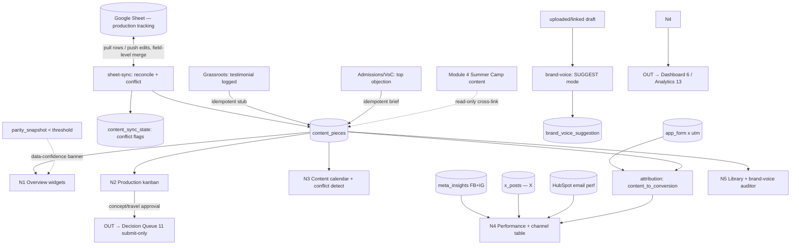

# Module 3: Content & Thought Leadership — Plan Spec
> Status: spec / ready-to-build · Owner: Content Owner (Operator) · PRD §3 Module 3 (lines 295–397)
> Source of truth: **Google Sheet** (production tracking, synced read+write) · **HubSpot** (email perf) · **Meta Business Suite** (FB+IG) · **X/Twitter API** (X) · **Supabase `app_form × UTM`** (per-piece conversion attribution)
> RBAC: **Operator** = Content Owner (read/write own module, **submit-only** to Decision Queue) · **Leader** approves/kills concepts + founder travel · **Admin** (Marketing Lead) full read/write · camp content read-only (Module 4)

---

## 0. Build-on-this (existing backbone/tables/connectors to reuse, not duplicate)

| Capability | Where | Reuse for Content |
|---|---|---|
| Stand-in Google Sheets content feed | `lib/dev/catalog.ts` → `content_sheet` (zone=standin, `_standIn`/`_source`) | The sheet side of the bidirectional sync; promote to a **real mirrored table** + a stand-in remote |
| Stand-in social feeds | `content` of `meta_insights` (FB+IG), `x_posts` (X) in `catalog.ts` | Performance channel rows — kept **separate** (Meta vs X), joined on `utm_campaign` |
| UTM join spine | `lib/seed/campaigns.ts`, `families.utm_campaign` (app-authoritative attribution) | Per-piece content-to-conversion (`content_pieces.utm_campaign → families.utm_campaign → app_form`) |
| Per-field conflict + parity pattern | `lib/sync/reconcile.ts`, `lib/parity.ts`, `field_state` table | Template for `content_sync_state` (field-level merge, conflict flag, echo-suppression) |
| Idempotency ledger | `processed_events` (`source,event_id`) | Cross-link stubs (Grassroots testimonial / VoC objection) fire **exactly once** |
| Durable outbound | `lib/sync/outbox-worker.ts`, `sync_outbox` | Push Hub-side edits back to the Google Sheet |
| Data-confidence banner | `parity_snapshot` < threshold → banner (PRD §4) | Module 3 consumes HubSpot (email) → must render the banner |
| Budget workstream | `budget_workstream` key `thought_leadership` | Content/founder spend rolls here (Module 10); no Google Sheet for budget |
| HubSpot connector | `lib/connectors/hubspot.ts` | Email send performance (open/click/unsub per email) |
| In-app dev docs | `lib/dev/catalog.ts`, `/dev/*` | Register the 4 new tables here |
| Module registry | `lib/modules.ts` (`{n:3, slug:"content", tint:"violet"}`) | Sidebar nav + routing already exist — do not re-add |

**No backbone table is edited.** All new tables are additive (`0003_content.sql`).

---

## 1. Expert-panel synthesis

**Roster (pared to 9 — full asks in `~/.claude/skills/gt-hub-content-panel/SKILL.md`):**

| Persona | Order | Lens | Falsifiable ask |
|---|---|---|---|
| Priya Menon — editorial / content-ops SME | 1st | Real Content-Owner flow | The 6 pre-loaded productions render from a query, not hard-coded |
| Tobias Hed — Google-Sheets bidirectional-sync eng *(PRIMARY source)* | 1st | Two-way sync, no orphan | Same-row edit both sides → conflict in `content_sync_state`, not a clobber |
| Lucia Ferraro — social-data specialist (Meta + X) | 1st | Two **separate** APIs | Channel table shows X, FB, IG as distinct rows; no merged "social" |
| Marcus Bell — content analytics / attribution analyst | 1st | Conversion, not vanity | `content_to_conversion` = `app_form × utm`; missing UTM = `(not set)`, never dropped |
| Devon Park — backbone / integration eng | 2nd | SSOT / RBAC / idempotency | New tables carry grants + catalog entry; re-delivered stub fires once |
| Ravi Anand — brand-voice / LLM eng | 2nd | Suggest, never gate | Draft with N suggestions still publishes; replay is deterministic |
| Maya Lindqvist — product / UX designer (kanban+calendar) | 2nd | **"don't ship if unusable"** | Every sub-view has empty/loading/error/**conflict**; drag writes back to sheet |
| Elena Schwartz — privacy & compliance counsel | 2nd | **"don't ship"** — minors' PII | `grassroots_stub` needs a consent/usage-rights flag before `scheduled` |
| Dr. Aisha Rahman — causal / decision scientist | 3rd | **"don't trust it"** | 42% is a **measured** ratio that varies with the seed, never a constant |

**Convergent:** the bidirectional Google Sheet sync is the module's defining contract — neither system orphaned; X must stay a distinct, conversion-weighted channel; the brand-voice auditor suggests and never gates; content-to-conversion must be a real `app_form × UTM` join.

**Divergent (surfaced, not averaged):**
- *Sheet as SoT (Hed/Menon — keep the Content Owner in her sheet, Hub mirrors)* vs *Hub as SoT (Park — backbone honesty)* → **resolved: Google Sheet stays source of truth for production status; Hub mirrors with field-level merge + a conflict queue; Hub-side writes push back via `sync_outbox`.**
- *Brand-voice as quality gate (would lift consistency)* vs *suggest-only (Ravi/PRD)* → **resolved: SUGGEST mode only; advisory rows, never blocks a status transition.**

**Risks (ranked, sourced):**
1. **Sync orphans/clobbers a row** (Hed) — violates "neither system orphaned".
2. **42% shipped as a hard-coded headline** (Rahman) — fabricated-as-measured.
3. **FB/IG/X blended into one "social"** (Ferraro) — double-count + erases X's role.
4. **Top-performer ranks reach not conversion; missing-UTM dropped** (Bell).
5. **Auditor gates publish** (Ravi) — non-blocking feature becomes a bottleneck.
6. **Auto-stubbed testimonial carries a minor's PII, publishable by default** (Schwartz).
7. **Kanban/calendar not operable (no drag write-back / conflict state)** (Lindqvist).
8. **Cross-link stub fires twice / camp content writable here** (Park).

**Open:** see §8.

---

## 2. Workflow — sub-views as nodes (data-in / processing / data-out)

**Cross-cutting (apply to every node):** SSOT per §3 source map · reconciliation = field-level merge + conflict queue (`content_sync_state`) · RBAC = Operator read/write + submit-only DQ, Leader approves, camp read-only · data-confidence banner on HubSpot-fed widgets · cross-links idempotent.

### N1 — Overview (composable dashboard)
| | |
|---|---|
| **Data in** | `content_pieces` (status, owner, type, due/publish dates, source) · `meta_insights` · `x_posts` · HubSpot email · `app_form × utm` (attribution) · manual: Substack subs, podcast listens · `parity_snapshot` |
| **Processing** | Compute the 11 PRD widgets: productions-in-flight + on-track ratio, this-week publish schedule, top-performing (by **conversion**), Substack subs+growth, X engagement (flagged "42% conversion engine"), FB+IG engagement, AGL podcast listens, content-to-conversion, founder content in flight (Pam/Joe/advisors), recently captured testimonial assets, brand-voice suggestion count |
| **Data out** | Composable widget grid; data-confidence banner if parity < threshold |

### N2 — Production pipeline (kanban)
| | |
|---|---|
| **Data in** | `content_pieces` where status ∈ {concept, in_production, review, scheduled, published}; filters: channel, owner, persona_target, status |
| **Processing** | Columns **Concept → In production → Review → Scheduled → Published**; card move = status write → `sheet-sync` push to Google Sheet; **camp cards read-only** (cross-link to Module 4); `grassroots_stub` requires consent flag before leaving `concept` (Schwartz) |
| **Data out** | Kanban board (card: name, owner, type, due date, deliverable link, attachments) with empty/loading/error/conflict states; sheet row updated |

### N3 — Content calendar (month grid)
| | |
|---|---|
| **Data in** | `content_pieces` with `publish_date`, `channel` |
| **Processing** | Month grid color-coded by 7 channels (Substack, X, Instagram, Facebook, Podcast, Email, YouTube); **drag-to-reschedule** writes new date via `sheet-sync`; **conflict indicator** when > N pieces ship same day/channel |
| **Data out** | Color-coded calendar with conflict badges; rescheduled date persisted both sides |

### N4 — Performance
| | |
|---|---|
| **Data in** | `meta_insights` (FB+IG) · `x_posts` (X) · HubSpot (email open/click/unsub) · `app_form × utm` (conversion) · manual (Substack/podcast) joined on `utm_campaign` |
| **Processing** | Per-piece reach/clicks/**conversion-attributed**; channel breakdown as **distinct rows** (X, Facebook, Instagram, Substack, Podcast, Email — never a blended "social"); X conversion ratio **measured**; top + bottom performers + "what worked" themes |
| **Data out** | Per-piece metrics table; channel performance table; top/bottom leaderboard; content-to-conversion report |

### N5 — Content library + brand-voice auditor
| | |
|---|---|
| **Data in** | `content_pieces` where status=published; tags (persona, tier, channel, type, format) · uploaded/linked draft |
| **Processing** | Searchable flat archive (v1, no repurposing flags) · brand-voice **SUGGEST mode**: AiAuditor → inline `brand_voice_suggestion` rows (record-replay for demo); **non-blocking** — never gates a status transition |
| **Data out** | Searchable library; inline suggestion list (suggested/accepted/dismissed) |

---

## 3. Data model touchpoints (additive — `0003_content.sql`; NO backbone edits)

**Reads:** `families` (`utm_campaign`, app_form attribution) · `meta_insights`, `x_posts`, `ga4_days` (stand-in social) · `budget_workstream` (`thought_leadership`) · `parity_snapshot` · HubSpot email (connector).

**`content_pieces`** (global; the Hub mirror of the Google Sheet + cross-link stubs)
| column | type | notes |
|---|---|---|
| `id` | uuid pk | |
| `sheet_row_id` | text unique | maps to the Google Sheet row (sync key) · tag `key`,`idem` |
| `title` | text | piece name |
| `owner` | text | responsible person (Pam/Joe/advisor/Content Owner) |
| `type` | text | video \| podcast \| article \| social \| email |
| `status` | text | concept → in_production → review → scheduled → published |
| `channel` | text | substack \| x \| instagram \| facebook \| podcast \| email \| youtube |
| `persona_target` | text | filter axis |
| `due_date` / `publish_date` | date | pipeline + calendar |
| `deliverable_link` | text | asset URL |
| `attachments` | jsonb | linked files |
| `utm_campaign` | text nullable | attribution join → `families.utm_campaign`; missing → `(not set)` · tag `key` |
| `source` | text | sheet \| grassroots_stub \| voc_brief \| camp_xref |
| `origin_ref` | uuid nullable | cross-link source id (testimonial / objection / camp) · tag `fk` |
| `consent_status` | text | required≠ok blocks advance past concept for `grassroots_stub` (minors) |
| `program_key` | text nullable | `summer_camp` rows are **read-only** here (Module 4 owns) |
| `row_version` | int | optimistic concurrency |
| `sheet_updated_at` / `app_updated_at` / `last_synced_at` | timestamptz | merge timestamps |
| `created_at` | timestamptz | |

**`content_sync_state`** (machinery; field-level bidirectional reconciliation — mirrors `field_state`)
| column | type | notes |
|---|---|---|
| `piece_id` | uuid → `content_pieces.id` | tag `fk` |
| `sheet_row_id` | text | tag `key` |
| `field` | text | synced field |
| `app_value` / `sheet_value` | text | both retained on conflict |
| `app_updated_at` / `sheet_updated_at` | timestamptz | merge inputs |
| `in_parity` | boolean | app==sheet |
| `conflict` | boolean | both edited since last sync → flagged, never clobbered |
| `last_checked_at` | timestamptz | |

**`content_metrics`** (rollup; per-piece × channel performance — raw social stays in stand-ins)
| column | type | notes |
|---|---|---|
| `id` | uuid pk | |
| `piece_id` | uuid → `content_pieces.id` | tag `fk` |
| `channel` | text | x \| facebook \| instagram \| substack \| podcast \| email |
| `source` | text | meta \| x_api \| hubspot \| manual |
| `reach` / `impressions` / `clicks` / `engagements` | numeric | native per-channel (no blend) |
| `conversions_attributed` | int | from `app_form × utm` |
| `period` | date | weekly grain |

**`brand_voice_suggestion`** (advisory; SUGGEST mode — non-blocking)
| column | type | notes |
|---|---|---|
| `id` | uuid pk | |
| `piece_id` | uuid → `content_pieces.id` | tag `fk` |
| `draft_ref` | text | uploaded/linked draft |
| `span_start` / `span_end` | int | inline offset |
| `original_text` / `suggested_text` | text | rewrite |
| `rationale` | text | brand-voice reason |
| `status` | text | suggested \| accepted \| dismissed (never gates publish) |
| `created_at` | timestamptz | |

**Grants:** `app_rw` read/write, `staff_ro` read on all four (mirror `0001_backbone.sql`). **Register** all four in `lib/dev/catalog.ts` with zones + field tags (PII tags on `grassroots_stub` minor fields).

---

## 4. Cross-module contracts

**Inbound (consumed):**
| Trigger | Source | Effect | Idempotency |
|---|---|---|---|
| Testimonial logged | Grassroots (2) | Auto-stub `content_pieces` (`source=grassroots_stub`, `status=concept`, `type=video/social`, `consent_status=required`) | `processed_events(source='grassroots', event_id=testimonial_id)` → one stub |
| Top objection | Admissions/VoC (9) | Auto-create content brief (`source=voc_brief`, `status=concept`) | one brief per objection id |
| Camp content visibility | Summer Camp (4) | Read-only cross-link row (`source=camp_xref`, `program_key=summer_camp`) — **no write** | n/a (read-only) |
| Sync parity drop | CRM Ops (7) / `parity_snapshot` | Data-confidence banner on HubSpot-fed widgets | n/a |

**Outbound (emitted):**
| Payload | Destination | Trigger |
|---|---|---|
| `content_to_conversion` (piece → applicants, UTM) | Dashboard (6) + Analytics (13) | on Performance compute |
| Concept approve/kill · founder appearance/travel | Decision Queue (11) — **Operator submits, cannot view/act** | Content Owner raises |
| Content/founder spend | Budget (10) `thought_leadership` workstream actual | spend logged |

---

## 5. Files to build (additive, real paths)

| File | Purpose |
|---|---|
| `hub/supabase/migrations/0003_content.sql` | `content_pieces` + `content_sync_state` + `content_metrics` + `brand_voice_suggestion` + grants |
| `hub/lib/content/sheet-sync.ts` | Bidirectional Google Sheet sync: pull rows → upsert, push Hub edits → sheet, field-level merge + **conflict policy** + echo-suppression (rides `sync_outbox`) |
| `hub/lib/content/attribution.ts` | `content_to_conversion` via `content_pieces.utm_campaign → families.utm_campaign → app_form`; `(not set)` for missing UTM; **measured X conversion ratio** |
| `hub/lib/content/metrics.ts` | Channel performance — **separate** Meta (FB+IG) + X + HubSpot email + manual Substack/podcast; single metric definitions |
| `hub/lib/content/brand-voice.ts` | `Auditor` interface, `AiAuditor` (structured output, record-replay), rules floor; **SUGGEST-only, non-blocking** |
| `hub/lib/content/cross-links.ts` | Idempotent consumers: Grassroots testimonial → stub; VoC objection → brief; camp read-only xref |
| `hub/app/m/content/page.tsx` | Module shell + tab bar (5 sub-views) under existing `m/[slug]` routing |
| `hub/app/m/content/_components/{Overview,PipelineKanban,ContentCalendar,Performance,ContentLibrary,BrandVoicePanel}.tsx` | The 5 sub-views (+ auditor panel) with empty/loading/error/conflict states |
| `hub/app/api/content/sheet-sync/route.ts` | Sync trigger / webhook (fast ACK, idempotent) |
| `hub/lib/seed/generate.ts` (extend) | Seed the 6 named productions + edge cases: **sync conflict**, **missing-UTM**, **grassroots stub (minor consent)**, calendar same-day **conflict** |
| `hub/lib/seed/invariants.ts` (extend) | New invariants (§6) |
| `hub/lib/dev/catalog.ts` (extend) | Register the 4 new tables (zones + field/PII tags) |

---

## 6. Provable invariants (against seeded data)

1. **No orphan, no clobber (bidirectional):** a row added in the sheet appears in `content_pieces`; a Hub status change appears in the sheet; a both-sides edit yields a `content_sync_state` row with `conflict=true` and **both values retained** — never a silent overwrite.
2. **SSOT honored:** production status reads `content_pieces` (Google-Sheet-mirrored); FB/IG read `meta_insights`, X reads `x_posts` (**separate**); email perf reads HubSpot; conversion reads `app_form × utm` — **not** HubSpot/Meta-reported leads.
3. **Attribution is measured, not constant:** the "X = 42% conversion" figure = `count(attributed conversions from X content) ÷ count(attributed conversions)`; it **changes when the seed changes**; no hard-coded 42 in code.
4. **UTM honesty:** a piece with no UTM persists as `(not set)`, is counted, and is never dropped from leaderboards.
5. **Auditor non-blocking:** a piece with N `brand_voice_suggestion` rows still transitions `review → scheduled → published`.
6. **RBAC denial:** Operator (Content Owner) cannot view/act on the Decision Queue (submit-only); a camp (`program_key=summer_camp`) card cannot be edited here.
7. **Cross-link idempotent:** a re-delivered Grassroots testimonial creates **exactly one** stub; a VoC objection creates exactly one brief.
8. **Consent gate (minors):** a `grassroots_stub` piece cannot advance past `concept` until `consent_status='ok'`.
9. **Calendar conflict detection:** > N pieces on one day/channel renders a conflict indicator.
10. **Widget Inputs→Outputs:** each of the 11 Overview widgets maps to a real query (no hard-coded lists).

---

## 7. Demo script (clickable)

1. **Watch it propagate:** add a piece in the Google Sheet stand-in → it appears in the kanban **Concept** column; move the card to **Scheduled** in the Hub → the sheet row's status updates (bidirectional).
2. **Conflict, not clobber:** edit the same piece's status in the sheet *and* the Hub between syncs → a conflict appears in the sync state with both values, not a silent overwrite.
3. **Calendar:** drag two X posts onto the same day → conflict indicator fires; the moved date persists to the sheet.
4. **Performance / real 42%:** open Performance → X, Facebook, Instagram show as distinct channel rows; the X conversion ratio is computed (and changes if you re-seed).
5. **Cross-link:** log a testimonial in Grassroots → a `grassroots_stub` card appears here in Concept, **flagged for consent** (can't advance until consent=ok).
6. **Auditor non-blocking:** upload a draft → inline brand-voice suggestions appear; publish the piece anyway.
7. **RBAC denied:** as the Content Owner, open the Decision Queue → denied (submit-only); submit a "founder travel" approval.
8. **Data-confidence banner:** drop sync parity below threshold → the banner appears on the email-fed widgets.

---

## 8. Open questions / assumptions

- **Assumption:** Google Sheet remains the **source of truth** for production status; the Hub mirrors and pushes back. Conflict policy = field-level last-writer-wins by timestamp **plus** a retained conflict row for human resolution (not auto-merge of free text).
- **Assumption:** in the build, Meta/X/Sheets are **stood-in** (`meta_insights`, `x_posts`, `content_sheet` fixtures) modeled as live; swap to real APIs later. Substack subscriber count + podcast listens are **manual v1** (API later). Brand-voice LLM runs behind an `Auditor` interface with **record-replay** for a deterministic demo.
- **Assumption:** v1 library is **flat** — no repurposing flags (deferred to v2).
- **Open:** conflict-resolution UX — who arbitrates a `content_sync_state` conflict (Content Owner vs Admin), and does an unresolved conflict block the sheet push?
- **Open:** consent/usage-rights source for auto-stubbed testimonials — does the flag come from Grassroots' capture, or must the Content Owner set it here?
- **Open:** the "42% conversion engine" denominator — conversions attributed across **all** channels, or only **content-attributable** conversions? (changes the ratio).
- **Open:** founder-content lane — is it a kanban **swimlane** (Pam/Joe/advisors) or a `type`/`owner` filter on the existing board?
- **Open:** YouTube appears in the calendar's 7 channels but not the Inputs list — is it a manual channel in v1?
