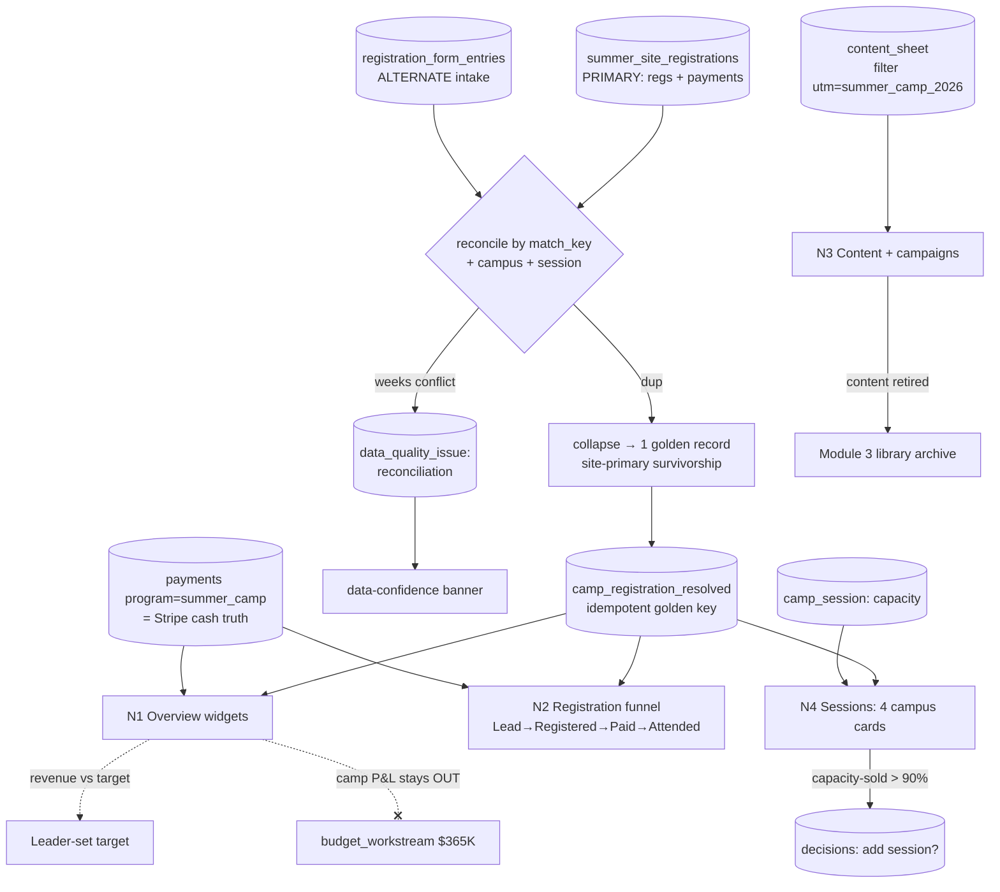

# Module 4: Summer Camp — Plan Spec

> Status: spec / ready-to-build · Owner: the Content Owner (Operator) · PRD §3 Module 4 (lines 399–476)
> Source of truth: **summer.gt.school** (primary — registrations + payments) **+ registration form** (alternate intake, Supabase-backed) — **both read, reconciled by `match_key`, no double-count**. Payments reconcile to Stripe.
> RBAC: Content Owner = **Operator** (read/write camp, submit to Decision Queue, cannot view/act on the full queue) · **Leader** = full read + approve pricing/session changes + set the revenue target · **Admin** (Marketing Lead) = full access except *deciding*. Roster (minors' PII) is role-gated to camp-Operator + Leader.

---

## 0. Build-on-this (existing backbone/tables/connectors to reuse, not duplicate)

| Capability | Where | Reuse for Summer Camp |
|---|---|---|
| Dual-source stand-in feeds | `summer_site_registrations`, `registration_form_entries` (`lib/dev/catalog.ts`, `lib/seed/types.ts`) | The two camp sources, already shaped with `match_key`, `campus_key`, `weeks`, `status`, `paid`, UTM |
| Reconcile thread + match-key identity | `RECONCILE_THREAD` (`lib/dev/catalog.ts`), `matchKey` in `lib/connectors/SourceConnector.ts`, `lib/sync/reconcile.ts` | Collapse site ⇄ form duplicates; flag conflicting weeks |
| Program isolation (RLS) | `withProgram`/`withoutProgram` in `lib/db.ts`; `programs` seed `('summer_camp','Summer Camp')` | Route camp rows into the `summer_camp` store only |
| Money facts + idempotency | `payments` (RLS), `processed_events`, `lib/payments.ts` | Camp revenue = succeeded payments for `program=summer_camp`; exactly-once |
| Capacity inputs | `children` (seats count children), `enrollments` (`amount`, `paid`), `program_membership` | Per-campus registered/paid/roster |
| Campus catalog + price | `SUMMER_CAMPUSES` (Georgetown 2wk·60, Austin 2wk·48, Dallas 2wk·40, Houston 1wk·30), `SUMMER_WEEK_PRICE=1450` (`lib/seed/dictionaries.ts`) | The 4 campus cards + amount math |
| Content pipeline | `content_sheet` (`status`, `utm_campaign`) — Module 3 spine | Filter to the summer-camp tag (`utm_campaign='summer_camp_2026'`) |
| Parity / data-confidence | `parity_snapshot`, `data_quality_issue`, `lib/parity.ts` | Dual-source reconciliation drop → DQ issue + banner |
| Decision Queue | `decisions` (seed already has *"Add a 4th summer session at Austin?"*) | Pricing / add-or-close-session approvals; capacity>90% auto-suggest |
| Budget (DO NOT touch) | `budget_workstream` ($365K) | Camp is a **separate P&L** — must stay out of this sum |
| Dev docs | `lib/dev/catalog.ts`, `/dev/*` | Register any additive table here with zone + PII field tags |

**No backbone edits.** Capacity (`camp_session`), the reconciled golden record (`camp_registration_resolved`), and attendance live in one **additive** migration (§3).

---

## 1. Expert-panel synthesis (pared to 9 — see `gt-hub-summer-camp-panel`)

| Persona · order | Lens | Falsifiable ask |
|---|---|---|
| Priya Nandakumar — camp/program-ops SME · 1st | Per-campus reality | Capacity/roster/waitlist computed **per campus per session**; a query returns the 4 distinct capacities, not one aggregate |
| Marcus Lee — summer.gt.school data-source · 1st | Both feeds, real states | Funnel/capacity read site **and** form; form-only rows appear; `cancelled` excluded from capacity-sold |
| Sara Kim — reconciliation/idempotency eng · 1st | No double-count | Same `match_key` → 1 resolved row; re-run is a no-op; week conflict resolved by written rule **and** raised as a DQ issue |
| Devon Park — backbone/integration eng · 1st | Isolation + banner | Camp rows route only into `summer_camp` (RLS); cross-program read rejected; reconciliation drop trips the banner |
| Dr. Elena Schwartz — privacy counsel (minors) · 2nd | **"Don't ship"** | Roster role-gated, minimal fields, non-owner Operator **denied** (proven); COPPA/FERPA note |
| Tomás Rivera — revenue/FP&A · 2nd | Separate P&L | Camp $ doesn't change `sum(recommended)==365000`; revenue-per-family ÷ **distinct** families; target is Leader-set |
| Hannah Okafor — capacity/waitlist modeler · 2nd | Sold % + overflow | Capacity-sold % per campus from data; waitlist = `status='waitlisted'`; overflow alert when over capacity |
| Maya Lindqvist — product/UX · 2nd | **Executability** | 4 reachable sub-views; merged duplicate visibly labeled; empty/loading/conflict/duplicate-merged states |
| Dr. Aisha Rahman — attribution/decision sci · 3rd | **"Don't trust it"** | Top-channel = measured %, organic/owned only, **no ad-spend row** (ads paused), sums to 100% |

**Convergent:** the module lives or dies on **dual-source reconciliation** — one resolved registration per `match_key`+session, counted once everywhere; camp is a self-contained P&L; per-campus granularity is non-negotiable.
**Divergent → resolved:** *site-primary survivorship* (Lee) vs *latest-write* (Kim) → **summer.gt.school wins on payment + status; on a `weeks` conflict take the site value AND raise a `data_quality_issue`** (never average). Revenue SSOT (Rivera) *site `amount`* vs *Stripe* → **Stripe `payments` is the cash truth; site `amount` is the expected/booked figure**; show both, reconcile.
**Risks (ranked):** (1) double-count across feeds; (2) minors' PII in roster; (3) camp P&L leaking into $365K; (4) per-campus reality lost to aggregation; (5) fabricated/paid-ads "top channel"; (6) reconciliation correct but not legible in the UI.
**Open:** source of `Attended`; whether leadership opts camp into Module 10; age-group slice source.

---

## 2. Workflow — sub-views as nodes (data-in / processing / data-out)

### Node table (one per PRD sub-view + the cross-cutting reconciler)

| Node | Data in | Processing | Data out |
|---|---|---|---|
| **N0 Reconcile (cross-cutting)** | `summer_site_registrations` (primary) + `registration_form_entries` (alternate); `match_key`, `campus_key`, `session_start`, `weeks`, `status`, `paid` | Identity by `match_key`; **golden key** = hash(`match_key`+`campus_key`+`session_start`) → idempotent upsert; **survivorship**: site wins on payment/status; `weeks` conflict → take site + raise `data_quality_issue('reconciliation')`; `cancelled` dropped from active | `camp_registration_resolved` (one row per child·session, `source_feeds[]`, `reconciled=true`); DQ issues; parity input → banner |
| **N1 Overview** (4a) | `camp_registration_resolved`, `payments` (program=summer_camp), `camp_session`, `content_sheet`, organic `source`/UTM, Leader target | Compute widgets: capacity-sold % (agg + per campus), regs-this-week, paid-vs-lead (registered→paid), days-to-start countdown, **top channel (organic/owned only)**, content shipped this week, **revenue vs target**, waitlist/overflow count | Composable widget grid (aggregate + per-campus); each widget = one Input→Output number |
| **N2 Registration funnel** (4b) | resolved registrations + `payments` + attendance | Stage rollup **Lead → Registered (unpaid) → Paid → Attended**; drop-off % per stage; slice by campus / age group; filter by `source` | Funnel with per-stage drop-off %, sliceable + filterable; counts are reconciled (each family once) |
| **N3 Content + campaigns** (4c) | `content_sheet` filtered to `utm_campaign='summer_camp_2026'` (mirrors Module 3) | Camp-only kanban (idea→drafting→review→scheduled→published); active email sequences + social pushes for camp; on retire → archive payload to Module 3 library | Camp content pipeline view; "content shipped this week" count feeds N1; retired-card archive event |
| **N4 Sessions (campus cards)** (4d) | `camp_session` (capacity), `camp_registration_resolved`, `payments`, `children` | Per campus: name, dates, duration (1wk/2wk), capacity, registered, paid, waitlist; drill-in → **roster + attendance** (role-gated, minors PII) | 4 campus cards (Georgetown/Austin/Dallas/Houston) + gated roster/attendance drill-in |

**Cross-cutting honored on every node:** SSOT (site primary / Stripe cash / no HubSpot field values) · dual-source reconciliation (N0) · RBAC (Operator submit-not-view; roster gated) · data-confidence banner on reconciliation/parity drop · **no paid-acquisition view** (ads paused) · **camp P&L isolated from Module 10**.

---

## 3. Data model touchpoints (additive migration — touches NO backbone table)

**Read (existing):** `programs`, `families`, `children`, `program_membership`, `enrollments`, `payments`, `summer_site_registrations`, `registration_form_entries`, `content_sheet`, `parity_snapshot`, `data_quality_issue`, `decisions`. **Written (existing):** `data_quality_issue` (reconciliation conflicts), `decisions` (Operator-submitted proposals).

`supabase/migrations/0003_summer_camp.sql` (additive only):

**`camp_session`** — the 4 campuses' capacity (makes campus cards + capacity-sold % real, not a fixture constant)
| column | type | notes |
|---|---|---|
| `id` | uuid pk | |
| `campus_key` | text unique | `georgetown` / `austin` / `dallas` / `houston` |
| `name` | text | display name |
| `session_start` | date | session start |
| `weeks` | int | 1 or 2 |
| `capacity` | int | 60 / 48 / 40 / 30 |
| `status` | text | `open` / `waitlist` / `closed` |

**`camp_registration_resolved`** — the dual-source golden record (one row per child·session; the no-double-count guarantee)
| column | type | notes |
|---|---|---|
| `id` | uuid pk | |
| `program_id` | uuid → `programs.id` | RLS scope = `summer_camp` |
| `resolved_key` | text **unique** | hash(`match_key`+`campus_key`+`session_start`) — idempotent dedupe (Kim, Park) |
| `family_id` / `child_id` | uuid → families/children | resolved identity (children = seats) |
| `campus_key` | text → `camp_session.campus_key` | |
| `weeks` | int | survivorship value (site-primary on conflict) |
| `amount` | numeric | booked = `weeks × 1450`; cash truth = `payments` |
| `funnel_stage` | text | `lead` → `registered` → `paid` → `attended` |
| `source_feeds` | text[] | `{summer_site}` / `{registration_form}` / **both** when merged |
| `conflict` | boolean | weeks disagreed across feeds → also a `data_quality_issue` |
| `created_at` | timestamptz | |

**`camp_attendance`** — source for the `Attended` funnel stage + roster drill-in (minors PII)
| column | type | notes |
|---|---|---|
| `id` | uuid pk | |
| `program_id` | uuid → `programs.id` | RLS scope = `summer_camp` |
| `registration_id` | uuid → `camp_registration_resolved.id` | |
| `attended` | boolean | from summer.gt.school roster |
| `marked_at` | timestamptz | |

Grants: `app_rw` read/write, `staff_ro` read. RLS `program_id = summer_camp` + FORCE. Register all three in `lib/dev/catalog.ts` (zone `scoped`; PII tags on `family_id`/`child_id`/attendance).

---

## 4. Cross-module contracts (inbound consumed + outbound emitted)

| Direction | Edge | Trigger → payload |
|---|---|---|
| **Outbound → Module 3 (Content)** | Camp content archives to Module 3's library on retire | `content_sheet` card tagged `summer_camp_2026` set to retired → archive payload `{piece, owner, utm_campaign, retired_at}` to the library |
| **Outbound → Module 11 (Decision Queue)** | Pricing / add-or-close-session approval; capacity-sold > 90% auto-suggest | Operator submits `decisions{question, raised_by, recommendation, budget_ask?}`; capacity rule emits *"Add a 4th `<campus>` session?"* (seed precedent: Austin) |
| **Outbound (negative) → Module 10 (Budget)** | Camp is a **separate P&L line** | Camp revenue/spend **does not** roll into `budget_workstream`; `sum(recommended)==365000` unchanged — **unless leadership decides otherwise** (a Decision Queue opt-in flips it on) |
| **Outbound → all modules** | Data-confidence banner | Dual-source reconciliation parity drop / unresolved week conflict → `data_quality_issue` + banner |
| **Inbound from N0 reconcile** | Resolved registrations feed N1/N2/N4 | one golden row per child·session |

---

## 5. Files to build (all additive, mapped to real paths)

| File | Purpose |
|---|---|
| `supabase/migrations/0003_summer_camp.sql` | `camp_session` + `camp_registration_resolved` + `camp_attendance` + grants/RLS |
| `lib/camp/reconcile.ts` | site ⇄ form reconcile: `match_key` identity, golden `resolved_key`, site-primary survivorship, week-conflict → `data_quality_issue` (idempotent) |
| `lib/camp/metrics.ts` | single definitions: capacity-sold %, registered/paid/waitlist per campus, revenue (Stripe) vs booked vs **target**, revenue-per-(distinct)-family, organic top-channel % |
| `app/m/summer-camp/page.tsx` (+ tabs) | the 4 sub-views: Overview / Funnel / Content+campaigns / Sessions |
| `app/m/summer-camp/_components/CapacityCard.tsx` | per-campus card: capacity/registered/paid/waitlist + drill-in |
| `app/m/summer-camp/_components/RosterDrawer.tsx` | **role-gated** roster + attendance (minors PII; non-owner denied) |
| `app/m/summer-camp/_components/CampFunnel.tsx` | Lead→Registered→Paid→Attended with drop-off %, campus/age slice, source filter |
| `lib/dev/catalog.ts` (extend) | register the 3 new tables with zone + PII tags |
| `lib/seed/generate.ts` (extend) | seed resolved records incl. **dual-source duplicate** + **week-conflict** + a `waitlisted`/`cancelled` edge case |
| `lib/seed/invariants.ts` (extend) | new invariants (§6), building on existing #9 dual-source |
| `tests/summer-camp.test.ts` | reconcile idempotency, no-double-count, per-campus capacity, revenue math, P&L isolation, RBAC denial |

---

## 6. Provable invariants (against seeded data)

1. **No double-count:** a family on **both** site + form (same `match_key`+campus+session) → exactly **1** `camp_registration_resolved` row, counted once in capacity, funnel, and revenue; `source_feeds = {summer_site, registration_form}`.
2. **Reconcile is idempotent:** re-running `reconcile.ts` produces no new rows (stable `resolved_key`).
3. **Conflict surfaced, not averaged:** a `weeks` disagreement resolves to the **site** value AND raises a `data_quality_issue('reconciliation')` with `conflict=true`.
4. **Per-campus capacity is real:** capacity-sold % per campus = `paid ÷ camp_session.capacity`; the 4 campuses show distinct capacities (60/48/40/30); aggregate = sum, not an average that hides a sold-out campus.
5. **Revenue is measured:** camp revenue = `sum(succeeded payments where program=summer_camp)`; revenue-per-family ÷ **distinct** families; revenue-vs-target reads a Leader-set target — none hard-coded.
6. **P&L isolation:** adding camp revenue/spend leaves `sum(budget_workstream.recommended)==365000` unchanged.
7. **Program isolation (RLS):** camp rows route only into the `summer_camp` store; a cross-program read/write is rejected.
8. **RBAC + minors:** a non-camp Operator is **denied** the roster drawer (Decision Queue stays submit-not-view for Operators); roster shows minimal child fields.
9. **No paid-acquisition / honest channel:** the Overview has no ad-spend widget; top-channel % is organic/owned only and sums to 100% from real `source`/UTM.
10. **Waitlist/overflow:** `waitlist = count(status='waitlisted')` per campus; an over-capacity campus raises an overflow alert.

---

## 7. Demo script (clickable)

1. Open **Summer Camp → Sessions** → 4 campus cards show distinct capacity / registered / paid / waitlist (60/48/40/30).
2. Register the same child on **summer.gt.school** and the **registration form** → reconcile → it appears **once**, labeled "reconciled from site + form" (no double-count).
3. Create a **week conflict** across the two feeds → the resolved row takes the site value **and** a reconciliation issue appears + the data-confidence banner lights.
4. Open **Overview** → capacity-sold %, revenue vs target, waitlist, and **top channel (organic only — no ads)** render per campus + aggregate.
5. Open **Funnel** → Lead → Registered → Paid → Attended with drop-off %, sliced by campus / age group.
6. Open **Budget Tracker** → camp revenue/spend is **not** in the $365K — total still reconciles.
7. As a **non-camp Operator**, try the roster drawer → **denied** (minors PII gate); submit *"Add a 4th Austin session?"* to the Decision Queue → it lands but the full queue stays hidden.

---

## 8. Open questions / assumptions

- **`Attended` source:** assumes summer.gt.school provides a per-child attendance roster (modeled as `camp_attendance`); if unavailable, the funnel stops at Paid and Attended renders "not yet available."
- **`camp_session` as a table vs the `SUMMER_CAMPUSES` dict:** assumes a real additive table so capacity is editable + Leader-approvable; the dict stays the seed default.
- **Revenue SSOT on disagreement:** assumes **Stripe `payments` = cash truth**, site `amount` = booked/expected; both shown, difference reconciled — flag if a paid site reg has no matching payment.
- **P&L roll-in:** assumes camp stays OUT of Module 10 unless a Leader flips an explicit opt-in via the Decision Queue.
- **Age-group slice:** assumes age/grade comes from `children.grade`; if registration carries no child grade, the slice shows "(not set)", never dropped.
- **Identity for multi-child families:** assumes one resolved registration **per child per session** (seats count children), so a 2-child family is 2 registrations but 1 family in revenue-per-family.
- **Consent for minors:** assumes a parent-consent flag exists at the registration source; the roster view is gated regardless. The privacy seat blocks shipping the roster without it.
