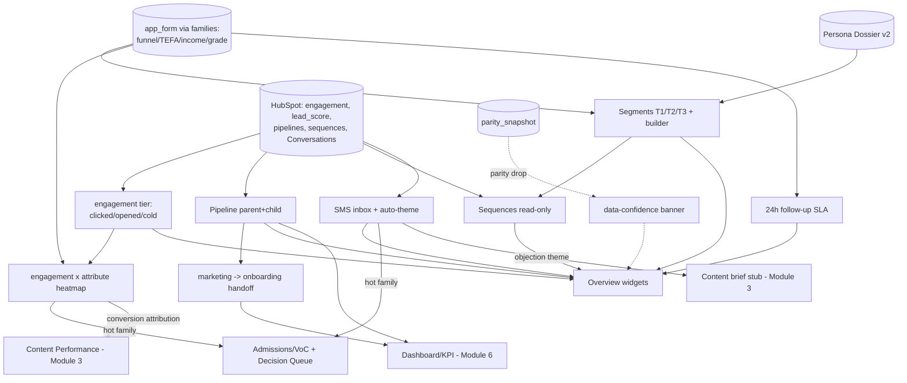

# Module 5: Nurture & Lifecycle — Plan Spec

> **Status:** spec / ready-to-build · **Owner:** the Marketing Lead (Admin) · **PRD §3 Module 5** (lines 478–618)
> **Source of truth:** **Supabase `app_form`** for funnel / TEFA / income / grade (NOT HubSpot field values) · **HubSpot** for engagement, pipelines (parent + child), sequences, lead score, Conversations/SMS · **Persona Dossier v2** for persona tag · tier = manual + rule-based
> **RBAC:** Admin (Marketing Lead) read/write · Leader full read + approve/kill sequence + comment on SLA miss + flag thread · Operator read-only · **SMS PII gated to Admin/Leader** (phone masked otherwise) · Decision Queue acts = Leader-only
> The most data-rich module — and the Hub's **reconciliation centre**. Engagement tier is the top conversion predictor (clicked → 52% commit vs. never-clicked 16%).

---

## 0. Build-on-this (existing backbone/tables/connectors to reuse, NOT duplicate)

| Capability | Where | Reuse for Nurture |
|---|---|---|
| `families` w/ split authority (app_form vs HubSpot columns) | `0001_backbone.sql`, `lib/dev/catalog.ts` | SSOT for funnel/TEFA/income/grade; segment + heatmap rows |
| `field_authority` (who-wins + `expected_unreliable`) | `0001_backbone.sql` (tefa/income/source flagged unreliable) | Proves the "read app_form, not HubSpot" rule programmatically |
| `enrollments` (= HubSpot deal, `stage`, RLS-scoped) | `0001_backbone.sql` | The **deal** half of the pipeline + handoff |
| `program_membership` + `withProgram` RLS | `0001_backbone.sql`, `lib/db.ts` | Scope pipeline/handoff reads per program |
| `parity_snapshot` + parity calc | `0001_backbone.sql`, `lib/parity.ts` | Data-confidence banner on this module |
| HubSpot connector + `matchKey` identity | `lib/connectors/hubspot.ts`, `lib/connectors/SourceConnector.ts` | Resolve SMS responder / engagement event → family |
| `decisions` (Decision Queue) | `0001_backbone.sql` | Hot-family flag + approve/kill-sequence land here |
| `data_quality_issue` | `0001_backbone.sql` | Cold-segment / scoring-gap alerts |
| In-app dev docs catalog | `lib/dev/catalog.ts`, `/dev/*` | Register the new nurture tables here (PII-tagged) |
| Seed generator + invariants | `lib/seed/generate.ts`, `lib/seed/invariants.ts` | Extend with engagement/pipeline/sms/sla edge cases |

**Backbone is frozen.** All new state ships as an **additive** `0003_nurture.sql`; no column is added to `families`/`enrollments`.

---

## 1. Expert-panel synthesis (nurture panel — `gt-hub-nurture-panel`, pared to 9)

| Persona | Lens | The catch it enforces |
|---|---|---|
| Renée Adler — lifecycle/CRM SME | Engagement scoring | Tier = clicked/opened/cold from HubSpot engagement **only**; 52%/16% split **measured** from `funnel_stage`/`enrollments`, not declared |
| Marcus Bell — HubSpot data specialist | Source reliability | funnel/TEFA/income/grade read `families` (app_form); **Sequences view has no write path** to HubSpot |
| Dr. Priya Nair — causal scientist | **"don't trust" seat** | Engagement ⟂ conversion fields (no circularity); every heatmap cell shows **n + CI**; **n < 25 suppressed** |
| Tara Whitfield — SLA-ops lead | Service levels | Clock starts at app_form funnel-entry; %=contacted_within_24h ÷ new_applicants; late-list is **owner-attributable** |
| Diego Marin — SMS/NLP theming eng | Classification honesty | Every thread ≥1 theme (else `untagged`); v1 keyword rules deterministic; v2 LLM behind swappable iface + record-replay |
| Sofia Reyes — RevOps/pipeline analyst | Pipeline math | Parent vs child kept separate; velocity from dated transitions; handoff conv = onboarded ÷ handed_off; **no double-count** |
| Elena Schwartz — privacy counsel | **"don't ship" seat (SMS PII / TCPA)** | Inbox PII gated to Admin/Leader; phone masked otherwise; STOP/opt-out suppresses; retention window |
| Maya Lindqvist — product/UX designer | **"can it be done" seat** | Heatmap + inbox are decidable + actionable on mobile; empty/loading/error/**small-cell** states everywhere |
| Devon Park — backbone/integration eng | SSOT + isolation | Additive `0003` only; idempotent cross-links (dedupe_key); banner consumes `parity_snapshot` |

**Convergent:** `app_form` is the SSOT and the heatmap is the centrepiece; engagement tier must be a *measured* predictor; SMS is the highest-PII surface in the whole Hub; cross-links out (hot family, objection, attribution, handoff) are this module's reason to exist.
**Divergent → resolved:** richer LLM SMS theming (Marin) vs. auditable/minimal-PII (Schwartz, Nair) → **v1 deterministic keyword rules shipped; v2 LLM behind a swappable `ThemeClassifier` interface with record-replay, gated to non-PII fields and Admin/Leader.** Heatmap depth (Adler) vs. small-cell honesty (Nair) → **render the cell but suppress + label `n<25`.**
**Top risks (ranked):** (1) SMS PII/TCPA consent — *don't ship* without gating + STOP suppression + retention (Schwartz); (2) heatmap circularity / fabricated findings (Nair); (3) SSOT violation reading HubSpot for funnel/TEFA/income/grade (Bell); (4) SLA clock/owner attribution wrong (Whitfield); (5) parent/child/handoff double-count (Reyes, Park); (6) sequences accidentally writable (Bell, Park); (7) heatmap/inbox undecidable — no action screen (Lindqvist); (8) SMS theme mislabel with no fallback/eval (Marin).

**Lindqvist's executability gate (each must be a reachable, legible screen):** the Segments **heatmap** (mobile-legible, cell = conversion% + n, small-cell suppressed, click → segment builder); the **SMS inbox** (filters: unread / haven't-heard-back / objection / hot-family; one-click flag-to-hot-family w/ confirm); the **SLA red-list** (owner named, one-click "mark contacted"); the **pipeline board** (stuck-in-stage badge, velocity tooltip). Each carries empty/loading/error states.

---

## 2. Workflow — sub-views as nodes (data-in / processing / data-out)

### Node table (data-in / processing / data-out)

| Node | Data in | Processing | Data out |
|---|---|---|---|
| **N1 Overview** (5a) | every node below + `parity_snapshot` | compose the 10 default widgets; each widget names its source table; banner if parity < threshold | T1/T2/T3 counts + reachability · tier mix · latest-send health · 24h SLA % · weekly SMS replies · top sequence · cold count · persona×engagement crosstab · pipeline stage distribution · weekly handoff count |
| **N2 Segments** (5b) | `families` (app_form: funnel/TEFA/income/grade), `family_geo`, `family_persona`, `hs_engagement`→tier, `nurture_segment(_member)` | build **T1** (messaging cohort), **T2** (~3,100, reps ~323 each, TX geo subset), **T3** (1,124 waitlist: ESA-planned / ESA-ineligible / no-indicator); **TEFA segments read-only/historical** (frozen 2026-06-01); compute **engagement-tier × attribute heatmap** (rows clicked/opened/cold × cols income/geo/persona/grade → conversion% with **n + CI, suppress n<25**); segment builder = attribute×engagement combo | segment panels + reachability % · heatmap matrix (cells = conv% + n) · custom audience → feeds N4 |
| **N3 Pipeline stages** (5c) | `contact_pipeline` (parent), `child_pipeline`, `pipeline_stage_transition`, `enrollments.stage` (deal), `program_membership` (RLS) | **parent** stage distribution + **stuck-in-stage** (days_in_stage > N) + **velocity** (avg days between dated transitions); **child** stages + parent↔child linkage; **handoff** count (weekly/monthly/cumulative), handoff conversion (onboarded ÷ handed_off), handoff velocity; **parent vs child never merged** | stage distribution bars · stuck alerts · velocity · handoff metrics → N1 + Dashboard |
| **N4 Sequences** (5d) | `sequence`, `sequence_step_stat` (HubSpot, **read-only**) | list active by type (welcome/nurture/re-engagement/event/waitlist); per-step open/click/conversion; health flag if perf < threshold; **approve/kill = Decision Queue submission, NOT a HubSpot mutation** | sequence health cards · health flags · approve/kill → `decisions` |
| **N5 SMS inbox** (5e) | `sms_thread`, `sms_message` (HubSpot Conversations / GT Anywhere), `matchKey`→family | threads w/ filters (unread / haven't-heard-back / objection / hot-family); **auto-theme**: v1 keyword rules (cost/price/tuition→Tuition, …), v2 LLM via `ThemeClassifier`; quick-reply snippets; **flag-to-hot-family**; **PII gated, STOP suppresses** | themed threads · hot-family flag → N-Xlinks · objection theme → Content stub |
| **N6 SLA tracker** (5f) | `families` funnel-entry ts (app_form), `sla_followup` (first_contact_at, owner) | clock start = funnel entry; **%=contacted_within_24h ÷ new_applicants**; build **late-list** (>24h uncontacted), **owner-attributable**; 30-day historical chart | real-time SLA % · red late-list (owner named) · historical chart → N1 |

**Cross-cutting:** SSOT (N2/N6 read `app_form`; N3/N4/N5 read HubSpot — never crossed) · reconciliation (parent/child/handoff counted once) · RBAC (Operator read-only; SMS PII Admin/Leader; Decision acts Leader-only) · data-confidence banner (consumes `parity_snapshot`) · cross-links (N4 → emit edges in §4).

---

## 3. Data model touchpoints (additive `0003_nurture.sql` — NO backbone edits)

**Reads (existing):** `families` (app_form columns funnel_stage/tefa_status/income_band/grade; HubSpot columns lead_score/lifecycle_stage/source), `children`, `enrollments` (deal stage), `program_membership`, `field_authority`, `parity_snapshot`, `decisions`.

**New additive tables** (`supabase/migrations/0003_nurture.sql`):

| Table | Zone | Source of truth | Key columns | Notes |
|---|---|---|---|---|
| `hs_engagement` | standin (HubSpot) | `_source=hubspot` | `family_id` fk, `hs_contact_id`, `email_send_id`, `opened` bool, `clicked` bool, `unsubscribed` bool, `sent_at` | drives engagement tier (clicked>opened>cold); `_standIn` marker |
| `contact_pipeline` | standin (HubSpot) | `_source=hubspot` | `family_id` fk, `pipeline`, `stage`, `entered_stage_at`, `days_in_stage` | parent contact pipeline |
| `child_pipeline` | standin (HubSpot) | `_source=hubspot` | `child_id` fk, `family_id` fk, `pipeline`, `stage`, `entered_stage_at` | child pipeline (separate from parent) |
| `pipeline_stage_transition` | standin (HubSpot) | `_source=hubspot` | `entity` (`contact`\|`child`\|`deal`), `entity_id`, `from_stage`, `to_stage`, `occurred_at` | dated transitions → velocity |
| `sequence` | standin (HubSpot, **read-only**) | `_source=hubspot` | `seq_id` uniq, `name`, `type` (welcome/nurture/re-engagement/event/waitlist), `audience_size`, `step_count`, `status` | no Hub write path |
| `sequence_step_stat` | standin (HubSpot, **read-only**) | `_source=hubspot` | `seq_id` fk, `step_no`, `sends`, `opens`, `clicks`, `conversions` | per-step perf |
| `sms_thread` | standin (HubSpot Conv.) | `_source=hubspot` | `thread_id` uniq, `family_id` fk, `responder_phone` **(PII)**, `last_message_at`, `unread` bool, `status`, `opted_out` bool | GT Anywhere inbox; STOP→`opted_out` |
| `sms_message` | standin (HubSpot Conv.) | `_source=hubspot` | `id`, `thread_id` fk, `direction` (in/out), `body` **(PII)**, `sent_at`, `theme_tags` text[] | `theme_tags` ⊇ {`untagged`} fallback |
| `nurture_segment` | machinery (Hub) | Hub | `id`, `key` uniq, `tier` (T1/T2/T3/custom), `name`, `rule` jsonb, `is_tefa_historical` bool, `frozen_at` | tier = manual + rule-based |
| `nurture_segment_member` | machinery (Hub) | Hub (derived) | `segment_id` fk, `family_id` fk, `source` (manual/rule) | membership |
| `family_persona` | global (Hub) | Persona Dossier v2 | `family_id` fk, `persona_tag`, `source=persona_dossier_v2` | persona not on backbone |
| `family_geo` | global (Hub) | app_form | `family_id` fk, `state`, `county`, `metro`, `tx_subset` bool | needed for heatmap geo col + T2 TX targeting (see §8) |
| `sla_followup` | machinery (Hub) | Hub | `id`, `family_id` fk, `funnel_entered_at`, `first_contact_at`, `owner`, `within_24h` bool (computed) | owner-attributable |
| `family_flag` | machinery (Hub) | Hub | `id`, `family_id` fk, `kind` (`hot_family`), `reason`, `source_module=nurture`, `dedupe_key` **uniq**, `created_by`, `created_at` | idempotent cross-link emit (shared w/ Admissions) |

**Grants:** `grant select, insert, update on <Hub tables> to app_rw;` `grant select on <all> to staff_ro` **EXCEPT** `sms_thread.responder_phone` / `sms_message.body` (PII — gated at the **app layer** to Admin/Leader; staff_ro/Operator see masked). Register every new table in `lib/dev/catalog.ts` with zone + **PII field tags** on `responder_phone`/`body`/persona/geo.

---

## 4. Cross-module contracts (in/out edges — payload + trigger)

**Inbound (consumed):**
| Trigger | From | Payload | Effect here |
|---|---|---|---|
| Sync-parity drop < threshold | Module 7 CRM Ops (`parity_snapshot`) | `{overall_pct, taken_at}` | data-confidence banner on all nurture sub-views (HubSpot-consuming) |
| Persona assignment | Persona Dossier v2 | `{family_id, persona_tag}` | populates `family_persona` → heatmap persona col + crosstab |

**Outbound (emitted):**
| Trigger | To | Payload | Idempotency |
|---|---|---|---|
| Flag-to-hot-family (SMS inbox or heatmap cell) | Module 9 Admissions/VoC **+** Module 11 Decision Queue | `{family_id, reason, source_module:'nurture', flagged_by, at}` | `family_flag.dedupe_key` UNIQUE → one chip + one decision per family/reason |
| Top objection theme in SMS | Module 3 Content (brief auto-stub) | `{theme, sample_thread_ids, count, window}` | dedupe per (theme, week) |
| Conversion attribution per piece | Module 3 Content Performance | `{utm_campaign, conversions, segment}` | derived read, idempotent |
| Approve/kill a sequence | Module 11 Decision Queue | `{seq_id, action:'approve'\|'kill', raised_by}` | a Decision row, **not** a HubSpot mutation |
| Pipeline stage distribution | Module 6 Dashboard/KPI | `{stage, count, pipeline:'parent'\|'child'}` | derived read |
| Marketing→onboarding handoff count | Module 6 Dashboard/KPI | `{period, handed_off, onboarded, conv_rate}` | derived read |

---

## 5. Files to build (additive list → real paths)

| File | New/extend | Purpose |
|---|---|---|
| `supabase/migrations/0003_nurture.sql` | new | the 14 additive tables + grants (no backbone edits) |
| `lib/nurture/engagement.ts` | new | engagement tier (clicked>opened>cold) from `hs_engagement` — the ONLY tier source |
| `lib/nurture/heatmap.ts` | new | engagement×attribute conversion% with **n + CI, suppress n<25**; conversion measured from `funnel_stage`/`enrollments` (disjoint from engagement) |
| `lib/nurture/segments.ts` | new | T1/T2/T3 + sub-buckets + reachability %; segment builder; TEFA-historical (read-only) guard |
| `lib/nurture/pipeline.ts` | new | parent/child distribution, stuck-in-stage, velocity (dated transitions), handoff metrics — parent/child never merged |
| `lib/nurture/sla.ts` | new | 24h SLA %, late-list, owner attribution; clock = funnel-entry |
| `lib/nurture/sms-theme.ts` | new | `ThemeClassifier` iface; v1 keyword rules (deterministic); v2 LLM (record-replay); `untagged` fallback |
| `lib/nurture/sequences.ts` | new | read-only sequence health (no HubSpot write path) |
| `lib/nurture/crosslinks.ts` | new | idempotent hot-family flag (`family_flag.dedupe_key`); objection→Content stub; attribution feed; approve/kill→`decisions` |
| `app/m/nurture/page.tsx` + `_tabs.tsx` | new | tab bar: Overview / Segments / Pipeline / Sequences / SMS / SLA |
| `app/m/nurture/_components/OverviewWidgets.tsx` | new | the 10 default widgets (each names its source) |
| `app/m/nurture/_components/Heatmap.tsx` | new | mobile-legible matrix; cell = conv% + n; small-cell suppressed; click → builder |
| `app/m/nurture/_components/SegmentPanel.tsx` | new | T1/T2/T3 + builder |
| `app/m/nurture/_components/PipelineBoard.tsx` | new | parent/child distribution + stuck badge + velocity + handoff |
| `app/m/nurture/_components/SequenceList.tsx` | new | read-only health cards + approve/kill |
| `app/m/nurture/_components/SmsInbox.tsx` | new | filters, themed threads, quick-reply, **PII-gated**, flag-to-hot-family |
| `app/m/nurture/_components/SlaTracker.tsx` | new | real-time %, red late-list (owner), 30-day chart |
| `lib/dev/catalog.ts` | extend | register the 14 tables w/ zone + PII tags |
| `lib/seed/generate.ts` | extend | seed engagement/pipeline/sequence/sms/sla + edge cases (§6) |
| `lib/seed/invariants.ts` | extend | the new invariants (§6) |

---

## 6. Provable invariants (against seeded data)

1. **SSOT (app_form):** funnel/TEFA/income/grade for any segment or heatmap cell come from `families` (app_form columns); a test asserting a HubSpot-field read for these **fails**. `field_authority.expected_unreliable` is honored for tefa/income/source.
2. **No circularity:** engagement tier is a function of `hs_engagement` only; conversion% is a function of `funnel_stage`/`enrollments` only; the two share **no** field. A definition that crosses them fails an invariant.
3. **Small-cell honesty:** every heatmap cell carries `n`; cells with `n < 25` are suppressed/labelled, never reported as a finding. The income $160K+ ≈ 25% cell is **computed**, not constant.
4. **Reconciliation:** a contact appears **once** in the parent stage distribution; parent and child counts are disjoint; `handoff_conv = onboarded ÷ handed_off ≤ 1`.
5. **Sequences read-only:** there is no code path writing to `sequence`/`sequence_step_stat` from the Hub; approve/kill produces exactly one `decisions` row.
6. **SLA correctness:** `SLA% = contacted_within_24h ÷ new_applicants`; clock starts at `funnel_entered_at`; the late-list = applicants with `now − funnel_entered_at > 24h AND first_contact_at IS NULL`, each with a non-null `owner`. Deterministic from seed.
7. **SMS theming:** every `sms_message`/thread has `theme_tags` non-empty (≥1 or `untagged`); v1 keyword rules deterministic + unit-tested; v2 LLM reproducible via record-replay.
8. **SMS PII / consent:** an Operator/`staff_ro` session cannot read raw `responder_phone`/`body` (masked); a thread with `opted_out=true` (STOP) is suppressed from quick-reply.
9. **Cross-link idempotency:** flagging the same family hot twice yields **one** `family_flag` row (UNIQUE `dedupe_key`) → one Admissions chip + one Decision item.
10. **TEFA frozen:** `nurture_segment.is_tefa_historical=true` rows are read-only after `frozen_at` (2026-06-01); no new TEFA segment writes.
11. **RBAC denial:** an Operator cannot write a segment/flag-act; a non-Leader cannot act on the hot-family Decision; SMS PII denied as in #8.
12. **Widget Inputs→Outputs:** each of the 10 Overview widgets computes from its named source table (test maps widget → query).

---

## 7. Demo script (clickable; ties to the four "show us it works" signals)

1. **Open Nurture → Segments.** Show T1/T2/T3 counts + reachability; the **engagement×attribute heatmap** renders conv% + n; a thin cell shows `n<25` suppressed (honesty), and the $160K+ income cell ≈ 25% is *measured*.
2. **Watch it propagate:** open **SLA tracker** — an applicant who entered the funnel today appears in the 24h window; mark contacted → the % and the red late-list update, owner-attributed.
3. **SMS inbox:** filter to `objection`; a "cost/price/tuition" thread is auto-themed **Tuition**; click **flag-to-hot-family** → confirm.
4. **Cross-link fired:** open Admissions/VoC + Decision Queue → exactly **one** hot-family chip + **one** decision (re-flag → no duplicate); the Tuition objection has stubbed a **Content brief** in Module 3.
5. **Pipeline:** parent stage distribution + a **stuck-in-stage** badge + velocity; handoff count + conversion feed the **Dashboard** (the handoff KPI signal).
6. **Role denied the Decision Queue:** as an Operator, the hot-family decision is **not actionable**; raw SMS phone/body are **masked**.
7. **Sequences read-only:** approve/kill a sequence → a Decision row appears, HubSpot is **not** mutated.
8. **Data-confidence banner on parity drop:** an inbound HubSpot edit to an app-authoritative field (e.g. `funnel_stage`) drops parity → the **banner** appears across nurture sub-views.

---

## 8. Open questions / assumptions

1. **Geo source.** `families` has no geo column; the heatmap geo axis and T2 "TX subset" need `family_geo` (state/county/metro/tx_subset), assumed **sourced from `app_form`**. If app_form lacks geo, the geo column is `(not set)`, never fabricated. *(assumption)*
2. **Persona storage.** Persona is not on the backbone; assumed delivered by Persona Dossier v2 into additive `family_persona`. *(assumption)*
3. **Conversion definition for the heatmap.** Assumed **commit = `funnel_stage ∈ {deposit}` or a paid `enrollment`**; "52%/16%" reproduces only if seed encodes this outcome disjoint from engagement. Confirm the exact commit threshold with the Marketing Lead. *(open)*
4. **Stuck-in-stage `N`.** Days-in-stage threshold per pipeline stage is a config; default assumed 14 days, owner-tunable. *(assumption)*
5. **SMS retention + consent.** TCPA/opt-out + minors' PII retention window not specified by the PRD; assumed **STOP→`opted_out`, phone/body masked for non-Admin/Leader, retention TBD by counsel before any real data**. Must be resolved before shipping live SMS. *(open — Schwartz "don't ship")*
6. **Lead-score role.** `families.lead_score` (HubSpot, read-only) is shown but **not** mixed into the conversion definition (avoid circularity with engagement). *(assumption)*
7. **TEFA freeze date.** Assumed 2026-06-01 per PRD; TEFA segments retained historical/read-only until ~2027. *(assumption)*
8. **v2 LLM theming.** Out of v1 scope; ships behind `ThemeClassifier` with record-replay + a labeled precision sample before enabling. *(deferred)*
