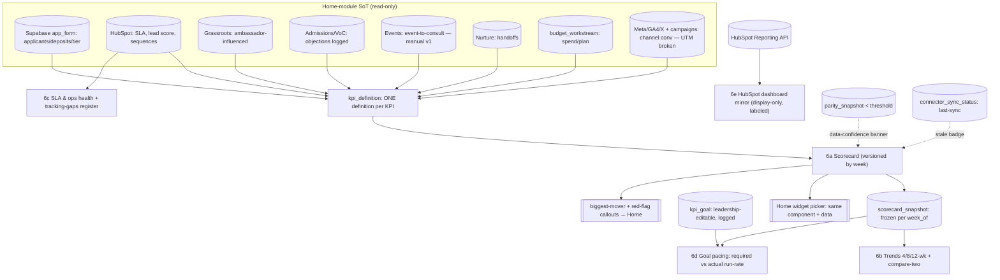

# Module 6: Dashboard / KPI Tracking — Plan Spec
> Status: spec / ready-to-build · Owner: Marketing Lead (Admin) · PRD §3 Module 6 (lines 620–688)
> Source of truth: **NONE of its own — read-only aggregator.** Every number's SoT is its **home module**.
> Reads: each module's primary metric · HubSpot Reporting API (mirror) · leadership-editable goals (Hub config) · each connector's last-sync (freshness).
> RBAC: scorecard **identical for all roles** (shared, not personal) · **only Leader edits goals** (logged) · Admin/Operator denied goal edits.

---

## 0. Build-on-this (existing backbone/tables/connectors to reuse, not duplicate)

| Capability | Where | Reuse for Dashboard |
|---|---|---|
| Funnel / TEFA / income / grade (app-authoritative) | `families` (`funnel_stage`, `income_band`, `grade`), Supabase | applicants, deposits, engagement-tier mix — **read Supabase, NOT HubSpot report values** |
| Pipeline + lead score + sequences | HubSpot via `enrollments`, `families.lead_score` | SLA, handoffs, channel context (HubSpot-authoritative) |
| Parity + data-confidence banner | `parity_snapshot`, `lib/parity.ts`, `field_state` | consume the banner on all HubSpot-derived scorecard rows (inbound contract) |
| Connector last-sync timestamps | `families.last_synced_at`, `sync_event_log.processed_at`, `parity_snapshot.taken_at` | **data freshness per connector** (6c / per-row stale badge) |
| Budget plan/actual + >10% variance | `budget_workstream`, Module 10 | budget-pacing KPIs; budget variance stays **Budget's** Decision-Queue contract (not ours) |
| Attribution thread (UTM join) | `meta_insights` / `ga4_days` / `x_posts` (stand-in), `campaigns` | conversion-by-channel KPI (flag **UTM-broken** as low-confidence) |
| Module registry + routing | `lib/modules.ts` (slug `dashboard`, n=6), `app/m/[slug]/page.tsx` | mount the tabbed sub-views; expose scorecard to Home widget picker |
| In-app dev docs / data dictionary | `lib/dev/catalog.ts`, `/dev/*` | register the additive tables here (zone `machinery`) |

**No backbone edits.** The dashboard owns no funnel/pipeline/payment data; it reads them.

---

## 1. Expert-panel synthesis (panel pared to 9 — see `gt-hub-dashboard-panel`)

| Persona | Lens | Falsifiable ask it enforces |
|---|---|---|
| Priya Nair — BI / metrics-layer engineer | Single KPI definition | every KPI resolves through one `kpi_definition`; Home-widget value == module value == snapshot, to the digit |
| Marcus Webb — HubSpot Reporting API specialist | Mirror ≠ SoT | HubSpot mirror is display-only + labeled; app-authoritative funnel reads Supabase, not the HS report |
| Dana Okafor — data-freshness / observability eng | Stale-but-green | each row carries source-connector last-sync; exceeds SLA → stale badge |
| Elena Brandt — FP&A / goal-pacing analyst | Projection method | "at this pace → X by Aug 17" states linear-v1 + required-vs-actual run-rate |
| Hannah Cho — data-visualization specialist | Honest encoding | status from an explicit run-rate band; sparklines share a baseline; labeled axes |
| Dr. Aisha Rahman — causal / decision scientist | **"don't trust it"** | uninstrumented (event-to-consult) + UTM-broken flagged `instrumented=false` + low-confidence badge |
| Devon Park — backbone / integration engineer | Read-only + RBAC | writes only snapshot/goal/audit; Leader-only goal edits; consumes data-confidence banner |
| Sam Whitfield — leadership end-user | Monday-meeting scan | "are we winning?" readable in ≤2 min; callouts on top; one row per KPI |
| Maya Lindqvist — product / UX designer | Widget parity + states | Home widget reuses the same component/data; week-selector + empty/loading/stale/error; mobile |

**Convergent:** the board is only worth anything if it's **single-defined and read-only** — one
definition per KPI, no drift Home↔Dashboard↔source, and the dashboard never becomes a second SoT.
The scorecard is **versioned by week** so the Monday meeting references a frozen artifact.

**Divergent (surfaced, not averaged):**
- *Marcus vs Sam* — "mirror real HubSpot dashboards so leadership stops logging into HubSpot" vs
  "don't let a HubSpot report contradict the Hub KPI." → **Resolved:** mirror is **display-only and
  labeled**; the canonical KPI reads its home-module SoT; a mismatch is expected and labeled, never silently reconciled.
- *Elena vs Rahman* — "give leadership a projection they can plan against" vs "a linear projection on a
  back-loaded funnel is a lie." → **Resolved:** ship linear-v1 **with its method stated**, show
  required-vs-actual run-rate, and flag seasonality + uninstrumented inputs as low-confidence.

**Risks (ranked, sourced):** (1) KPI drift / double definition — Priya, Devon; (2) false confidence on
uninstrumented metrics (event-to-consult manual, UTM broken) — Rahman, Hannah; (3) stale-but-green — Dana;
(4) HubSpot mirror reconciled into Hub KPIs — Marcus; (5) naive pacing projection — Elena; (6) RBAC slip on
goal edits — Devon; (7) too dense for the 10-min scan / widget drift — Sam, Maya.

**Open:** exact freshness SLA per connector; the precise on-track/watch/at-risk run-rate bands;
whether biggest-mover uses absolute or % delta (see §8).

---

## 2. Workflow — sub-views as nodes (data-in / processing / data-out)

**Cross-cutting (apply to every node):** **SSOT** = read the home module via `kpi_definition`, never
re-derive; **reconciliation** = none owned here (mirror is display-only, labeled); **RBAC** = shared view,
Leader-only goal edits; **data-confidence** = banner consumed on HubSpot-derived rows; **freshness** =
per-row last-sync; **cross-links** = scorecard → Home widget + callouts.

### Node table

| Node (sub-view) | Data in | Processing | Data out |
|---|---|---|---|
| **N1 — 6a Scorecard** | each KPI's home-module value for `week_of` and `week_of−1` via `kpi_definition`; `kpi_goal` target; last-4-wk series; `parity_snapshot`; `connector_sync_status` | resolve **one definition** per KPI → compute delta, 4-wk sparkline, status (run-rate band); freeze into `scorecard_snapshot` for the week; attach freshness + confidence flags; compute biggest-mover + red-flags | **canonical shared table**: one row per KPI (this wk / last wk / delta / sparkline / target / status), each row carrying source, last-sync, and `instrumented` flag; biggest-mover + red-flag cards; **identical for all users**; exposed as a Home widget |
| **N2 — 6b Trends** | `scorecard_snapshot` history per KPI | select KPI(s); window 4/8/12 wk; optional compare-two on one labeled-axis chart (event annotations deferred to v2) | line chart(s) per KPI; two-metric overlay |
| **N3 — 6c SLA & ops health** | HubSpot contact/SLA data (24-hr first-contact, owner-attributable); event-to-consult **manual entries**; known tracking gaps | 24-hr SLA % current + 30-day series, by owner; render event-to-consult as **uninstrumented/manual** (`instrumented=false`); list tracking-gaps register (UTM broken, events untracked, Reconnectext SMS send-rate unmeasurable) | SLA panel (current + 30-day chart, owner breakdown, late-contact list); event-to-consult (manual, low-confidence); **tracking-gaps register** |
| **N4 — 6d Goal pacing** | `kpi_goal` (Fall targets, per-workstream goals); actuals from `scorecard_snapshot`; weeks-to-cutoff (Aug 17) | required weekly run-rate = (target − actual) / weeks-left; actual run-rate from recent weeks; **linear-v1 projection** "at this pace → X by Aug 17"; flag seasonality + uninstrumented inputs as low-confidence | per-target pacing rows (required vs actual run-rate, projection, confidence flag); per-workstream pacing (ambassador, content, etc.) |
| **N5 — 6e HubSpot dashboard mirror** | HubSpot Reporting API (saved dashboards, report data, saved filters) | fetch + cache mirrored widgets; **label "mirrored from HubSpot — display only"**; **do NOT re-aggregate into a Hub KPI** | embedded read-only HubSpot widgets; freshness = HubSpot last-sync |

---

## 3. Data model touchpoints (tables read/written; additive migration; NO backbone edits)

**Reads (no writes):** `families`, `enrollments`, `program_membership`, `budget_workstream`,
`parity_snapshot`, `field_state`, `sync_event_log`, plus stand-in `meta_insights` / `ga4_days` /
`x_posts` / `campaigns` — all via `kpi_definition`, respecting RLS where scoped.

**Additive migration — `supabase/migrations/0003_dashboard.sql`** (zone `machinery`; grants `app_rw`
read/write, `staff_ro` read; register all in `lib/dev/catalog.ts`):

**`kpi_definition`** — the semantic layer; ONE definition per KPI (kills drift)
| column | type | notes |
|---|---|---|
| `key` | text pk | e.g. `applicants`, `deposits`, `conversion_top_channel`, `engagement_tier_mix`, `sla_24hr`, `objections_logged`, `event_to_consult`, `ambassador_influenced_enrollments`, `mkt_to_onboarding_handoffs` |
| `label` | text | display name |
| `home_module` | text | slug of the module that OWNS this number (`nurture`/`grassroots`/`admissions`/`events`/`analytics`/`budget`) |
| `source` | text | authoritative source (`supabase_app_form` / `hubspot` / `meta_ga4_x` / `manual`) |
| `definition` | text | the single formula/SQL reference (the one true computation) |
| `unit` | text | `count` / `pct` / `currency` / `ratio` |
| `direction` | text | `higher_better` / `lower_better` (drives delta color + status) |
| `instrumented` | boolean | **false** = uninstrumented/manual (event-to-consult) or broken (UTM channel-conv) → low-confidence badge |
| `format` | text | display format hint |

**`scorecard_snapshot`** — the canonical scorecard, **versioned by week** (immutable per week+KPI)
| column | type | notes |
|---|---|---|
| `id` | uuid pk | |
| `week_of` | date | Monday of the week (the version key) |
| `kpi_key` | text → `kpi_definition.key` | |
| `this_week` | numeric | computed via the single definition |
| `last_week` | numeric | |
| `delta` | numeric | this − last (or % per §8) |
| `sparkline` | jsonb | last-4-wk series |
| `target` | numeric nullable | from `kpi_goal` at snapshot time |
| `status` | text | `on_track` / `watch` / `at_risk` (run-rate band rule) |
| `source` | text | source connector for this KPI (for freshness join) |
| `confidence` | text | `measured` / `low` (mirrors `kpi_definition.instrumented`) |
| `computed_at` | timestamptz | |
| **unique** | | `(week_of, kpi_key)` — one frozen row per KPI per week |

**`kpi_goal`** — leadership-editable targets (Hub config; changes logged)
| column | type | notes |
|---|---|---|
| `id` | uuid pk | |
| `kpi_key` | text → `kpi_definition.key` | |
| `workstream_key` | text nullable | per-workstream goals (ambassador, content) |
| `period` | text | `fall_2026` etc. |
| `target_value` | numeric | the goal |
| `cutoff_date` | date | e.g. `2026-08-17` (drives required run-rate) |
| `set_by` | text | actor (Leader) |
| `updated_at` | timestamptz | |

**`kpi_goal_audit`** — change log (every goal edit, who + before/after)
| column | type | notes |
|---|---|---|
| `id` | uuid pk · `kpi_goal_id` uuid · `actor` text · `old_value` numeric · `new_value` numeric · `changed_at` timestamptz | append-only |

**`connector_sync_status`** — last-sync per connector (data freshness)
| column | type | notes |
|---|---|---|
| `connector` | text pk | `supabase` / `hubspot` / `meta` / `ga4` / `x` / `summer_site` / `community` |
| `last_sync_at` | timestamptz | most recent successful sync |
| `freshness_sla_minutes` | int | beyond this → stale |
| `status` | text | `fresh` / `stale` / `error` |

---

## 4. Cross-module contracts (inbound consumed + outbound emitted)

**Inbound (consumed):**
- **Every module's primary metric** — read-only via `kpi_definition.home_module` (applicants/deposits ←
  Supabase app_form; SLA/lead-score ← HubSpot; ambassador-influenced ← Grassroots; objections ←
  Admissions/VoC; event-to-consult ← Events manual; handoffs ← Nurture; channel-conv ← Analytics/attribution; budget ← Budget).
- **Data-confidence banner** (PRD §4) — when `parity_snapshot.overall_pct` < threshold, all
  HubSpot-derived scorecard rows show the banner linking to Module 7 (CRM Ops).

**Outbound (emitted):**
- **Scorecard → Home widget picker** — the same `Scorecard` component + data render as a Home widget
  (one render path, two mounts) so leaders see it on Home without navigating here.
- **Biggest-mover + red-flag callouts → Home** — auto-identified from weekly delta data.

**Explicitly NOT a contract in v1 (honesty / scope):** an at-risk KPI does **not** auto-create a Decision
Queue item — **budget variance >10% → Decision Queue** remains **Budget's** (Module 10) contract, not the
dashboard's. The dashboard surfaces, it does not raise decisions.

---

## 5. Files to build (additive list → real paths)

| File | Purpose |
|---|---|
| `supabase/migrations/0003_dashboard.sql` | `kpi_definition` + `scorecard_snapshot` + `kpi_goal` + `kpi_goal_audit` + `connector_sync_status` + grants (additive; no backbone edits) |
| `lib/metrics/registry.ts` | **the single KPI definition registry** — one fn per KPI, each reading its home-module SoT; the only place a KPI is computed |
| `lib/dashboard/scorecard.ts` | build + freeze `scorecard_snapshot` for a `week_of`; compute delta, sparkline, status, confidence; biggest-mover + red-flags |
| `lib/dashboard/pacing.ts` | required-vs-actual run-rate + **linear-v1 projection** ("→ X by Aug 17") with confidence flags |
| `lib/dashboard/freshness.ts` | per-connector last-sync → `connector_sync_status`; per-row stale evaluation |
| `lib/dashboard/hubspot-reporting.ts` | HubSpot Reporting API mirror (read-only; cached; display-only, never re-aggregated) |
| `app/m/dashboard/page.tsx` (+ tab routing) | the module shell with 6a–6e tabs + week-of selector |
| `app/_components/dashboard/Scorecard.tsx` | the canonical scorecard table (one row per KPI) — **reused** as the Home widget |
| `app/_components/dashboard/Trends.tsx` | 4/8/12-wk line charts + compare-two |
| `app/_components/dashboard/SlaOpsHealth.tsx` | 24-hr SLA + 30-day chart + tracking-gaps register |
| `app/_components/dashboard/GoalPacing.tsx` | required-vs-actual + projection rows (with confidence flags) |
| `app/_components/dashboard/HubspotMirror.tsx` | embedded display-only HubSpot widgets (labeled) |
| `app/_components/dashboard/ScorecardWidget.tsx` | thin Home-widget wrapper around `Scorecard.tsx` (same data) + register in the Home widget picker |
| `lib/dev/catalog.ts` (extend) | register the 5 additive tables (zone `machinery`, field tags) |
| `lib/seed/generate.ts` (extend) | seed `kpi_definition`, weekly `scorecard_snapshot` history, `kpi_goal` (+ one audit edit), `connector_sync_status` incl. **one stale connector** |
| `lib/seed/invariants.ts` (extend) | the §6 invariants |

---

## 6. Provable invariants (against seeded data)

1. **Single definition (no drift):** every scorecard row's `this_week` equals the value its
   **home module** reports for the same `week_of`, which equals the **Home-widget** render — to the digit.
   A KPI computed anywhere outside `lib/metrics/registry.ts` does not exist.
2. **Read-only aggregator:** the dashboard writes **only** `scorecard_snapshot` / `kpi_goal` /
   `kpi_goal_audit` / `connector_sync_status` — **never** `families` / `enrollments` / `payments` /
   any home-module table.
3. **Versioned + immutable:** re-running the scorecard build for a **closed** week yields **identical**
   `scorecard_snapshot` rows (deterministic from frozen inputs); `(week_of, kpi_key)` is unique.
4. **RBAC on goals:** a `kpi_goal` edit by **Leader** succeeds and writes a `kpi_goal_audit` row;
   the same edit by **Operator or Admin** is **rejected** and writes no goal/audit row.
5. **Honesty flag:** KPIs with `instrumented=false` (event-to-consult, UTM-broken channel-conv) render a
   **low-confidence badge**, and their pacing projection carries a confidence flag — visibly distinct
   from a measured KPI (deposits).
6. **Data-confidence banner:** when `parity_snapshot.overall_pct` < threshold, every HubSpot-derived
   scorecard row shows the banner (consumed from §4 contract).
7. **Freshness:** each scorecard row carries its source connector's `last_sync_at`; a connector whose
   `last_sync_at` exceeds `freshness_sla_minutes` renders **stale** (the seeded stale connector proves it).
8. **Mirror is not SoT:** a HubSpot-mirror widget value may differ from the Hub scorecard value for the
   same concept — and that is **labeled display-only**, never reconciled into a Hub KPI.

---

## 7. Demo script (clickable; ties to the four "show us it works" signals)

1. Open **Dashboard → 6a Scorecard** for the current week: one row per KPI — this wk / last wk / delta /
   4-wk sparkline / target / status — with biggest-mover + red-flag callouts on top. *(legible 10-min scan)*
2. **Add the scorecard to Home** via the widget picker → the widget shows **byte-identical** rows
   (same component, same data → **no drift**). *(watch a number stay consistent across surfaces)*
3. Switch the **week-of selector** to a prior week → the **versioned snapshot** renders unchanged (frozen).
4. **6b Trends** → pick `applicants` + `deposits`, compare on one chart, toggle 4/8/12-wk.
5. **6c SLA & ops health** → 24-hr SLA current + 30-day chart, owner-attributable; **event-to-consult**
   shows a **manual / low-confidence** badge; the **tracking-gaps register** lists UTM broken + Reconnectext.
6. **6d Goal pacing** → "at this pace → X by Aug 17" for deposits with required-vs-actual run-rate and a
   stated **linear-v1** method; an uninstrumented KPI's projection shows a low-confidence flag. *(honest projection)*
7. As **Operator**, edit a goal → **denied**; as **Leader**, edit the same goal → succeeds and appears in
   the **audit log**. *(role denied)*
8. Drop **parity** below threshold → **data-confidence banner** appears on HubSpot-derived rows; the seeded
   **stale connector** shows "last sync Nh ago / stale." *(data-confidence banner on parity drop)*

---

## 8. Open questions / assumptions (every assumption written down)

- **KPI set + home modules (single definition each):** applicants & deposits ← Supabase `app_form`
  (`funnel_stage`); engagement-tier mix ← Nurture (Supabase); 24-hr SLA & handoffs ← Nurture/HubSpot;
  objections logged ← Admissions/VoC; event-to-consult ← Events (**manual v1, uninstrumented**);
  ambassador-influenced enrollments ← Grassroots; conversion-by-top-channel ← Analytics/attribution
  (**UTM broken → low-confidence**). *Assumption: this is the v1 KPI list (PRD line 634); additions go
  through `kpi_definition`.*
- **Goals storage:** leadership-editable targets live in `kpi_goal` (Hub config), edits logged in
  `kpi_goal_audit`; **only Leader** may edit. *Assumption: targets are "already defined" per PRD and seeded.*
- **Projection method:** **linear run-rate v1** — `required = (target − actual)/weeks_left`, projected =
  `actual + actual_run_rate × weeks_left`; **explicitly labeled**; seasonality/back-loading flagged as a
  known limitation (no curve fit in v1).
- **Status bands:** `on_track` = actual run-rate ≥ required; `watch` = within ~10% below; `at_risk` =
  >10% below. *Open: confirm the exact band % with leadership.*
- **Biggest-mover metric:** *Open — absolute delta vs % delta?* Assumption: rank by |% delta| among
  `instrumented=true` KPIs (uninstrumented excluded from auto-callouts).
- **HubSpot Reporting API mirror:** read-only embed/sync of saved HubSpot dashboards; **display-only,
  labeled, never re-aggregated** into a Hub KPI. *Assumption: API access + cache; offline fixture fallback for the demo.*
- **Freshness SLA:** per-connector `freshness_sla_minutes` — *Open: confirm per-connector thresholds.*
  Assumption: Supabase ~15m, HubSpot ~60m, stand-ins ~daily.
- **No auto-decision in v1:** an at-risk KPI does **not** open a Decision Queue item; budget>10% → Decision
  Queue stays Budget's (Module 10) contract. *Assumption confirmed against PRD §4.*
- **Event annotations on Trends:** deferred to v2 (PRD §8).
