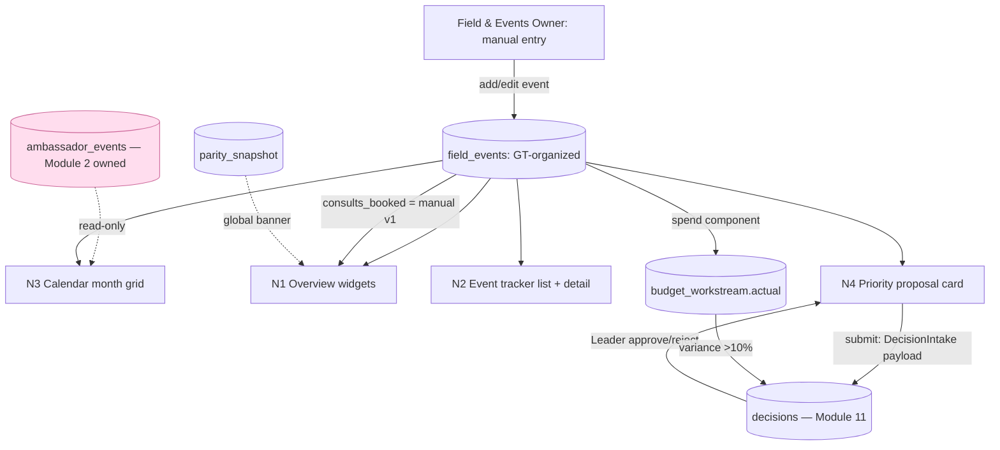

# Module 8: Field Marketing & Events — Plan Spec
> Status: spec / ready-to-build · Owner: Field & Events Owner (Operator) · PRD §3 Module 8 (lines 779–838)
> Source of truth: **Manual entry in the Hub** (no API to wire v1) · ambassador events are **read-only** from Module 2 (Grassroots)
> RBAC: Operator (Field & Events Owner) read/write own module + *submit* proposals · Leader full read, sets event budget, **decides** in Decision Queue · Admin (Marketing Lead) read/write all, does **not** decide

GT-ORGANIZED events only — Shadow Days, chess tournaments, AMAs, community events,
festivals, webinars. Ambassador-hosted events are owned by **Module 2** and appear
here only as a read-only calendar overlay (PRD line 819, 1208). Event→consult
conversion is **uninstrumented in v1** — honest manual entry, flagged as a GAP
(§8); auto-tracking deferred. Do not fake it.

---

## 0. Build-on-this (existing backbone/tables/connectors to reuse, not duplicate)

| Capability | Where | Reuse for Module 8 |
|---|---|---|
| Decision Queue table + intake | `decisions` (`lib/dev/catalog.ts`), Module 11 | Priority event proposals land here (`question`, `raised_by`, `workstream`, `recommendation`, `budget_ask`, `due_date`, `priority`) |
| Hub-owned budget ($365K) | `budget_workstream` (`lib/seed/dictionaries.ts`: `grassroots` $210K, `guerrilla` $40K, `thought_leadership` $90K, `foundations` $25K) | Event spend is a **component** summed into a workstream `actual` — not a new line |
| Budget >10% variance → auto-flag | `decisions.auto_flag` | An over-budget event surfaces in the queue via the existing rule |
| Data-quality to-do list | `data_quality_issue` (`utm\|sync\|scoring\|tracking\|other`) | Manual-entry gaps (stale/incomplete/duplicate events) raise `tracking`/`other` issues |
| Data-confidence banner | `parity_snapshot` + global banner (PRD 1207, 1210–1212) | Module renders the global banner; **events' own numbers are manual, not HubSpot-parity-bound** (state that honestly) |
| Module registry + routing | `lib/modules.ts` (n=8, slug `events`, owner "Field & Events Owner"), `app/m/[slug]/page.tsx` | Tabs: Overview · Event tracker · Calendar · Priority events |
| Dev data dictionary | `lib/dev/catalog.ts`, `/dev/*` | Register the new tables here |
| Ambassador event store | **Module 2 (Grassroots)** — `ambassador_events` (Module-2-owned; created by that module's plan) | **Read-only** join for the calendar overlay; never written or counted here |

> **No backbone table is edited.** Module 8 adds two additive tables and reads two
> existing/owned-elsewhere stores.

---

## 1. Expert-panel synthesis

Panel skill: `~/.claude/skills/gt-hub-events-panel/SKILL.md` (pared to 8; 1st×3, 2nd×3, 3rd×2; all 5 required archetypes seated).

| Persona | Order · Lens | Falsifiable ask |
|---|---|---|
| Renata Cole — field-events ops SME | 1 · operational lifecycle | Explicit `status` (planning→confirmed→completed→cancelled) + follow-up actions; tracker filters type/date/status/owner |
| Devon Park — manual-entry UX (**"don't ship"**) | 1 · low-friction capture | ≤30-second add-event flow, mobile-first, inline validation; demo completable without docs |
| Sara Ng — data-quality / manual reliability | 1 · DQ on hand-typed data | Required-field validation + duplicate (name+date) flag, not silent insert; stale/incomplete chip |
| Marcus Lin — calendar / cross-link integration | 2 · SSOT, overlay, intake, RBAC | Ambassador overlay read-only (zero write path); proposal → exactly one `decisions` row via named payload Operator can't read back |
| Hannah Cho — events-ROI / RevOps | 2 · single metric defs + budget rollup | One def each for attendance-rate + event→consult; event spend reconciles into a workstream, plan still $365K |
| Priya Anand — accessibility | 2 · WCAG 2.2 | Calendar event-type by color **+ text/shape**; tracker + grid keyboard/SR navigable |
| Dr. Aisha Rahman — measurement skeptic (**"don't trust it"**) | 3 · modeled-vs-measured | Every event→consult figure carries an **"manual v1 / uninstrumented"** badge + source; shown as estimate; auto-tracking named as a GAP |
| Dr. Lena Ortiz — gifted-ed / K-12 SME | 3 · ICP-fit of formats | Recommendations tie `type`+`target_persona` to observed attendance/consult signal, framed as fit not reach |

**Convergent:** manual-entry UX is the existential make-or-break (no API); the
event→consult number must be honestly labeled, never faked; the ambassador overlay
is read-only and owned by Module 2.
**Divergent (surfaced):** Rahman ("don't display a conversion you can't measure")
vs Cho/Ortiz ("leadership needs *some* signal to prioritize") → **resolved:** show
the estimate with a loud uninstrumented badge **and** name the deferred
auto-tracking GAP — neither suppress nor launder it.
**Risks (ranked, sourced):** (1) heavy manual entry → empty module [Park/Ng];
(2) uninstrumented event→consult presented as tracked, driving a real budget ask
[Rahman]; (3) ambassador overlay duplicated/owned here → double-count [Lin];
(4) Decision Queue intake is a dead button / RBAC leak [Lin]; (5) inconsistent
metric defs + spend not reconciled to $365K [Cho]; (6) color-only calendar [Anand];
(7) decorative taxonomy/persona [Ortiz].
**Open:** see §8.

---

## 2. Workflow — sub-views as nodes (data-in / processing / data-out)



| Node | Data in | Processing | Data out |
|---|---|---|---|
| **N1 Overview** (8a) | `field_events` rows; ambassador overlay (read-only) | compute widgets with **single defs**: upcoming-30d (`event_date` in [today, +30d]), completed-this-month, RSVP-vs-attendance (`sum(attendance)/sum(rsvp_count)`), **event→consult** (`sum(consults_booked)/sum(rsvp_count)` — **uninstrumented badge**), top-type-by-attendance | Composable widget grid; every event→consult figure flagged "manual v1" |
| **N2 Event tracker** (8b) | `field_events` | list with filters (type, date range, status, owner); detail card (notes, materials, budget, follow-up); **required-field validation + duplicate (name+date) flag** on write | Tracker table (name, type, date, venue, RSVP, attendance, consults, owner, status); detail view; empty/loading/error/duplicate states |
| **N3 Calendar** (8c) | `field_events` + **read-only** `ambassador_events` (Module 2) | month grid; encode type by **color + text/shape**; ambassador events rendered distinctly with **no edit affordance**; never counted as GT-organized | Color-coded month grid; ambassador overlay visibly read-only; keyboard/SR navigable |
| **N4 Priority events recommendation** (8d) | proposal inputs: name, type, date, rationale, expected_attendance, budget_ask, target_persona | save `field_event_proposals` (draft); on submit emit **one** `DecisionIntake` → `decisions`; reflect Leader response back; Operator **cannot** read the queue | Proposal card; `decisions` row in Module 11; status (draft→submitted→approved/rejected) |

**Cross-cutting:** SSOT (events = manual Hub data, not HubSpot; consults = manual);
reconciliation (event spend → workstream, no new line, plan stays $365K); RBAC
(Operator submit-not-view on Decision Queue; non-owner write denied); data-confidence
banner rendered but events' own numbers are manual (stated); cross-links
(ambassador overlay in ← Module 2; proposal out → Module 11).

---

## 3. Data model touchpoints (additive migration — NO backbone edits)

`supabase/migrations/0003_field_events.sql`

**`field_events`** (global; GT-organized events only)
| column | type | notes |
|---|---|---|
| `id` | uuid pk | |
| `name` | text not null | event name (required) |
| `type` | text not null | `shadow_day` \| `chess` \| `ama` \| `community` \| `festival` \| `webinar` |
| `event_date` | date not null | drives calendar + upcoming-30d |
| `venue` | text | location / "virtual" |
| `region` | text | city/metro (optional) |
| `rsvp_count` | int default 0 | manual |
| `attendance` | int default 0 | manual |
| `consults_booked` | int default 0 | **manual v1 — uninstrumented** (event→consult denominator-pair) |
| `consult_source` | text default `'manual_entry'` | honesty marker — never `'tracked'` in v1 |
| `owner` | text | responsible person |
| `status` | text default `'planning'` | `planning` \| `confirmed` \| `completed` \| `cancelled` |
| `workstream_key` | text → `budget_workstream.key` | `grassroots` (default) or `guerrilla` for one-off bets |
| `budget` | numeric(12,2) default 0 | component summed into the workstream `actual` |
| `target_persona` | text | ICP tag (Ortiz) |
| `materials` | text | materials/links |
| `notes` | text | |
| `follow_up_actions` | jsonb | post-event task list (Cole) |
| `created_at` / `updated_at` | timestamptz default now() | freshness for stale-event DQ chip |

> Unique guard: `(lower(name), event_date)` → duplicate flagged, not silently inserted (Ng).

**`field_event_proposals`** (priority recommendations → Decision Queue)
| column | type | notes |
|---|---|---|
| `id` | uuid pk | |
| `name` / `type` | text | proposed event |
| `proposed_date` | date | |
| `rationale` | text | the "why" |
| `expected_attendance` | int | |
| `budget_ask` | numeric(12,2) | → `decisions.budget_ask` |
| `target_persona` | text | |
| `workstream_key` | text → `budget_workstream.key` | which line the ask hits |
| `status` | text default `'draft'` | `draft` → `submitted` → `approved` \| `rejected` |
| `decision_id` | uuid → `decisions.id` nullable | set on submit (one-to-one); idempotency anchor |
| `created_by` | text | the Field & Events Owner |
| `created_at` | timestamptz default now() | |

**Reads (not owned):** `ambassador_events` (Module 2, read-only overlay) · `decisions`
(read own proposal's response only) · `budget_workstream` (rollup) · `parity_snapshot`
(global banner).

Grants: `app_rw` read/write `field_events` + `field_event_proposals`; **read-only** on
`ambassador_events`. `staff_ro` read. Register both new tables in `lib/dev/catalog.ts`
(zone `global`; tag `consults_booked`/`consult_source` as manual/uninstrumented).

---

## 4. Cross-module contracts (inbound consumed + outbound emitted)

**Inbound (consumed):**
- **Grassroots → Field Marketing calendar** (PRD line 819, 1208): `ambassador_events`
  rendered **read-only** on N3. Trigger: Module 2 creates/updates an ambassador event.
  Payload (read shape): `{ id, event_name, host_ambassador, date, location, type, rsvp_count, attendance }`. **No write path from Module 8.**
- **Sync-parity drop → data-confidence banner** (PRD 1207, 1210–1212): global banner on all sub-views; copy clarifies events' own numbers are manual, not HubSpot-bound.
- **Decision response → proposal status**: read `decisions.response` for the proposal's `decision_id`; reflect approved/rejected on the card (Operator reads **only their own** linked row, not the queue).

**Outbound (emitted):**
- **Priority proposal → Decision Queue** (PRD 813, 823, 837). On submit, emit exactly
  one row, payload **`DecisionIntake`**:
  ```ts
  type DecisionIntake = {
    source_module: "events";
    source_ref: string;        // field_event_proposals.id (idempotency key — one decision per proposal)
    question: string;          // "Approve <name> (<type>, <proposed_date>)?"
    raised_by: string;         // Field & Events Owner
    workstream: string;        // workstream_key
    recommendation: string;    // rationale + expected_attendance + target_persona
    budget_ask: number;        // proposal.budget_ask
    due_date: string;          // proposed_date - lead time
    priority: "normal" | "urgent";
  };
  ```
  Operator may submit but **cannot view/act on** the queue (RBAC, PRD line 71).
- **Event spend → budget**: `field_events.budget` is a component summed into
  `budget_workstream.actual` for `workstream_key`; >10% variance auto-flags to
  `decisions` via the existing rule (PRD 1206). No new workstream; plan stays $365K.

---

## 5. Files to build (additive, mapped to real paths)

| File | Purpose |
|---|---|
| `supabase/migrations/0003_field_events.sql` | `field_events` + `field_event_proposals` + grants (read-only on `ambassador_events`) |
| `lib/events/metrics.ts` | single defs: upcoming-30d, completed-this-month, attendance-rate, **event→consult (flagged manual)**, top-type-by-attendance |
| `lib/events/proposals.ts` | proposal → `DecisionIntake` intake (idempotent on `source_ref`); status reflect-back |
| `lib/events/calendar.ts` | merge `field_events` + read-only `ambassador_events`; type→color+shape encoding |
| `app/m/events/page.tsx` (+ tab bar) | module shell wiring the 4 sub-views into `app/m/[slug]` |
| `app/m/events/_components/Overview.tsx` | widget grid (N1) with uninstrumented badge on event→consult |
| `app/m/events/_components/EventTracker.tsx` | list + filters + detail card + add/edit form (≤30s flow, validation, duplicate flag) (N2) |
| `app/m/events/_components/Calendar.tsx` | month grid, color+text encoding, read-only ambassador overlay, keyboard/SR (N3) |
| `app/m/events/_components/PriorityProposals.tsx` | proposal card → Decision Queue submit; status reflect (N4) |
| `lib/dev/catalog.ts` (extend) | register `field_events` + `field_event_proposals` (manual/uninstrumented tags) |
| `lib/seed/generate.ts` (extend) | seed realistic GT-organized events incl. **duplicate** + **incomplete/stale** + **uninstrumented-consult** edge cases |
| `lib/seed/invariants.ts` (extend) | invariants in §6 |
| `tests/events.test.ts` | metric defs, duplicate flag, intake idempotency, RBAC denial, read-only overlay, budget reconcile |

---

## 6. Provable invariants (against seeded data)

1. **SSOT / honesty:** every `consults_booked` row has `consult_source='manual_entry'`
   and every event→consult figure renders with an "uninstrumented / manual v1" badge —
   never labeled tracked. (Rahman)
2. **Read-only overlay:** `ambassador_events` appear on N3 but **no insert/update/delete**
   path exists from Module 8; they are excluded from every GT-organized count (no
   double-count vs Module 2). (Lin)
3. **Decision intake idempotent:** submitting a proposal N times creates exactly one
   `decisions` row (keyed on `source_ref`); Operator querying the full queue is **denied**. (Lin, RBAC)
4. **Budget reconciles:** `field_events.budget` rolls into its `workstream_key`;
   `sum(budget_workstream.recommended) == 365000` still holds; no new workstream. (Cho)
5. **RBAC denial:** a non-owner write to `field_events` is rejected; Operator `GET`
   on the Decision Queue is denied (submit-only). (PRD line 71)
6. **Metric single-definition:** attendance-rate = `attendance/rsvp_count`,
   event→consult = `consults_booked/rsvp_count` — same value in Overview and tracker. (Cho)
7. **Manual-entry reliability:** required fields enforced; a duplicate `(name, event_date)`
   is flagged (raises a `data_quality_issue`), not silently inserted. (Ng)
8. **Widget Inputs→Outputs:** each Overview widget is computable purely from
   `field_events` (+ read-only overlay) — no hidden/hard-coded numbers. (M1)

---

## 7. Demo script (clickable)

1. **Add an event** in the Event tracker (Shadow Day, date, venue, RSVPs) in ≤30s,
   mobile-first → it appears in the list and on the Calendar. (Park/Cole)
2. Try to add the **same name+date** again → duplicate is flagged, not inserted. (Ng)
3. Open the **Calendar** → GT-organized events are color+shape coded; an **ambassador
   event** (from Module 2) shows read-only with **no edit affordance**. (Lin) → *watch the cross-link.*
4. Open **Overview** → event→consult conversion shows with a loud **"manual v1 /
   uninstrumented"** badge; top-type-by-attendance and RSVP-vs-attendance compute live. (Rahman/Cho)
5. **Priority events** → submit a proposal → a row appears in the **Decision Queue**;
   as the Field & Events Owner (Operator), the full queue is **denied**. (Lin) → *role denied.*
6. Set the event's `budget` → it rolls into its workstream; **Budget Tracker still
   sums to $365K**; an over-budget event auto-flags to the queue. (Cho) → *budget reconciles.*
7. A parity drop elsewhere → the **data-confidence banner** appears here, with copy
   noting events' own numbers are manual. → *data-confidence banner.*

---

## 8. Open questions / assumptions

- **A1 (assumption):** GT-organized events are stored in a new `field_events` table
  (no backbone table fits); ambassador events stay in Module 2's `ambassador_events`
  (created by that module's plan), read-only here.
- **A2 (assumption):** default `workstream_key='grassroots'` for community/Shadow Day/
  chess/AMA; `'guerrilla'` for one-off festival/earned-media bets. Confirm mapping with Budget Owner.
- **A3 (GAP — do not fake):** event→consult is **uninstrumented in v1**; auto-tracking
  (e.g. consult-booking link UTM → CRM) is deferred. v1 = manual entry per event,
  badged as estimate. Flag explicitly as a gap.
- **A4 (assumption):** webinar is included as an event `type` (PRD line 799 lists it in
  the tracker) even though the headline examples are in-person.
- **A5 (open):** lead-time for `due_date` on a proposal (proposed_date − N days) — pick a
  default (e.g. 14 days) unless Leadership specifies.
- **A6 (assumption):** the module renders the **global** data-confidence banner for
  consistency, while stating events' own numbers are manual (not HubSpot-parity-bound).
- **A7 (open):** does an approved proposal **auto-create** a `field_events` row, or does
  the owner create it manually after approval? Default v1: manual create after approval
  (keeps the proposal/event boundary clean).
