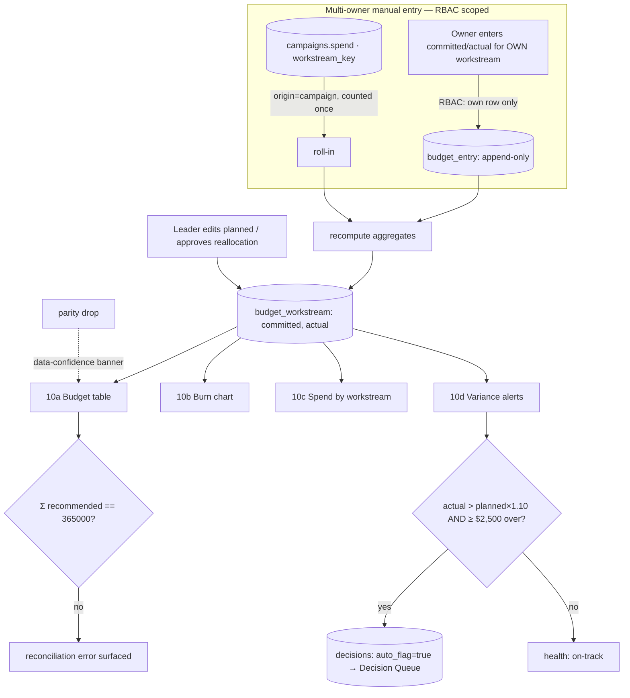

# Module 10: Budget Tracker — Plan Spec
> Status: spec / ready-to-build · Owner: the Budget Owner (fractional CMO) · PRD §3 Module 10 (lines 932–987)
> Source of truth: **Hub manual entry — the Hub IS the system of record (no Google Sheet)** · reconciles to **exactly $365,000**
> RBAC: Operator edits **only their own workstream row**; Leader edits `planned` + approves reallocation; Admin (Marketing Lead) edits all; everyone else read-only.

The one module where "watch a budget reconcile to the total" is the headline demo signal. Build on the existing `budget_workstream` + `decisions` backbone and the GT Challenge's campaign→workstream roll-in (`hub/docs/06-gt-challenge/WORKFLOW.md`); do **not** fork them.

---

## 0. Build-on-this (reuse, do not duplicate)

| Capability | Where | Reuse for Budget |
|---|---|---|
| Workstream aggregates ($365K) | `budget_workstream` (`lib/dev/catalog.ts`; seed `lib/seed/dictionaries.ts` `BUDGET`, `BUDGET_TOTAL`) | The four rows + `recommended/planned/committed/actual`; the table reads these |
| Decision Queue table | `decisions` (`lib/dev/catalog.ts`) — has `workstream`, `budget_ask`, `auto_flag`, `priority`, `status` | The >10% variance auto-flag target (no new table) |
| Campaign → workstream roll-in | `campaigns` (GT Challenge plan, `supabase/migrations/0002_gt_challenge.sql`; `campaigns.workstream_key → budget_workstream.key`, `campaigns.spend`) | A campaign's `spend` is a component summed into that workstream's `actual` |
| RLS / role scoping | `withProgram` / `withoutProgram` in `lib/db.ts`; roles in PRD §2 (Admin/Leader/Operator) | Per-owner edit scoping (which owner may write which workstream) |
| Data-confidence banner | `lib/parity.ts`, `parity_snapshot` | Inbound: parity drop shows the banner on this module too |
| In-app dev docs | `lib/dev/catalog.ts`, `/dev/*` | Register the new `budget_entry` table here |
| Seed + invariants harness | `lib/seed/generate.ts`, `lib/seed/invariants.ts` | Seed owner entries + an over-plan workstream; add the new invariants |

**Gap this module fills:** `budget_workstream` stores only **aggregates** (`committed`, `actual`) with **no per-owner attribution, no audit trail, and no history**. PRD requires *each owner enters their own* spend (multi-owner) and variance auto-flags — both need a detail ledger. Hence one additive table (`budget_entry`, §3).

---

## 1. Expert-panel synthesis (gt-hub-budget-panel, pared to 9)

| Persona | Lens | The catch it enforces (falsifiable ask) |
|---|---|---|
| Priya Venkat — Marketing FP&A SME | Column definitions | One arithmetic identity per column; `remaining = planned − actual` holds row-wise + at total |
| Daniel Osei — reconciliation/variance eng | The $365K + >10% | `Σ recommended == 365000` is a **live** invariant; a >10% row → **exactly one** open auto-flag |
| Maya Lindqvist — multi-owner entry UX | Workflow legibility ("don't ship") | Owner sees own row editable, all others **visibly** read-only; confirm + last-edited-by + undo |
| Wei Zhang — data-viz/analytics | Chart honesty | Burn overlays actual vs **plan pace line**; pie is **actual** share; exposes `projected_burn_out_date` |
| Devon Park — backbone/integration eng | SSOT + roll-in + queue | `actual = Σ entries + Σ campaign spend`, each counted **once**; auto-flag uses the real raise path |
| Grace Mbeki — controls/audit ("don't ship") | Audit trail | Append-only `budget_entry` (`entered_by`,`created_at`, immutable); aggregates derived, not edited in place |
| Sara Kim — data-governance/MDM | Survivorship | Campaign spend is its own component summed once; manual entry covers only **non-campaign** spend (`origin` discriminator) |
| Tomás Rivera — DM strategist/RevOps | "Which dollar next" | Variance alert deep-links a pre-filled reallocation decision; an **approved** reallocation adjusts `planned` |
| Dr. Aisha Rahman — causal/decision sci ("don't trust") | Threshold as signal | Trigger = absolute floor **+** % vs `planned` (not noise); demo shows alert → a logged decision outcome |

**Convergent:** the Hub is the sole budget source; the $365K reconciliation is the headline and must be a *recomputed* invariant; campaign spend rolls in like any other component (per GT Challenge); a variance alert is only worth shipping if it lands a real decision.
**Divergent → resolved:** mutable aggregates (simple) vs append-only ledger (auditable) → **append-only `budget_entry`, aggregates derived** (Mbeki/Park win — required by multi-owner + audit). Flat 10% (Osei) vs absolute+% floor (Rahman) → **`actual > planned × 1.10` AND `actual − planned ≥ $2,500` floor** so the $25K foundations line doesn't spam.
**Top risks (ranked):** (1) $365K silently breaks if reconciliation is a seed constant, not live; (2) campaign spend double-counted (in `campaigns.spend` **and** a manual `actual`); (3) RBAC enforced only server-side, invisible in UI → an Operator edits another's row; (4) no audit trail on a disputed number; (5) variance theater — alerts that spam or never resolve; (6) burn/pie dishonesty (no plan line; pie on planned).
**Open:** see §8.

---

## 2. Workflow — sub-views as nodes (data-in / processing / data-out)



| Node | Data in | Processing | Data out |
|---|---|---|---|
| **N1 · 10a Budget table** | `budget_workstream` rows; resolved aggregates from `budget_entry` + `campaigns.spend` | per-row `remaining = planned − actual`, `available = planned − committed`; assert `Σ recommended == 365000`; health = on-track/watch/at-risk | table: workstream × {recommended, planned, committed, actual, remaining} + **total row reconciling to $365K**; per-cell last-edited-by |
| **N2 · 10b Burn chart** | weekly cumulative `actual` (from `budget_entry.created_at` + campaign spend dates); `planned` total | cumulative actual vs **linear plan-pace** line; extrapolate `projected_burn_out_date` at current rate | line chart (weekly): actual vs plan; projected burn-out date + total remaining |
| **N3 · 10c Spend by workstream** | per-workstream `actual` | % of total **actual** per workstream (labelled actual, not planned) | pie / share bar of actual allocation |
| **N4 · 10d Variance alerts** | per-workstream `planned`, `actual` | flag where `actual > planned × 1.10` **and** `actual − planned ≥ $2,500`; dedupe one open flag per workstream | variance list; **auto-flag → Decision Queue** (payload §4); pre-filled reallocation deep-link |

**Cross-cutting:** SSOT = Hub only (no sheet) · reconciliation recomputed on every write · RBAC scoped per owner (§ below) · data-confidence banner on parity drop · campaign roll-in counted once.

---

## 3. Data model touchpoints (additive only — NO backbone edits)

**Reads:** `budget_workstream` (recommended/planned/committed/actual), `campaigns` (spend, workstream_key), `decisions` (existing variance flags), `parity_snapshot` (banner).

**Writes:** `budget_workstream.committed/actual` (derived recompute), `budget_workstream.planned` (Leader/Admin), `decisions` (auto-flag insert).

**Additive migration — `supabase/migrations/0003_budget.sql` (touches no backbone table):**

**`budget_entry`** (append-only spend ledger; the multi-owner + audit layer)
| column | type | notes |
|---|---|---|
| `id` | uuid pk | |
| `workstream_key` | text → `budget_workstream.key` | which of the 4 workstreams |
| `kind` | text | `committed` \| `actual` |
| `origin` | text | `manual` \| `campaign` — **survivorship discriminator** (Kim); campaign roll-ins are `campaign`, never hand-entered |
| `amount` | numeric(12,2) | the entry (corrections are **new** rows, never edits) |
| `entered_by` | text | role/user — audit trail (Mbeki) |
| `owner_role` | text | the function owner responsible (RBAC scope check) |
| `note` | text nullable | free text |
| `campaign_key` | text → `campaigns.key` nullable | set when `origin=campaign` |
| `created_at` | timestamptz default now() | immutable; powers weekly burn |

Aggregates are **derived**: `committed(ws) = Σ entry.amount[kind=committed, ws]`, `actual(ws) = Σ entry.amount[kind=actual, ws]` (which already includes campaign roll-ins as `origin=campaign` rows). Grants: `app_rw` read/write, `staff_ro` read. **Register `budget_entry` in `lib/dev/catalog.ts`** (zone `machinery`; tag `entered_by`/`amount` audit, `origin` as the dedupe discriminator).

---

## 4. Cross-module contracts

**Inbound (consumed):**
- **Campaign spend roll-in** ← Campaigns / GT Challenge: each `campaigns` row with `workstream_key=ws` contributes `spend` to `actual(ws)` as an `origin=campaign` `budget_entry` (e.g. GT Challenge `gifted_quiz` → `grassroots`). Mirrors `06-gt-challenge/WORKFLOW.md` N1 + invariant 4.
- **Planned-amount edits** ← Leadership: Leader/Admin adjust `budget_workstream.planned`.
- **Approved reallocation** ← Decision Queue: a decided reallocation adjusts `planned` of the from/to workstreams.
- **Parity drop** ← CRM Ops (`lib/parity.ts`): renders the data-confidence banner on this module.

**Outbound (emitted) — the variance auto-flag payload into `decisions`:**
```json
{
  "question": "Grassroots is 14% over plan ($24,000 over) — reallocate or raise budget?",
  "raised_by": "system:budget-variance",
  "workstream": "grassroots",
  "recommendation": "Reallocate $24,000 from an under-spent workstream, or approve the overage.",
  "budget_ask": 24000,
  "due_date": "<today + 7d>",
  "priority": "urgent",          // urgent if >20% over, else normal
  "auto_flag": true,
  "status": "open"
}
```
Emitted via the **same raise path a human uses** (not a raw insert); **idempotent** — one open `auto_flag` row per workstream until resolved (Park/Osei).

---

## 5. Files to build (additive — mapped to real paths)

| File | Purpose |
|---|---|
| `supabase/migrations/0003_budget.sql` | `budget_entry` ledger + grants |
| `lib/budget/reconcile.ts` | derive `committed/actual` from `budget_entry` + `campaigns.spend`; per-row `remaining`/`available`; assert `Σ recommended == 365000` |
| `lib/budget/variance.ts` | `actual > planned×1.10 AND ≥ $2,500` detector → idempotent Decision Queue payload (§4) |
| `lib/metrics/budget.ts` | single definitions: weekly burn series, `projected_burn_out_date`, % actual allocation, health (on-track/watch/at-risk) |
| `app/_components/budget/BudgetTable.tsx` | 10a — RBAC-scoped editable own-row, others read-only; total reconciles to $365K; last-edited-by |
| `app/_components/budget/BurnChart.tsx` | 10b — cumulative actual vs plan pace line + projected burn-out |
| `app/_components/budget/SpendByWorkstream.tsx` | 10c — actual-share pie |
| `app/_components/budget/VarianceAlerts.tsx` | 10d — variance list + reallocation deep-link to Decision Queue |
| `app/m/[slug]/page.tsx` (extend: budget tab wiring) | mount the four sub-views for `slug=budget` |
| `lib/dev/catalog.ts` (extend) | register `budget_entry` |
| `lib/seed/generate.ts` (extend) | seed per-owner `budget_entry` rows + one **over-plan** workstream (trips variance) + a campaign roll-in |
| `lib/seed/invariants.ts` (extend) | add §6 invariants |

---

## 6. Provable invariants (against seeded data)

1. **$365K reconciles (headline):** `sum(budget_workstream.recommended) == 365000` — a **runtime** check, re-asserted on every write, not a seed constant.
2. **Column identity:** for every row `remaining == planned − actual` and `available == planned − committed`; the total row equals the column sums.
3. **No double-count (survivorship):** `actual(ws) == Σ budget_entry.actual(ws)` where campaign spend appears **exactly once** as `origin=campaign`; a campaign `spend` + a matching `origin=manual` entry is rejected/forbidden.
4. **Variance trigger:** a workstream with `actual > planned×1.10 AND actual−planned ≥ 2500` produces **exactly one** open `decisions` row with `auto_flag=true`; re-running the detector creates no duplicate.
5. **RBAC denial:** an Operator writing a `budget_entry` for a workstream that is not theirs is rejected; a Leader can edit `planned` but not other owners' `actual` entries; proven by a denied write test.
6. **Audit immutability:** an aggregate never changes without a corresponding new `budget_entry` row; corrections are additive (no in-place edit).
7. **Widget Inputs→Outputs:** each of 10a–10d renders from its node inputs with empty/loading/error states (e.g. zero-entry workstream shows $0 actual + full remaining, not a crash).

---

## 7. Demo script (clickable; ties to the four "show us it works" signals)

1. Open **Budget Tracker → 10a**: four workstreams, total reconciles to **$365,000** (the "watch a budget reconcile to the total" signal).
2. As the **Grassroots Owner**, enter an actual-spend line on the grassroots row → table + burn update; other rows are **visibly read-only**; last-edited-by appears.
3. Open **Budget Tracker** after the GT Challenge campaign seeds spend → Challenge spend is **inside grassroots actual** (one component, not double-counted); total still $365K.
4. Push grassroots **>10% over plan** → **10d Variance alert** fires and **auto-flags into the Decision Queue** with the §4 payload.
5. As a **non-leader (Operator)**, open the **Decision Queue** → the auto-flagged "raise grassroots budget" item is **denied** (Leader-only) — the "role denied the Decision Queue" signal.
6. As a **Leader**, approve a reallocation → the from/to workstreams' `planned` adjust and the variance clears.
7. Trigger a **parity drop** → the **data-confidence banner** appears on the Budget module.

---

## 8. Open questions / assumptions (write down every assumption)

- **`remaining` definition:** assumed `planned − actual` (cash remaining); `available-to-commit = planned − committed` shown separately. Confirm with the Budget Owner.
- **Variance basis:** % evaluated against **`planned`** (not `recommended`), since leadership may re-plan. Assumed.
- **Variance floor:** `$2,500` absolute floor added to the PRD's `>10%` so the $25K foundations line doesn't spam (Rahman). Threshold/floor are config, not hard-coded.
- **Burn plan curve:** assumed **linear** weekly pacing of `planned` over the campaign window; a seasonal curve is a future refinement.
- **Guerrilla owner:** PRD lists *Leadership* as entering guerrilla committed/actual; assumed Leader role owns that row's entry (not an Operator).
- **Variance evaluation cadence:** assumed re-evaluated on every entry write (cumulative), with one open flag per workstream; a weekly batch is an alternative.
- **Campaign attribution completeness:** assumed every campaign carries a valid `workstream_key`; a campaign with a null/unknown workstream must surface as a reconciliation warning, not silently drop from `actual`.
