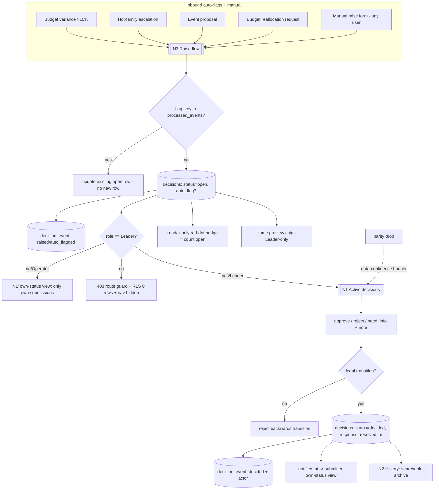

# Module 11: Decision Queue — Plan Spec
> Status: spec / ready-to-build · Owner: Leadership (view+decide); **all users submit** · PRD §3 Module 11 (lines 989–1052)
> Source of truth: Hub DB `decisions` table (manual submission + auto-flags from other modules) · RBAC: **submit = all roles; view full queue + act = Leader only**

This is the Hub's **headline RBAC surface**. The acceptance bar is not "the queue
renders" — it is **"watch a role be denied the Decision Queue"** (one of the four
"show us it works" signals, see `hub/docs/06-gt-challenge/WORKFLOW.md` §2). Build on
the existing `decisions` table and the existing sync/idempotency machinery; do **not**
fork them.

---

## 0. Build-on-this (existing backbone to reuse, not duplicate)

| Capability | Where | Reuse for Decision Queue |
|---|---|---|
| `decisions` table (question, raised_by, workstream, recommendation, budget_ask, due_date, priority, status, response, response_note, auto_flag, resolved_at, created_at) | `supabase/migrations/0001_backbone.sql` L167–182; catalogued `lib/dev/catalog.ts` | The decision card **is** this row. Extend additively only. |
| `leaderOnly: true` on the module def | `lib/modules.ts` L28 | Nav already badges it "Lead"; drives route guard + sidebar hide. |
| Budget >10% variance rule → auto-flag | `budget_workstream` + PRD cross-module rule L1206 | Inbound auto-flag producer (sets `auto_flag=true`). |
| Idempotency ledger | `processed_events` (`lib/payments.ts` pattern) | Dedupe auto-flags so a re-tripping variance doesn't re-open a row. |
| Data-confidence banner / parity | `lib/parity.ts`, `parity_snapshot` | This module shows the same banner as every other (M2/M4). |
| Program-scope helpers (reference only) | `withProgram` / `withoutProgram` `lib/db.ts` | `decisions` is a **global/machinery** table (not program-scoped); use `withoutProgram` reads. RBAC here is **role-based**, not program-RLS. |
| Home preview widget pattern | `app/page.tsx` | Leader-only "top 2–3 open decisions" chip. |
| Dev catalog registration | `lib/dev/catalog.ts` | Register new audit table + new columns with field tags. |

---

## 1. Expert-panel synthesis (pared to 9 — see `gt-hub-decisions-panel`)

| Persona | Lens | The catch it enforces |
|---|---|---|
| Devon Park — RBAC/security eng | **Leader-only gate — "don't ship" seat** | Deny at **3 layers** (route guard · RLS · UI), not UI-only |
| Maya Lindqvist — product/UX designer | **Workflow legibility — "don't ship" seat** | Submitter own-status view + resolution feedback; mobile raise→decide→outcome |
| Marco Reyes — cross-module intake eng | Auto-flag contracts | One inbound payload schema; auto-flags **idempotent** via `flag_key` |
| Priya Nayak — async-workflow SME | State machine | `Open→Decided→In-flight` guarded; no backwards transition |
| Sara Whitfield — audit/governance | Immutable trail | Append-only `decision_event`; outcomes not silently editable |
| Owen Tran — notifications/UX eng | Badge + notify | Badge = `count(open)`, Leader-only, clears on view; `notified_at` on decide |
| Ana Beltrán — backbone/integration eng | SSOT + additive | Ride `decisions` + additive migration; banner present |
| Dr. Lena Ortiz — domain SME (how leaders decide) | Decision sufficiency | Card fields decide without opening another module |
| Dr. Aisha Rahman — decision scientist | **"Don't trust it" seat** | Seed a reject + need-info + aged-open; measurable time-to-decision |

**Convergent:** RBAC is the product here — the deny must be real and demoable;
auto-flag intake must be idempotent; the submitter must get a resolution loop.
**Divergent → resolved:** Park wants RLS-enforced row visibility on `decisions`;
Beltrán notes `decisions` is not program-scoped → **resolve** with a *role-based*
RLS policy keyed on a `submitter_id`/role GUC (additive), plus the server route guard
as the primary gate (defense in depth, not either/or).
**Top risks (ranked):** (1) RBAC UI-only → fake denial; (2) auto-flag duplication;
(3) submitter black hole; (4) mutable/shallow audit; (5) status drift; (6) queue
theater; (7) banner/SSOT forgotten.

---

## 2. Workflow — sub-views as nodes (data-in / processing / data-out)

### Node table (one node per PRD sub-view + intake)

| Node | Data in | Processing | Data out |
|---|---|---|---|
| **N1 Active decisions (11a)** | open `decisions` rows; current user role | **Leader-only**: list all open; filter by owner/workstream/due/priority; render card (all fields); act = approve/reject/need_info + note | `decisions.status/response/response_note/resolved_at` updated; `decision_event` appended; submitter `notified_at` set; badge recount |
| **N1′ Own-status (submit-only users)** | `decisions where submitter_id = me` | **Operator/Admin**: read **only own** submissions + leadership response; **no act controls** | Read-only status list (Open/Decided/In-flight + note) |
| **N2 History (11b)** | decided `decisions` rows + `decision_event` | searchable archive; filter by workstream / date range / outcome (approved/rejected/info-requested); full audit trail per row | Read-only history + per-decision lifecycle timeline |
| **N3 Raise flow (11c)** | manual form (question, recommendation, budget_ask?, due_date, workstream, priority) **OR** inbound auto-flag payload | validate; compute `flag_key`; dedupe via `processed_events`; insert (or update existing open); `auto_flag` true for machine-raised | new/updated `decisions` row; `decision_event` (raised/auto_flagged); Home chip + badge (Leader-only) |

### Cross-cutting (every node)
- **RBAC (dominant):** view+act = Leader; submit+own-status = all. Enforced route guard **and** role-based RLS **and** UI hide.
- **SSOT:** the `decisions` table is the only home of a decision; auto-flags dedupe.
- **Data-confidence banner:** renders here identically to other HubSpot-consuming modules on parity drop.
- **Cross-links:** inbound from Budget/Admissions/Grassroots/Events; outbound Home preview + submitter notification.

---

## 3. Data model touchpoints (additive only — NO backbone edits)

**Reads/writes existing:** `decisions` (all card fields, status, response, auto_flag,
resolved_at), `processed_events` (auto-flag idempotency), `budget_workstream` (variance
source), `parity_snapshot` (banner).

**Additive migration** `supabase/migrations/0003_decisions_rbac_audit.sql` (touches no backbone table):

`ALTER TABLE decisions ADD COLUMN` (all nullable / defaulted → backwards-safe):
| column | type | notes |
|---|---|---|
| `submitter_id` | text | who raised it (role-scoped own-status read). Backfills from `raised_by`. |
| `submitter_role` | text | admin \| leader \| operator (at submit time) |
| `source_module` | text | originating module slug (`budget`/`admissions`/`grassroots`/`events`/manual) |
| `flag_key` | text **unique** | stable dedupe key for auto-flags (e.g. `budget_variance:grassroots:2026-W12`) → re-trip updates, never re-inserts |
| `decided_by` | text | Leader who acted (audit) |
| `notified_at` | timestamptz | submitter-notified timestamp (resolution loop) |

**New table `decision_event`** (append-only audit log; machinery zone):
| column | type | notes |
|---|---|---|
| `id` | uuid pk | |
| `decision_id` | uuid → `decisions.id` | |
| `kind` | text | raised \| auto_flagged \| commented \| decided \| notified |
| `actor` | text | user/role or `system` |
| `from_status` / `to_status` | text | state transition (null on non-transition) |
| `note` | text | optional |
| `at` | timestamptz default now() | **append-only — no UPDATE/DELETE grant** |

**Role-based RLS on `decisions`** (additive policy; `decisions` gets RLS enabled):
non-Leader sessions see **only `submitter_id = current_setting('app.current_user')`**;
Leader sessions see all. Grants: `app_rw` r/w `decisions` + insert-only `decision_event`;
`staff_ro` read own via policy. Register new column tags (`rls`, `idem` on `flag_key`)
+ `decision_event` in `lib/dev/catalog.ts`.

---

## 4. Cross-module contracts

**Inbound (consumed) — each is a named, idempotent payload → `decisions` (auto_flag=true):**
| Trigger | Source module | Payload (→ decisions fields) | Dedupe `flag_key` |
|---|---|---|---|
| Budget variance > 10% | 10 Budget | question, workstream, budget_ask, recommendation, priority=urgent | `budget_variance:<workstream>:<period>` |
| Hot-family escalation | 5 Nurture / 2 Grassroots / 9 Admissions | question, source_module, recommendation, priority | `hot_family:<family_id>` |
| Event proposal | 8 Field & Events | question, recommendation, budget_ask?, due_date, workstream | `event_proposal:<event_id>` |
| Budget reallocation request | any workstream | question, workstream, budget_ask, recommendation | `realloc:<from>:<to>:<period>` |

**Outbound (emitted):**
| Edge | Target | Payload |
|---|---|---|
| Open-decision preview chip | 1 Home (Leader-only widget) | top 2–3 open `decisions` (question, priority, due) |
| Resolution notification | back to submitter (own-status view) | `status`, `response`, `response_note`, `notified_at` |
| Decision back-reference | source workstream module | `decision_id` + outcome (read-only cross-link) |

---

## 5. Files to build (additive — mapped to real paths)

| File | Purpose |
|---|---|
| `supabase/migrations/0003_decisions_rbac_audit.sql` | additive columns + `decision_event` + role-based RLS policy + grants |
| `lib/auth/role.ts` | resolve current user + role + `app.current_user` GUC; `requireLeader()` guard |
| `lib/decisions/intake.ts` | one inbound payload type for all 4 auto-flags; `flag_key` dedupe via `processed_events`; insert-or-update |
| `lib/decisions/queries.ts` | role-aware reads (Leader=all, others=own); active/history filters; `badgeCount()` |
| `lib/decisions/transitions.ts` | `Open→Decided→In-flight` state machine; reject illegal transitions; write `decision_event` |
| `app/m/decisions/page.tsx` | module surface — **server-side `requireLeader()` 403 for non-Leaders**; Active/History tabs |
| `app/m/decisions/_components/DecisionCard.tsx` | card (all PRD fields) + Leader act controls (approve/reject/need-info + note) |
| `app/m/decisions/my/page.tsx` | submitter own-status view (all roles; read-only) |
| `app/_components/RaiseDecisionDialog.tsx` | raise form usable from any module |
| `app/_components/DecisionBadge.tsx` | Leader-only red-dot = `count(open)`, clears on view (wire into `Sidebar.tsx` nav item) |
| `app/api/decisions/route.ts` | role-guarded `GET` (own vs all) + `POST` raise; act endpoints `POST /api/decisions/[id]/decide` (Leader-only 403 otherwise) |
| `lib/seed/generate.ts` (extend) | seed open + decided + **rejected** + **need-info** + **aged-open** + an **auto-flagged** decision; an Operator-submitted item |
| `lib/seed/invariants.ts` (extend) | the §6 invariants |
| `tests/decisions.test.ts` | RBAC denial (3 layers), auto-flag idempotency, state-machine guard, notify loop, audit append-only |

---

## 6. Provable invariants (against seeded data)

1. **RBAC denial (3 layers):** a non-Leader (Operator/Admin) (a) gets **403** from the module page + act endpoints; (b) a raw `decisions` read returns **only own** rows (RLS); (c) nav item + badge are hidden. A Leader sees all + can act.
2. **Submit ≠ view:** an Operator can `POST` a raise and read it back in own-status, but **cannot** read another submitter's decision nor call `/decide`.
3. **Auto-flag idempotency:** the same budget-variance `flag_key` fired N× → exactly **1** open `decisions` row (re-trip updates, never re-inserts).
4. **State machine:** `Open→Decided→In-flight` only; a backwards transition (e.g. Decided→Open) is rejected; every `decided` row has `response` + `resolved_at`.
5. **Audit completeness + immutability:** every lifecycle step has a `decision_event`; the log is append-only (no UPDATE/DELETE); a decided decision's trail reconstructs raised→…→decided→notified.
6. **Resolution loop:** deciding sets `notified_at`; the submitter's own-status view reflects `response` + note (a decision with no notification record fails).
7. **Badge correctness:** badge = `count(status='open')`, visible to Leaders only, clears on view.
8. **SSOT / banner:** one decision = one `decisions` row; the data-confidence banner renders here on parity drop like other modules; total budget still reconciles to $365K (auto-flag writes no budget).

---

## 7. Demo script (clickable; ties to the four "show us it works" signals)

1. As an **Operator**, open a workstream module → **Raise a decision** ("Reallocate $8K to grassroots ads") → it lands in the queue.
2. Still as Operator, open **My submissions** → see it as **Open** (own-status); try to open `/m/decisions` directly → **denied (403)**, nav item hidden. *(Signal #3: role denied the Decision Queue.)*
3. Switch to **Leader** → **Decision Queue** shows the full queue + a **red-dot badge**; the Home preview chip lists it.
4. Trip a **budget variance >10%** in Budget → an **auto-flagged** decision appears; trip it again → **no duplicate** (idempotent).
5. As Leader, **Reject** one and **Need-more-info** another with a note → status moves `Open→Decided`; **History** tab shows the archived outcomes + full audit trail.
6. Back as the **Operator submitter** → My submissions shows the **resolution + leadership note** (notification loop).
7. Drop sync parity → the **data-confidence banner** appears on this module like every other.

---

## 8. Open questions / assumptions

- **Assumption:** identity/role comes from a `lib/auth/role.ts` resolver; until real auth exists, role is a session/dev-switch stub (the sidebar already shows "Admin · GT Anywhere"). The RBAC **mechanism** (guard + RLS + UI) is real; the **identity source** is stubbed and labeled.
- **Assumption:** `submitter_id` backfills from existing `raised_by` text for seeded rows; new submissions write the resolved user id.
- **Assumption:** `decisions` is global/machinery (not program-scoped), so isolation here is **role-based** (own-vs-all), not the program-RLS used for payments/enrollments.
- **Assumption:** notifications v1 = in-app badge + own-status view only (PRD defers browser push to v2); no email/SMS.
- **Assumption:** "In-flight" = approved-and-being-executed; we treat it as a post-Decided state set manually by a Leader (PRD lists it in the status enum but doesn't define its trigger). Flagged for confirmation.
- **Open:** should Admin (Marketing Lead) see the full queue read-only? PRD says Admin can submit but **not** decide and is **not** granted view; we treat Admin as submit+own-status only (same as Operator) unless leadership says otherwise.
- **Open:** retention/archival policy for decided decisions + audit log (none specified).
