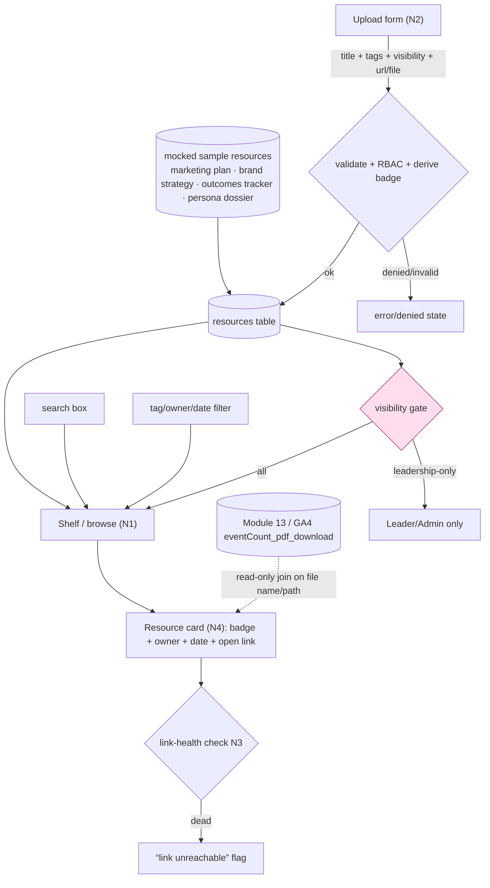

# Module 12: Resource Library — Plan Spec
> Status: spec / ready-to-build · Owner: All (upload), Admin/Leader (governance) · PRD §3 Module 12 (lines 1054–1084)
> Source of truth: **manual upload + linked Google Docs/Sheets/Slides** (Library owns resource *metadata*; access counts are read-only from Module 13) · RBAC: anyone uploads; `visibility` gates who sees; owner/Admin edits/deletes

Produced by the `gt-hub-library-panel` panel via the `gt-hub-module-panel` engine.
**Deliberately the simplest module in the Hub:** a flat, tag-filterable shelf — no
versioning, no approval workflow, no automation. The spec's discipline is *restraint*
plus the three risks a simple shelf still has: **access control, link rot, small-n search.**

---

## 0. Build-on-this (existing backbone/tables/connectors to reuse, not duplicate)

| Capability | Where | Reuse for the Library |
|---|---|---|
| Module registry (slug=library, n=12, owner=All) | `lib/modules.ts` | Already defined — wire the page under `/m/library`; no edit needed |
| In-app dev docs / data dictionary | `lib/dev/catalog.ts`, `/dev/*` | Register the one new `resources` table here (zone + field/PII tags) |
| RBAC role helpers + RLS scoping | `lib/db.ts` (`withProgram`/role context) | Enforce `visibility` server-side; resolve current user as `owner` |
| Deterministic seed + fixtures + manifest | `lib/seed/generate.ts`, `lib/seed/types.ts`, `seed-data/*.json` | Emit the **mocked** sample resources as labeled fixtures |
| Invariant validators | `lib/seed/invariants.ts` | Add Library invariants (§6) |
| GA4 stand-in (PDF/download events) | `lib/dev/catalog.ts` → `ga4_days.eventCount_pdf_download`, `landingPage` | **Inbound** per-resource download counts (Module 13 cross-link) |
| Module sub-view shell + tab bar | `app/m/[slug]/page.tsx`, `app/_components/*` | Render the shelf inside the standard module frame |

**No backbone table is edited.** One additive table (`resources`) + one additive migration.

---

## 1. Expert-panel synthesis

### Roster (pared to 8 — required 5 archetypes are seats 1–5)

| Persona · order | Lens | Falsifiable ask |
|---|---|---|
| Marguerite Vance — KM / information-architecture SME · 2nd | Findable taxonomy | Lock tags to a controlled vocab + multi-tag; every resource maps to ≥1 tag, no orphan |
| Devon Park — file-upload/storage + link-integrity eng · 1st | Link rot + file-type truth | Link-health check (dead-link flag visible); badge derived from URL/MIME, not free text |
| Maya Lindqvist — product/UX designer · 1st | State coverage | empty / no-match / uploading / upload-confirmed all render; new upload visible w/o reload |
| Sara Okonkwo — backbone/integration eng · 1st | SSOT + server-side RBAC | counts are read-only from Analytics (no fabrication); `visibility` enforced server-side |
| Elena Schwartz — data-governance & privacy counsel · 2nd — **DON'T-SHIP** | Access control / PII | `visibility=leadership-only` denies Operators at the query layer; external links share-scoped |
| Priya Nair — search & findability specialist · 1st | Small-n recall | search spans title+desc+tags+owner w/ case/diacritic folding; synonym/partial finds the doc |
| Tom Reyes — content steward (end-user) · 1st | Upload friction | owner+date auto-filled; add a linked doc in ≤4 fields |
| Hideo Tanaka — YAGNI / scope skeptic · 3rd | Restraint | every feature traces to a PRD line; **no** versioning/approval/automation in the build list |

**Convergent:** keep it flat and simple; Library owns metadata only; download counts are
**read** from Analytics, not invented; the build's risk is *governance + link health*, not features.
**Divergent (surfaced, not averaged):** Reyes wants **frictionless** upload (fewer required
fields) vs Vance/Schwartz want **mandatory tag + visibility** at upload → **resolved:** require
exactly `title + ≥1 tag + visibility + (url|file)`; everything else optional and auto-filled.
**Risks (ranked):** (1) confidential-doc/PII leak [Schwartz]; (2) link rot [Park]; (3) small-n
search misses [Nair/Vance]; (4) stale shelf from upload friction [Reyes]; (5) scope-creep [Tanaka];
(6) fabricated download counts [Okonkwo].
**Open:** virus/file-scan on real uploads? external-link allow-list to GT domains? (see §8).

---

## 2. Workflow — features as nodes (data-in / processing / data-out)

### Node table (data-in / processing / data-out)

| Node | Data in | Processing | Data out |
|---|---|---|---|
| **N1 Shelf / browse + search + tag filter** | `resources` rows current user may see; search string; tag/owner/date filters | apply **visibility** RBAC first; case/diacritic-folded match across `title+description+tags+owner`; facet filter by tag/owner/date | filtered, RBAC-safe card list; **empty** + **no-match** states |
| **N2 Upload (file or link)** | `title`, `≥1 tag`, `visibility`, `url` **or** uploaded file; (owner/date auto) | validate required fields; RBAC (any role may upload); derive `file_type` badge from URL/MIME; persist | new `resources` row; **upload-confirmed** toast; row appears **without reload** |
| **N3 Linked docs + link health** | external Google Docs/Sheets/Slides/PDF URLs | classify URL → badge; record `link_checked_at`; flag unreachable/permission-walled | card with correct badge or a visible **“link unreachable”** state |
| **N4 File-type badge + metadata** | resource `file_type`, `owner`, `created_at` | render badge ∈ {DOC, SHEET, SLIDES, PDF, MD, HTML}; format owner + date | badge + owner + date on every card |
| **N5 Access/download count (cross-link IN)** | Module 13 / GA4 `eventCount_pdf_download` joined on file name/path | **read-only** lookup; if no Analytics data → show nothing (no fabrication); inherit GA4 stand-in label | optional “↓ N this week” chip on a card |
| **N0 Mocked pre-load (seed)** | none (generator) | emit 4+ sample resources labeled `is_sample`, each tagged + badged + visibility-set | a non-empty, filterable shelf on first load; resettable to known state |

**Cross-cutting:** SSOT = Library owns metadata, **not** counts (M2); RBAC `visibility`
enforced at the query layer (M3); the only cross-module edge is the **inbound** Analytics
count (M4); **no** data-confidence banner here (n/a — no HubSpot parity input).

---

## 3. Data model touchpoints (additive migration — touches no backbone table)

`supabase/migrations/0003_resource_library.sql`

**`resources`** (global; Library is SSOT for resource metadata)

| column | type | notes |
|---|---|---|
| `id` | uuid pk | |
| `title` | text not null | display name; searchable |
| `description` | text | one-line summary card text; searchable |
| `kind` | text not null | `link` \| `file` |
| `url` | text | external URL (Google Docs/Sheets/Slides/PDF) when `kind=link` |
| `storage_path` | text | object-store path when `kind=file` |
| `file_type` | text not null | badge enum: `DOC`/`SHEET`/`SLIDES`/`PDF`/`MD`/`HTML` — **derived** from URL/MIME, not free text |
| `tags` | text[] not null | controlled vocab ⊆ {`strategy`,`data`,`creative`,`persona`,`playbook`}; ≥1 |
| `owner` | text not null | uploader (auto = current user) |
| `visibility` | text not null default `all` | `all` \| `leadership` — **RBAC gate** (Schwartz) |
| `link_checked_at` | timestamptz | last link-health probe (`kind=link`) |
| `link_ok` | boolean | false → card shows “link unreachable” (Park) |
| `is_sample` | boolean default false | **mocked** pre-load marker (honesty/reset, like `_standIn`) |
| `created_at` | timestamptz default now() | the “date” metadata |
| `updated_at` | timestamptz default now() | |

Grants: `app_rw` read/write, `staff_ro` read; **RLS:** `visibility='leadership'` rows
returned only to Leader/Admin. **Register in `lib/dev/catalog.ts`** (zone `global`, PII tag
on `owner`, fixture tag on `is_sample`). **Access counts are NOT a column** — they are a
read-only join from `ga4_days.eventCount_pdf_download` (§4); never stored here.

---

## 4. Cross-module contracts

**Inbound (consumed):**
- **Module 13 — Website & Digital Analytics → Library.** Per-resource access/download
  count from GA4 `eventCount_pdf_download` (PRD §13d "PDF & download tracking"), joined on
  **file name / landing path**. Rendered as an optional chip on the card. **Read-only**,
  labeled GA4 stand-in; absent Analytics → no chip (no fabricated number). Trigger: on shelf load.

**Outbound (emitted):** **none.** By design — Module 12 raises **no** auto-links into other
modules (no testimonial/objection/budget/parity edges). Simplicity is the contract. *(If a
persona dossier is later referenced by Nurture/Admissions, that is a plain link, not an auto-stub.)*

---

## 5. Files to build (additive list mapped to real paths)

| File | Purpose |
|---|---|
| `supabase/migrations/0003_resource_library.sql` | `resources` table + grants + `visibility` RLS |
| `lib/library/types.ts` | `Resource`, `FileBadge`, `Visibility`, controlled-vocab `Tag` enum |
| `lib/library/badge.ts` | derive `file_type` badge from URL pattern / MIME (single source of badge truth) |
| `lib/library/search.ts` | case/diacritic-folded match over title+description+tags+owner; facet filter |
| `lib/library/links.ts` | link-health probe → `link_ok` + `link_checked_at` |
| `lib/library/access.ts` | read-only join to GA4 download counts (no writes) |
| `app/m/library/page.tsx` (or via `app/m/[slug]/page.tsx`) | the shelf: search + tag/owner/date filters + grid of cards + states |
| `app/m/library/_components/ResourceCard.tsx` | badge + owner + date + open link + dead-link/“↓ N” chip |
| `app/m/library/_components/UploadDialog.tsx` | upload/link form (title + ≥1 tag + visibility + url\|file); confirm toast |
| `app/api/library/route.ts` | `GET` (RBAC-filtered list + search/filter params), `POST` (upload/add link) |
| `lib/seed/generate.ts` (extend) | emit the 4 **mocked** sample resources (`is_sample=true`) |
| `lib/dev/catalog.ts` (extend) | register `resources` in the dev data dictionary |
| `lib/seed/invariants.ts` (extend) | Library invariants (§6) |
| `tests/library.test.ts` | RBAC denial, badge derivation, search recall, no-fabrication of counts |

### Mocked pre-loaded resources (seeded so the shelf has filterable content)

| title | kind | file_type | tags | visibility | owner |
|---|---|---|---|---|---|
| Go-Forward Marketing Plan | link (Google Doc) | DOC | strategy, playbook | all | Marketing Lead |
| Brand Strategy | link (Google Slides) | SLIDES | strategy, creative | **leadership** | Marketing Lead |
| Outcomes / Results Tracker | link (Google Sheet) | SHEET | data | all | Marketing Lead |
| Persona Dossier v2 | file (PDF) | PDF | persona | all | Grassroots Owner |

*(All four carry `is_sample=true`; "Brand Strategy" is leadership-only so the RBAC-denial
invariant has a concrete target. Add a 5th MD/HTML "Suggested Prios" note to exercise every badge.)*

---

## 6. Provable invariants (against seeded data)

1. **RBAC denial (don't-ship gate):** an **Operator** querying the shelf does **not** receive any `visibility='leadership'` row (e.g. "Brand Strategy") — denied at the query layer, not merely hidden in the UI.
2. **Every resource is filed:** every `resources` row has ≥1 tag from the controlled vocab; the tag filter for a tag returns exactly the rows carrying it (no orphan, no leak).
3. **Badge truth:** `file_type` is derived from URL/MIME; a Google Slides URL badges `SLIDES`, a `.pdf` badges `PDF` — never mismatched against the link.
4. **Search recall at small n:** a partial/synonym query returns the intended sample (e.g. "results" → Outcomes/Results Tracker; "persona" → Persona Dossier v2), case/diacritic-insensitive.
5. **Upload Inputs→Outputs:** a `POST` with title + tag + visibility + url returns a row that appears in the next `GET` immediately, with owner=current user and date=now.
6. **No fabricated counts:** with Analytics/GA4 empty, no download chip renders; the count, when present, equals the GA4 `eventCount_pdf_download` for that file (read-only, labeled stand-in).
7. **Link health surfaced:** a resource with `link_ok=false` renders a visible "link unreachable" state rather than a silent broken link.
8. **Honesty / reset:** mocked resources are tagged `is_sample=true` and a reset restores exactly the seeded shelf (deterministic known state).

---

## 7. Demo script (clickable)

1. Open **Resource Library** → the shelf is pre-populated with the mocked samples, each with a file-type badge + owner + date.
2. Type **"results"** in search → the Outcomes/Results Tracker surfaces (small-n recall).
3. Filter by tag **`persona`** → only the Persona Dossier remains; clear filter → all return.
4. Click **+ Add resource**, paste a Google Doc URL, title it, tag `strategy`, visibility `all` → it appears **immediately** with a `DOC` badge, owner = you, today's date.
5. Sign in as an **Operator** → "Brand Strategy" (leadership-only) is **not in the list**; sign in as **Leader** → it appears (RBAC denial proven).
6. Point a sample's URL at a dead link → the card shows **"link unreachable"** (link rot caught).
7. Show a card's **"↓ N this week"** chip sourced read-only from Analytics; empty the Analytics data → chip disappears (no fabrication).

---

## 8. Open questions / assumptions

**Assumptions (written down per PRD discipline):**
- Pre-loaded resources are **mocked** (PRD says they are not provided); they are labeled `is_sample` and stand in for the real planning-sheet docs.
- "Upload" of real files persists to object storage; for the demo, file resources may be **fixtures** (path only) — same shape, swappable for live storage.
- Download/access counts are **owned by Module 13 (GA4)**; Library only reads them. Library shows **no** data-confidence banner (n/a — no HubSpot parity input).
- All three roles (Admin/Leader/Operator) may **upload**; `visibility` is the only see-gate; owner or Admin may edit/delete.
- No versioning, no approval workflow, no automation, no full-text/OCR — explicitly out of scope (PRD: "No automation, no versioning").

**Open questions to route:**
- Should real uploads be **virus/file-scanned**, and is there a max size / allowed MIME list? (governance — Schwartz)
- Should external links be **allow-listed** to GT-owned domains / Drive, and how do we verify Google share-scope (not "anyone with the link")? (Park/Schwartz)
- Is there a **retention** rule for stale or dead-linked resources, or do they live forever? (Schwartz)
- Where exactly does the **GA4 file-name → resource** join key live (filename vs landing path vs a stored asset id)? (Okonkwo — Module 13 contract)
