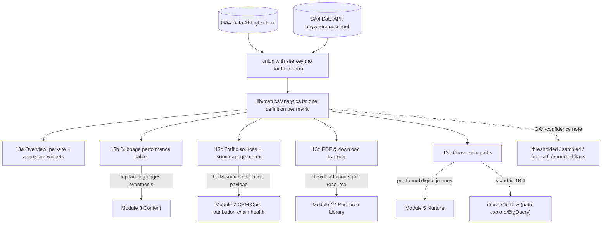

# Module 13: Website & Digital Analytics — Plan Spec
> Status: spec / ready-to-build · Owner: Marketing Lead (Admin) · PRD §3 Module 13 (lines 1086–1183)
> Source of truth: **GA4 (Data API)** — gt.school **+** anywhere.gt.school, per-site + aggregate · RBAC: Admin (Marketing Lead) r/w · Leader read + request-analysis/flag-page · Operator read-only

GA4 is the source of truth and is **NOT a Supabase backbone table** — it is read live from the GA4 Data API in production and is stood-in today as `ga4_days` (+ proposed additive stand-in shapes). This module never writes a backbone table; it consumes a stand-in/external source and **emits** cross-module payloads. The website is where **UTM parameters originate**, so Module 13 is the head of the attribution chain Module 7 reconciles.

---

## 0. Build-on-this (existing backbone/tables/connectors to reuse, not duplicate)

| Capability | Where | Reuse for Analytics |
|---|---|---|
| GA4 stand-in rows (grain: date × site × campaign × landing page) | `lib/seed/types.ts` `Ga4Day`; `seed-data/ga4_days.json`; generated in `lib/seed/generate.ts` (GA4 block) | The base feed for **all 5 sub-views**; per-site + aggregate roll-ups |
| GA4 registered as a stand-in source | `lib/dev/catalog.ts` (`ga4_days` entry, `SOURCES` row: kind `standin`, joinKey `utm_campaign`, grain `date × site × campaign × landing page`) | Dev-doc registration; extend with new additive fields/shapes here |
| Canonical UTM / campaign taxonomy | `lib/seed/campaigns.ts` (`ALL_CAMPAIGNS`, `campaignByUtm`, `ga4_channel`, `landing_page`) | The validation reference for **13c** UTM check → CRM Ops contract |
| UTM thread + reconcile narrative | `lib/dev/catalog.ts` `UTM_THREAD` (X→GA4→Meta→CRM) | The attribution-chain story this module heads |
| Module registry + routing | `lib/modules.ts` (`analytics`, n=13), `app/m/[slug]/page.tsx`, `app/_components/Sidebar.tsx` | Sub-view tab bar host; no new top-level route |
| Open Data enrichment (optional) | `lib/opendata/enrich.ts` | Optional context only; not a source of truth |

> **No backbone migration.** GA4 stays stood-in/live. Any new fields are **additive stand-in shapes** (seed + types + catalog registration), per the same pattern Meta/X already follow.

---

## 1. Expert-panel synthesis
*(panel built by `gt-hub-analytics-panel`; engine `gt-hub-module-panel`)*

### Roster (pared to 9 — persona · lens · falsifiable ask)

| Persona · lens | Falsifiable ask |
|---|---|
| **Lindsey Tran** — measurement strategist / KPI taxonomy | One definition per metric; **bounce = 1 − engagedSessions/sessions** identical on 13a & 13b |
| **Marcus Webb** — GA4 Data API specialist | Thresholded/sampled rows flagged; `(not set)` is a visible explicit bucket, never dropped |
| **Devon Park** — web data-modeling / integration eng | **aggregate == gt.school + anywhere.gt.school** (no cross-property double-count); `site` key on every row |
| **Maya Lindqvist** — product/UX designer | 13b sortable+filterable with empty/loading/thresholded states + mobile card; request-analysis ≤2 taps |
| **Elena Schwartz** — privacy & consent counsel · *don't ship* | No query-string PII in `landingPage`; modeled data labeled "modeled"; cross-site stitching gated on consent or not shipped |
| **Hannah Cho** — RevOps / attribution | 13c validates UTMs vs `campaigns.ts`; emits UTM-validation payload to CRM Ops, never silent pass-through |
| **Priya Nair** — conversion-path / user-flow | 13e shows measured step counts; multi-hop & cross-site flow badged "stand-in (path-explore/BigQuery TBD)" |
| **Sofia Mendes** — data-visualization | sessions-by-site as side-by-side small-multiples, shared zero baseline, no dual-axis |
| **Dr. Aisha Rahman** — causal / decision scientist · *don't trust* | "underperforming page" carries traffic-quality-confound caveat; Content-refresh edge framed as hypothesis |

### Convergent
GA4 is the single source; **per-site + aggregate must reconcile by summation**; honesty about GA4 realities (thresholding, sampling, `(not set)`, consent-mode-modeled, cross-site limits) is a first-class UI requirement, not a footnote; this module **owns UTM origin** and must validate the taxonomy it emits downstream.

### Divergent (surfaced, not averaged)
- **Cross-site flow:** Nair/Park want it shown for decision value vs Schwartz/Rahman who won't trust/ship visitor-level stitching → **resolved:** ship aggregate cross-site *entrance/exit overlap* badged **stand-in (TBD: same/linked GA4 property — see PRD data-source note lines 1153–1155)**; do **not** ship individual cross-site identity stitching without a consent basis.
- **"Underperforming page" → Content:** Tran/Cho want an automatic flag vs Rahman who calls it confounded → **resolved:** emit as a **hypothesis with the source-mix caveat**, Leader-confirmed before it becomes a Content brief.

### Risks (ranked, sourced)
1. Cross-property double-count inflates the headline (Park).
2. Fabricated conversion paths / cross-site flow shown as measured (Nair).
3. Consent-mode-modeled data shown as observed; PII / minors' cross-site stitching (Schwartz — don't ship).
4. GA4 thresholding/sampling/`(not set)` ignored → tables look complete but aren't (Webb).
5. Metric drift across 13a/13b/13d (Tran).
6. Bad/missing UTMs passed downstream, orphaning CRM Ops attribution (Cho).
7. Correlational "underperforming page" verdict fed to Content as fact (Rahman — don't trust).
8. Two-site comparison rendered misleadingly (Mendes).

### Open
Same vs linked GA4 property for cross-site (PRD gap, TBD); consent-mode/post-ATT modeling share; whether avg-duration, new-vs-returning, PDF file-name, and path sequences come from GA4 Data API config vs BigQuery export (see §8).

---

## 2. Workflow — sub-views as nodes (data-in / processing / data-out)

> **Cross-cutting (apply to every node):** **SSOT** — read GA4 only, per-site + aggregate by summation. **Reconciliation** — `aggregate == gt.school + anywhere.gt.school`, no cross-property double-count. **RBAC** — Admin r/w; Leader read + request-analysis/flag-page; Operator read-only (flag/request denied). **Data-confidence** — this module reads GA4 **not HubSpot**, so the **sync-parity banner does not gate it**; it shows its own GA4-confidence note (thresholded/sampled/`(not set)`/modeled). **Cross-links** — see §4.

| Node (sub-view) | Data in | Processing | Data out |
|---|---|---|---|
| **13a Overview** | `ga4_days` rows both sites (sessions, totalUsers, engagedSessions, screenPageViews, eventCount_pdf_download, eventCount_generate_lead) + additive `newUsers`, `avgSessionDuration` | aggregate **= sum of two sites**; per-site split; **bounce = 1 − engagedSessions/sessions**; new-vs-returning = `newUsers` vs `totalUsers−newUsers`; top-5 landing pages by sessions; PDF count + top files | 7 widgets: total sessions (aggregate), sessions-by-site (small-multiples), bounce-by-site, avg duration, new-vs-returning, PDF downloads this week, top-5 landing pages |
| **13b Subpage performance** | `ga4_days` grouped by `landingPage` × `site` (+ additive `exits`, page-type tag) | per-page rollups: pageviews (+weekly trend), unique visitors, avg time on page, bounce, exit, conversion events; apply thresholding flag | sortable table; filters site / page-type / date-range; thresholded + empty + loading states; mobile card fallback |
| **13c Traffic sources** | `ga4_days` `sessionDefaultChannelGroup`, `sessionSourceMedium`, `utm_campaign`, `landingPage` + `campaigns.ts` taxonomy | bucket Organic/Direct/Social(by platform where derivable)/Email/Referral/UTM; build **source × page matrix**; **validate UTMs** vs canonical taxonomy; `(not set)` explicit bucket | source breakdown; source×page matrix; **UTM-validation result → CRM Ops payload** (valid / invalid / missing counts) |
| **13d PDF & download tracking** | `eventCount_pdf_download` per row + additive `ga4_downloads` stand-in (file, referringPage, channel, count) | per-file rollup: weekly + cumulative count, referring page, originating source; rank; trend over time | ranked downloads table + trend; **per-resource counts → Resource Library payload** |
| **13e Conversion paths** | `eventCount_generate_lead`, `landingPage`, entrances + additive `ga4_paths` stand-in (from→to→count) | measured step counts homepage→application form, drop-off; identify highest form-submission-rate pages; **cross-site overlap badged stand-in/TBD** | flow view (measured steps + stand-in badge for multi-hop/cross-site); **pre-funnel journey → Nurture payload** |

---

## 3. Data model touchpoints (tables read/written; additive only; NO backbone edits)

**Read (stand-in / live GA4):** `ga4_days` (`Ga4Day`). **Reference:** `lib/seed/campaigns.ts` (UTM taxonomy). **No Supabase backbone table is read or written.**

**Additive stand-in shapes** (extend `lib/seed/types.ts` + generate + register in `lib/dev/catalog.ts`; all carry `_standIn: true`, `_source: "ga4_data_api"`):

| Shape | New fields / rows | Why (which sub-view) | Honesty note |
|---|---|---|---|
| `Ga4Day` (extend) | `newUsers:number`, `avgSessionDuration:number`, `exits:number`, `pageType:"landing"\|"blog"\|"resource"\|"form"\|"about"` | 13a new-vs-returning + avg duration; 13b exit rate + page-type filter | Derivable GA4 metrics; not in current seed |
| `Ga4Download[]` (new) | `date, site, file, referringPage, channel, count` | 13d file name + referring page + source | Requires GA4 `file_download` event params (`file_name`, `link_url`) — config-gated |
| `Ga4Path[]` (new) | `date, site, fromPage, toPage, count` | 13e flow + cross-site overlap | **Stand-in:** Data API can't return ordered sequences at row grain → real version needs path exploration / BigQuery export (TBD) |

No grants change (no new Postgres tables). Register the three shapes in `lib/dev/catalog.ts` with PII tags on any `landingPage`/path field that could carry query strings (Schwartz: strip/normalize first).

---

## 4. Cross-module contracts (inbound consumed + outbound emitted)

**Outbound (this module emits):**

| Edge | Trigger | Payload |
|---|---|---|
| **→ Module 7 CRM Ops** (attribution-chain health) | 13c UTM validation run | `{ utm_campaign, utm_source, utm_medium, status: valid\|invalid\|missing, sessions }` — counts of orphaned/`(not set)` UTMs originating at the website (the **UTM-origin** contract) |
| **→ Module 3 Content** (page performance) | 13b top-landing-pages / underperforming flag (Leader-confirmed) | `{ landingPage, site, sessions, conversionRate, hypothesis: "refresh?", caveat: "source-mix confound" }` |
| **→ Module 12 Resource Library** (resource access) | 13d per-file rollup | `{ file, downloadsWeekly, downloadsCumulative, topReferringPage }` |
| **→ Module 5 Nurture** (pre-funnel digital journey) | 13e path rollup | `{ entryPage, stepsToForm, dropOffRate }` — digital journey before a lead enters the funnel |

**Inbound (this module consumes):**

| Edge | Source | Effect |
|---|---|---|
| Leadership input — "analyze this page/campaign" | Leader (Module 11 / inline) | Pins a page/campaign analysis view; Operators cannot trigger |
| Leadership input — "flag underperforming page" | Leader | Marks a page; emits the Content hypothesis edge above |

> **Not consumed:** the sync-parity **data-confidence banner** — analytics reads GA4, not HubSpot, so it is **not** gated by parity. It surfaces its own **GA4-confidence note** instead (G1).

---

## 5. Files to build (additive list mapped to real paths)

| File | Purpose |
|---|---|
| `lib/seed/types.ts` (extend) | add `Ga4Day` fields (`newUsers`, `avgSessionDuration`, `exits`, `pageType`); add `Ga4Download`, `Ga4Path` interfaces + to `SeedDataset` |
| `lib/seed/generate.ts` (extend) | extend GA4 block to emit new fields + `ga4_downloads`, `ga4_paths`; seed **thresholded-day** and **`(not set)`** edge cases |
| `lib/metrics/analytics.ts` (new) | single definitions: per-site + aggregate sessions/users, **bounce = 1 − engagedSessions/sessions**, avg duration, new-vs-returning, top landing pages, traffic-source rollup, source×page matrix, PDF rollup, UTM validation |
| `lib/dev/catalog.ts` (extend) | register `ga4_downloads`, `ga4_paths` shapes + new `ga4_days` fields; PII tags on path/landingPage |
| `app/m/[slug]/_views/analytics/Overview.tsx` (new) | 13a widgets (small-multiples per site) |
| `app/m/[slug]/_views/analytics/SubpagePerformance.tsx` (new) | 13b sortable/filterable table + states + mobile card |
| `app/m/[slug]/_views/analytics/TrafficSources.tsx` (new) | 13c breakdown + source×page matrix + UTM-validation panel |
| `app/m/[slug]/_views/analytics/Downloads.tsx` (new) | 13d ranked downloads + trend |
| `app/m/[slug]/_views/analytics/ConversionPaths.tsx` (new) | 13e flow + stand-in badge for multi-hop/cross-site |
| `app/m/[slug]/_views/analytics/tabs.ts` (new) | sub-view tab registry wired into `app/m/[slug]/page.tsx` for `slug === "analytics"` |
| `lib/seed/invariants.ts` (extend) | add §6 invariants |
| `tests/analytics.test.ts` (new) | aggregate-sum, bounce definition, `(not set)` retained, PDF reconcile, UTM-validation payload, RBAC denial |

---

## 6. Provable invariants (against seeded data)

1. **No cross-property double-count:** `aggregate.sessions == sum(site == gt.school) + sum(site == anywhere.gt.school)`; every row has a `site`; aggregate users likewise.
2. **Single metric definition:** bounce computed exactly as `1 − engagedSessions/sessions` everywhere it appears (13a == 13b); test asserts identical formula output.
3. **`(not set)` / null UTM retained:** a row with `utm_campaign = null` lands in the explicit Direct/Organic bucket and is **counted**, never dropped; appears in 13c and in the CRM Ops UTM-validation payload as `missing`.
4. **PDF reconcile:** `sum(ga4_downloads.count per file)` for the week `==` the 13a "PDF downloads this week" widget `== sum(eventCount_pdf_download)` over the window.
5. **Top-landing-pages parity:** the ranking emitted to Content equals the ranking rendered in 13a/13b for the same window.
6. **Stand-in honesty:** any multi-hop / cross-site path rendered in 13e carries the `_standIn`/"TBD" badge; no path shape without it is presented as measured.
7. **Thresholding flagged:** the seeded thresholded-day row renders with a "thresholded/sampled" flag, not silently omitted.
8. **RBAC denial:** an Operator session cannot trigger "request analysis" or "flag page" — the affordance renders denied; only Admin/Leader can.

---

## 7. Demo script (clickable)

1. Open **13a Overview** → total sessions aggregate; toggle the side-by-side sessions-by-site small-multiples; confirm aggregate == gt.school + anywhere.gt.school (the reconcile).
2. Open **13b** → sort by bounce rate, filter to `anywhere.gt.school` + page-type `landing`; hit a **thresholded** row and see its flag + an empty state on an over-filtered range.
3. Open **13c** → view the source×page matrix; find the **`(not set)`** bucket; click **"validate UTMs"** → see invalid/missing counts → follow the link into **Module 7 CRM Ops** attribution-chain health (the UTM-origin contract).
4. Open **13d** → top downloads ranked with referring page + source; confirm the count matches 13a's PDF widget.
5. Open **13e** → homepage→application-form measured steps + drop-off; the cross-site overlap renders with a **"stand-in (BigQuery TBD)"** badge.
6. As an **Operator**, try "flag page for content refresh" → denied; as a **Leader**, flag it → a Content hypothesis brief is emitted (with the source-mix caveat).

---

## 8. Open questions / assumptions

- **Cross-site analysis (PRD gap, lines 1153–1155):** assumes a **same or linked** GA4 property; whether visitor-level cross-site flow is even available is **TBD** — shipped as an aggregate stand-in badged TBD, not visitor stitching (Schwartz/Park).
- **Avg session duration, new-vs-returning, exit rate:** **not in the current `ga4_days` seed** — assumed available as additive GA4 Data API metrics (`userEngagementDuration`, `newUsers`, `exits`); added as additive stand-in fields.
- **PDF file name + referring page (13d):** assumes GA4 `file_download` event is configured with `file_name`/`link_url` params; without it only aggregate `eventCount_pdf_download` exists.
- **Conversion path sequences + cross-site flow (13e):** GA4 Data API does **not** return ordered paths at row grain — real version assumes **path exploration / BigQuery export**; seeded as `ga4_paths` stand-in.
- **Social platform split (X / Facebook / Instagram):** GA4 `sessionDefaultChannelGroup` gives "Paid/Organic Social"; FB-vs-IG split assumes `sessionSourceMedium`/source granularity — partial, flagged where not separable.
- **GA4 realities applied throughout:** **data thresholding** (consent-driven low-volume suppression), **sampling**, **`(not set)`**, **consent-mode/post-ATT modeled conversions** — surfaced in-UI as the GA4-confidence note (this module is not gated by the HubSpot sync-parity banner).
- **PII:** `landingPage` query strings stripped/normalized before display; no minors' visitor-level cross-site identity persisted without a documented consent basis (Schwartz — don't ship).
