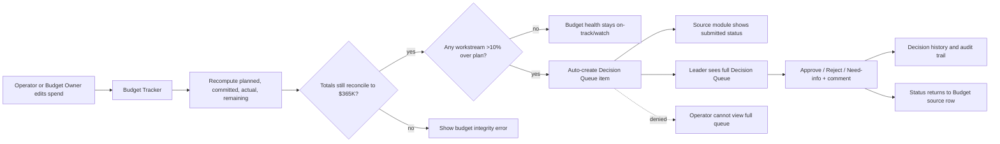
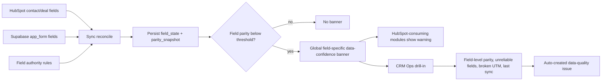
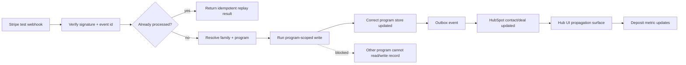
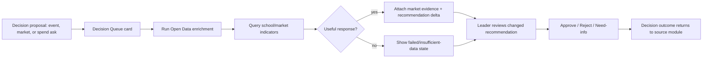
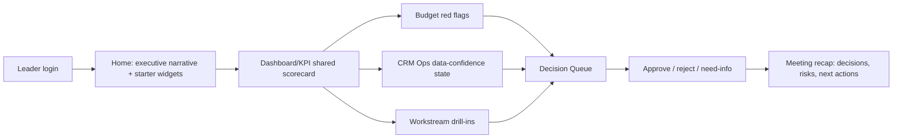

# Priority Grader Workflows

This doc turns the five highest-leverage grader workflows into side-by-side implementation maps. The intent is to make the demo slice obvious: each workflow should prove multiple rubric items at once, with visible cross-module handoffs and a clear data/tech path.

## Side-by-Side Summary

| Priority | Workflow | Business value | Technical value | Grader proof | Modules touched | Data needed | Tech needed |
|---:|---|---|---|---|---|---|---|
| 1 | Budget overrun -> Decision Queue -> Leader ruling | Keeps GT from overspending the $365K plan and turns budget exceptions into accountable leadership decisions. | Proves canonical money math, role enforcement, cross-module writes, and auditable state transitions. | Budget reconciles to $365K, variance auto-flag, Leader-only decision gate, audit trail | Budget, Decision Queue, Home preview | `budget_entry`, workstream plans, variance threshold, decision records, user roles | Next.js module pages, Supabase RLS/API guards, server actions/routes, budget aggregation, decision mutations |
| 2 | Data-confidence drop -> banner -> CRM Ops drill-in | Prevents teams from acting on bad CRM data and makes known data quality gaps visible instead of hidden. | Proves sync parity, field-level authority, connector health, and global trust UX over shared data. | Sync parity becomes product UX, known unreliable fields are honest, source-of-truth rules are visible | CRM Ops, global shell/banner, all HubSpot-consuming modules | `field_state`, `parity_snapshot`, synced family/contact fields, connector timestamps, data-quality issues | Parity computation, banner component, CRM Ops drill-in page, HubSpot connector/reconcile job, field-authority rules |
| 3 | Payment/deposit propagation without contamination | Gives staff confidence that paid families land in the right program and deposits update operating metrics correctly. | Proves webhook verification, idempotency, outbox sync, program isolation, and CRM writeback. | Stripe event is idempotent, routes to correct program store, no cross-program leakage | Payment/admin surface, CRM/HubSpot, program store, Dashboard/Home metric | Stripe event payloads, processed event ids, families, enrollments, program-scoped records, HubSpot contact/deal ids | Stripe webhook verification, outbox/reconcile worker, RLS `withProgram`, idempotency keys, HubSpot writeback, propagation viewer |
| 4 | Open Data-enriched decision | Helps leadership choose markets/events/spend using external school-market evidence instead of opinion alone. | Proves third-party integration, enrichment persistence, explainable recommendation deltas, and graceful failure. | External data changes a real decision, plus failure/edge path is shown | Decision Queue, Open Data enrichment, Budget/Event context | Decision record, school/market query params, Open Data response, enrichment summary, fallback/error state | Open Data API route, enrichment service, decision-card UI, cached/failure state, leadership response mutation |
| 5 | Monday marketing meeting flow | Shows GT can run the weekly marketing operating cadence from one product instead of scattered dashboards/docs. | Proves role-aware navigation, shared metric semantics, cross-module drill-ins, and responsive product cohesion. | The app is usable as a business operating system, not only plumbing | Home, Dashboard/KPI, Budget, CRM Ops, Decision Queue, key workstream modules | Executive narrative, scorecard KPIs, budget status, data-confidence state, open decisions, role-specific home layout | Home widgets, shared metrics layer, Dashboard scorecard, role-aware nav, responsive shell, help guide |

## Workflow Diagrams

### 1. Budget Overrun -> Decision Queue -> Leader Ruling

**Modules:** Budget, Decision Queue, Home preview.

**Business value:** The budget owner sees overspend early, leadership has a structured approval path, and operators get a clear outcome without side-channeling decisions in Slack or docs.

**Technical value:** This is the highest-density SSOT demo: budget math stays canonical, the variance creates a real cross-module record, and role/RLS/API checks prove operators cannot act as leaders.

**Data:** Workstream planned/recommended amounts, committed spend, actual spend, remaining, variance threshold, decision records, role/session claims, audit log.

**Tech:** Budget aggregation query/service, append-only budget entries, server-side role checks, RLS/API guards, Decision Queue mutations, sidebar/home badge counts.

### 2. Data-Confidence Drop -> Banner -> CRM Ops Drill-In

**Modules:** Global shell/banner, CRM Ops, Nurture, Dashboard/KPI, any module consuming HubSpot-derived fields.

**Business value:** Marketing can keep working without pretending the data is clean; the system tells users which field is suspect and where to inspect it before they make a bad call.

**Technical value:** It connects Phase 1 sync correctness to Phase 2 product behavior through field authority, persisted parity state, threshold logic, and a visible global warning path.

**Data:** HubSpot contact/deal fields, Supabase app_form fields, `field_authority`, `field_state`, `parity_snapshot`, connector sync timestamps, UTM health rows, data-quality issue queue.

**Tech:** Reconcile/parity job, field-level authority model, banner state selector, CRM Ops tabs, HubSpot connector, data-quality auto-detection.

### 3. Payment/Deposit Propagation Without Contamination

**Modules:** Payment/admin propagation surface, program store views, CRM/HubSpot sync, Home/Dashboard deposit metric.

**Business value:** A paid family becomes operationally visible without manual cleanup, duplicate events do not inflate deposits, and program teams only see the records they are allowed to use.

**Technical value:** This proves the hardest backbone claims: webhook idempotency, monotonic state, program-scoped writes, RLS isolation, outbox propagation, and CRM consistency.

**Data:** Stripe payment intent/checkout session, processed event ids, family identity, program id, enrollment/payment state, HubSpot contact/deal ids, outbox records, RLS check fixtures.

**Tech:** Stripe webhook route, signature verification, processed-events idempotency table, program-scoped DB helper, Supabase RLS policies, HubSpot writeback, propagation/audit viewer.

### 4. Open Data-Enriched Decision

**Modules:** Decision Queue, Budget or Field/Event context, optional Home decision preview.

**Business value:** Leadership can justify a spend/event/market call with external evidence, and the product shows when the evidence was unavailable or insufficient.

**Technical value:** This demonstrates a real external integration that changes product state, not a decorative API call. It also shows caching, error handling, and explainable enrichment attached to a decision.

**Data:** Decision question, workstream, budget ask, target geography/school context, Open Data response, enrichment summary, error/fallback state, leadership ruling.

**Tech:** Open Data API client/service, decision enrichment route, cached enrichment payloads, decision-card UI state, failure handling, leadership response action.

### 5. Monday Marketing Meeting Flow

**Modules:** Home, Dashboard/KPI, Budget, CRM Ops, Decision Queue, selected workstream modules.

**Business value:** The Hub becomes the weekly operating room: leaders review the same scorecard, see risks, inspect data confidence, and close decisions in one place.

**Technical value:** This proves product cohesion across the shell: shared metrics, role-aware navigation, responsive layouts, cross-module links, and Help content that makes the workflow self-serve.

**Data:** Role-specific home layout, executive narrative, scorecard KPIs, budget status, parity/banner status, open decisions, workstream health rows, meeting-week selector.

**Tech:** Role-aware shell/nav, Home widget selection, shared metrics layer, Dashboard scorecard, responsive UI, Decision Queue preview, Help guide for meeting flow.

## Implementation Cut Line

Build the first three workflows before expanding surface area. They provide the clearest proof of the backbone, source-of-truth discipline, role gates, and visible cross-module handoffs. Add Open Data as a focused enhancement to Decision Queue, then use the Monday meeting flow to stitch the demo narrative together.
