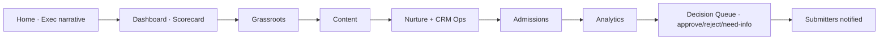
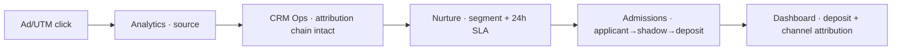
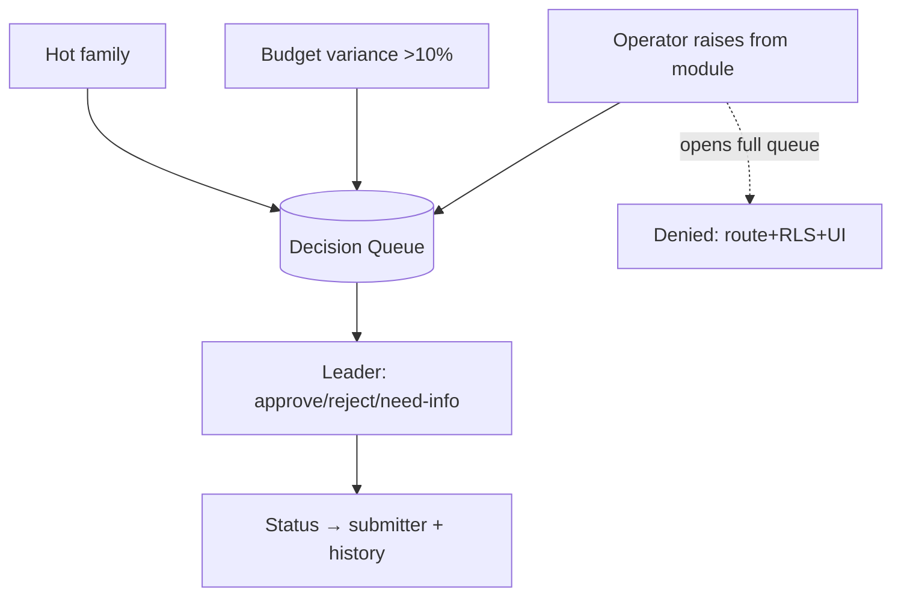

# GT Marketing Hub — Cross-Module Cohesion & Use-Case Workflows

Produced by the **`gt-hub-cohesion-panel`** skill — the system-level body that sits above
the 13 per-module panels and judges the Hub as **one product** that is **easy to use**.
This doc holds (1) the cohesion review and (2) the full end-to-end workflows for the common
objectives. The user-facing version of each workflow is the in-app **Help section**
(`/help`, source: `hub/lib/help/guides.ts`).

---

## 1. Cohesion panel — synthesis

Roster (pared, meticulous by design): service designer · interaction/usability lead ·
accessibility lead · design-systems lead · IA/navigation architect · metrics-semantics
steward · RBAC-experience reviewer · front-end architect · technical writer/onboarding ·
QA "every-button-works" skeptic.

**Pillars:** C1 one design system · C2 nav & IA · C3 one meaning per metric · C4 seamless
handoffs · C5 coherent role journeys · C6 ease of use · C7 accessibility · C8 learnability.

**Convergent (the system can rely on these):**
- The Hub already has one shell (persistent sidebar + shared tokens) — C1 is achievable if every module reuses it instead of bespoke layouts.
- The cross-module **auto-links are the product** (testimonial→Content, objection→brief, hot-family→DQ, variance→DQ, parity→banner, event→Field). They are the C4 backbone and must each have a *visible landing*, not just a DB write.
- One canonical metric definition per KPI (semantic layer) is the only way C3 holds across Home, the module, and the Dashboard scorecard.

**Divergent (surfaced, not averaged):**
- *Personal Home* vs *shared Scorecard* — both exist on purpose (Home is per-user; Dashboard is the shared board). The risk is users confusing the two in the Monday meeting → guidance: meetings run off the **Scorecard**.
- Density vs simplicity — operators want rich dashboards; the QA/usability seats want fewer clicks. Resolve per-surface with default widget packs + progressive disclosure.

**Risks (ranked, with pillar + seat):**
1. **C4 — silent handoffs.** An auto-link fires but the destination has no obvious "you have a new X" landing → work lost. (service designer)
2. **C5 — role dead-ends.** An Operator sees a link to the Decision Queue then gets denied → confusing. Hide/disable denied entries, don't 403 after a click. (RBAC reviewer)
3. **C3 — metric drift.** "Qualified", "applicants", "parity %" computed differently in two modules. (metrics steward)
4. **C6/C7 — mobile + a11y.** Leaders check on phones; the fixed brand palette must pass WCAG AA contrast; icon-only controls need labels. (accessibility lead)
5. **C8 — no self-serve.** Without the Help guides, a new operator can't run the weekly cadence unaided. (technical writer)

**Open questions:**
- Where does a global search / command palette live (jump to any module/record)?
- Is there a single "notifications/inbox" surface, or are chips scattered per module?
- Breadcrumbs + back-affordance standard for drill-ins (rosters, decision cards, pages)?

**Acceptance (the meticulous bar):** every use case below must be completable end-to-end by
its role, on mobile, with each cross-module hop landing on a visible, in-context screen — and
documented as a Help guide.

---

## 2. Common objectives → full workflows

Each links to its in-app guide. Two are **spec-provided** (the GT Challenge worked example; the
§5 weekly-meeting agenda). Pillars exercised noted per case.

| Use case | Spans | Role | Guide | Pillars |
|---|---|---|---|---|
| Run the Monday meeting | Home→Dashboard→workstreams→Decisions | Leader/Lead | [/help/weekly-meeting](../../lib/help/guides.ts) | C2,C3,C5,C8 |
| Launch & run the GT Challenge | Budget→quiz→CRM/Nurture→assess→Dashboard | Lead | /help/gt-challenge | C3,C4,C6 |
| New applicant click→deposit | Analytics→CRM Ops→Nurture→Admissions→Dashboard | Lead | /help/new-applicant | C3,C4 |
| 24-hr follow-up SLA | Nurture→Dashboard | Lead/Operators | /help/follow-up-sla | C5,C6 |
| Objection → content → resolved | Admissions→Content→Analytics | Admissions+Content | /help/objection-to-content | C4 |
| Escalate a hot family | Nurture/Grassroots→Admissions→DQ | any→Leader | /help/hot-family | C4,C6 |
| Raise a decision & get a ruling | any→Decision Queue | Operator→Leader | /help/raise-a-decision | C5 |
| Catch an overrun & reallocate | Budget→Decision Queue | Budget Owner→Leader | /help/budget-variance | C3,C4 |
| Respond to data-confidence drop | CRM Ops→all→CRM Ops | Lead | /help/data-confidence | C3,C4 |
| Compose your Home | Home (+ all sources) | every role | /help/compose-home | C1,C6 |

### Marquee flows

**Run the Monday meeting (spec §5):**

**New applicant click→deposit (the funnel reconciles):**

**Govern loop (raise → rule, with the denial):**

Full step-by-step (what you click, where, what happens) for all ten lives in
`hub/lib/help/guides.ts` and renders at `/help`.

---

## 3. Help section (in-app)

- `hub/lib/help/guides.ts` — canonical guide content (one per use case).
- `hub/app/help/page.tsx` — index, grouped by category.
- `hub/app/help/[slug]/page.tsx` — a guide (objective · who · modules · trigger · numbered steps · what-good-looks-like · watch-for · related).
- Sidebar → **Help · User guides**.

To add a use case: append to `GUIDES` in `guides.ts` — the index, detail page, and counts update automatically.
